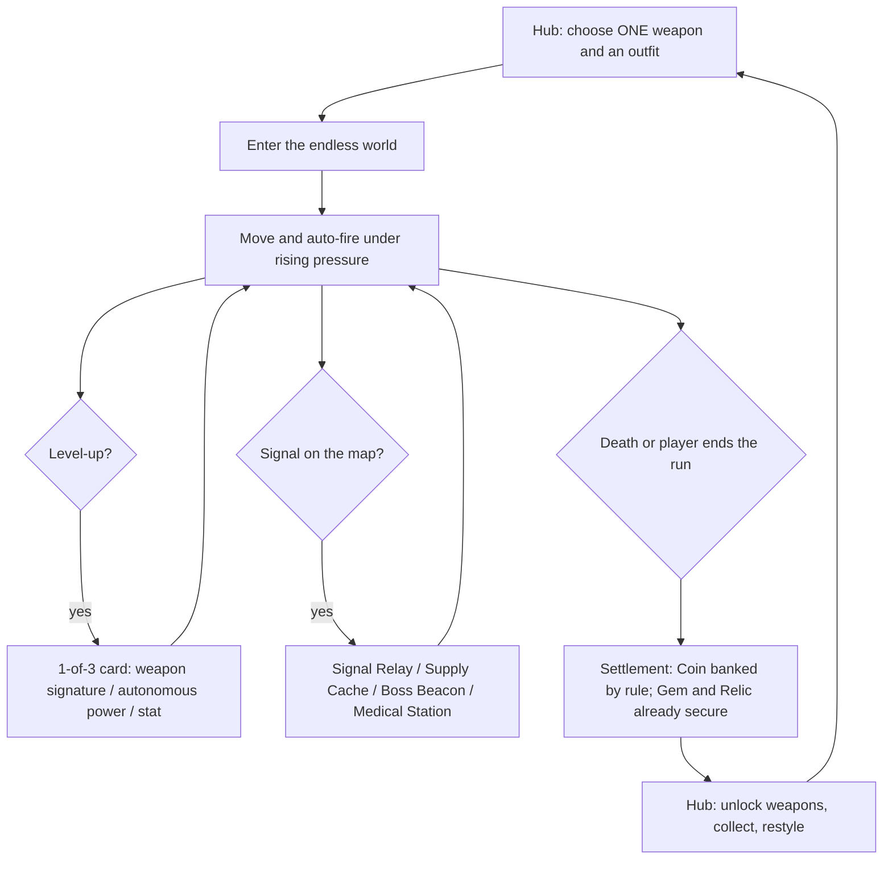

# Zombie War — Game Design Document

**Authority:** Canonical game vision, player fantasy, world and content direction  
**Phase:** CONCEIVE — vision locked; **M6 system design is LOCKED** (W1–W7 answered 2026-08-15)  
**Updated:** 2026-08-15  
**System companion:** [`M6_ENDLESS_RUN_SYSTEM_DESIGN.md`](M6_ENDLESS_RUN_SYSTEM_DESIGN.md)  
**Technical companion:** [`WORLD_STREAMING_TECHNICAL_DESIGN.md`](WORLD_STREAMING_TECHNICAL_DESIGN.md)

> ## ⚠ M6 SUPERSESSION — read this before anything below
>
> **[`M6_ENDLESS_RUN_SYSTEM_DESIGN.md`](M6_ENDLESS_RUN_SYSTEM_DESIGN.md) holds the run-system design,
> and it is **LOCKED** — the owner answered `W1`–`W7` on 2026-08-15 (four APPROVE, three CHANGE).**
> Items inside it still labelled `PROPOSAL`, `HYPOTHESIS` or `TUNING` are unproven design work inside a
> locked frame, not open questions about the frame. This document keeps the vision, fantasy, world model
> and content philosophy.
>
> ### What M6 changed, and how firm each change is
>
> | Change | Status |
> |---|---|
> | One endless world; no bounded expedition, no required field objectives | **OWNER-LOCKED** |
> | One weapon chosen before the run; no in-run switching | **OWNER-LOCKED** |
> | Auto-fire, no reload, no manual grenade button | **OWNER-LOCKED** |
> | Level-up is 1-of-3, pauses ≤30 s unscaled, auto-picks on timeout | **OWNER-LOCKED** |
> | No Victory state; death banks 25 % Coin, manual abandon banks 0 % | **OWNER-LOCKED** (corrected) |
> | `Map_Level2`–`5` retired; dedicated character metal cut | **OWNER-LOCKED** |
> | **Weapon Factory**: 6 families, variants inside families, mostly-automatic onboarding | **OWNER-LOCKED** (W1, 2026-08-15). No fixed weapon count is a design boundary |
> | **Universal Weapon Visual Onboarding Gate** (G1–G8) + measured tier ladder | **OWNER-LOCKED** (W3). Replaces the retired MW4-specific gate |
> | **23-card catalog** (5 stat + 12 signature + 4 autonomous + 2 universal); all 23 in scope; max one stat card per offer | **OWNER-LOCKED** (W2). MUST/SHOULD/LATER is build order, not scope. 20 cards rest on 9 shared primitives |
> | Signal Relay / Supply Cache / Boss Beacon as first interactives, in that order; station identity carried by a prop-independent **World Signal Language** | **OWNER-LOCKED** (W4) |
> | Relic collection system — collection-only, never grants stats, **2D/billboard art** | **OWNER-LOCKED** (W5) |
> | Replacement economy: **Coin + Gem + Blueprint (new) + Relic**. Weapons cost Blueprint only | **OWNER-LOCKED** (W6) |
> | Gold / Weapon Shard / star upgrades / gacha | **OWNER-LOCKED (W6): present in code, without design authority.** Not deleted, not "pending approval" |
> | H2 outfit grammar | **OWNER-LOCKED (W7): APPROVED FOR PRODUCTION.** Gate is **0 % hard conflicts (mandatory)** + ~70 %+ thematic coherence; measured 0 % / 73 % over 300 seeds. The earlier 85 % bar is **superseded by owner decision**. Metadata authoring over 453 items is still outstanding |
>
> Everything below describing expeditions, extraction, POIs or contracts is **historical**.
>
> This document replaces the authored five-map campaign direction, static wave-arena assumptions, and
> the idea that procedural generation is itself the game.

> **Locked direction (M4 closeout, 2026-08-12): ONE ENDLESS PROCEDURAL WORLD.**
>
> The game is a single endless run played in `Map_Level1`, a deterministic procedural world with no
> end and no map-to-map progression. `Map_Level2`–`Map_Level5` are **deprecated, non-production**
> content: their scenes and wave data remain on disk but they are absent from Build Settings and from
> the campaign catalog, so nothing in the runtime can reach them.
>
> The hub and menu stay part of the production flow — the player enters the endless run from the hub
> and returns to it. Any statement below that still describes five production maps, stage-to-stage
> unlocking or a campaign of levels is **obsolete** and describes the pre-M4 design.
>
> The M4.6CD.1 environment asset selection and the environment-outline contract are locked; see
> `WORLD_STREAMING_TECHNICAL_DESIGN.md`.

## 1. Design state

### Project facts retained

- Unity 6, URP, portrait/mobile presentation and one-handed controls are the current foundation.
- The player moves with a joystick; **aiming and firing are automatic. Weapons have no magazine
  reload cycle — while a valid target is in range the weapon fires continuously at its effective fire
  rate.** Weapon rhythm comes from fire cadence and weapon-specific behaviour, not from reload
  downtime. **The only player inputs are movement, the level-up card choice, and a single context
  action for world interactives.** There is no manual bomb button and no in-run weapon switching.
- The current runtime has pooled enemies, 16 enemy data assets (11 unused in production), 25 weapon
  data assets, run closure, profile persistence and Coin/Gold/Gem infrastructure. `LoadoutState` still
  models three weapon slots; **M6 uses slot 0 semantics only and the rest is dormant.**
- Current combat already supports useful questions: crowd pressure, runners/pouncers, ranged pressure,
  burrow telegraphs, chargers, heavy enemies and bosses.
- **Superseded at M4:** production maps no longer use baked NavMesh or authored terrain as the world
  surface. All five run on the procedural streamed world over one flat shared gameplay surface, and
  enemies pursue with planar crowd steering rather than NavMesh agents. The line below describes the
  pre-M4 state and is kept for history.
- Current production maps are five authored scenes with baked NavMesh, fixed spawn points and hundreds
  of static environment objects. That spatial architecture is superseded.

### Locked direction — M6

- Zombie War is a **top-down endless action roguelite in one continuous procedural world**.
- A run has **no fixed end**. It ends when the player dies or deliberately ends it.
- Exploration is directed by **deterministic world interactives** — signals, caches, beacons, stations —
  plus risk/reward decisions the player opts into.
- Ordinary scenery is non-interactive. Only rare, budgeted objects become gameplay entities.
- **One weapon per run** is the foundation of playstyle; the level-up card pool builds on top of it.
- The five authored map scenes do not define progression. One gameplay scene plus data-driven world,
  encounter and reward profiles.

### Assumptions to validate

- First meaningful level-up choice at **30–45 seconds**, then widening intervals.
- One visible destination or meaningful route decision appears every **30–60 seconds**.
- The first implementation profile uses dry scrub, grassland and rocky visual weights, blended
  continuously rather than separated into biome chunks.
- **Death banks 25 % of Coin; a manual abandon banks 0 %.** Gem and Relic are secured the moment they
  are picked up, in every ending.
- Threat rises from time, distance and the stations the player chooses to activate.

### Open tuning questions, not concept blockers

- All tuning variables listed in `M6_ENDLESS_RUN_SYSTEM_DESIGN.md` section 25 (none are locked).
- Target Android reference device and final frame/memory budgets.

## 2. Game vision

The player is a mobile survivor pushing through an infected frontier. Each run asks the player to leave
safety, chase the signals worth chasing, survive escalating enemy compositions, and decide how long to
keep pushing before the world wins.

The procedural world provides continuity, route variation and replayable combinations. It does not
replace authored goals, combat encounters, reward pacing or progression decisions.

## 3. Player fantasy

**“Tôi cầm một khẩu súng, chạy giữa bầy quái, và mỗi vài chục giây tôi lại tự biến mình thành một thứ
mạnh hơn — cho tới khi thế giới thắng tôi.”**

*(“I carry one gun, run through the horde, and every half-minute I turn myself into something stronger
— until the world beats me.”)*

The player should feel:

- mobile rather than trapped in a static arena;
- tactically clever despite low input complexity;
- tempted to push one signal farther;
- responsible for every risk they opted into;
- increasingly capable through new tactical options, not only larger damage numbers.

## 4. Design pillars and anti-pillars

### Pillar 1 — Move with purpose

The world always gives the player a legible reason to move: a station signal, a resource gradient, a
biome opportunity, an encounter or a Boss Beacon. Empty travel is a pacing failure.

### Pillar 2 — Low input, high consequence

Movement, spacing, card choices and the one weapon carried must solve readable enemy problems.
Auto-fire removes execution burden; the card pool and enemy grammar must return agency.
**There is no manual grenade button** — explosive content is autonomous (`Ordnance Core`) or
instant-on-pickup (`Emergency Detonation`).

### Pillar 3 — Continuous world, escalating run

World space is continuous and deterministic, and a run has a clear beginning, continuous escalation and
a result the player either accepts or is handed. “Endless” never means “aimless”: pressure rises, the
map keeps offering destinations, and the player decides when the risk stops being worth it.

### Anti-pillars

- Not a sandbox survival-crafting game.
- Not a walking simulator with random props.
- Not a terrain climbing, jumping or vehicle game.
- Not every tree, rock or bush is interactive.
- Not an HP-inflation treadmill.
- Not a collection of isolated biome chunks with hard borders.
- Not an aimless endless session: pressure must rise and the map must keep offering destinations.

## 5. Complete player flow

> **M6 draft:** `M6_ENDLESS_RUN_SYSTEM_DESIGN.md` section 5. Summarised here, not duplicated.



### First ten minutes

| Time | Expected player experience |
|---:|---|
| 0:00-0:20 | Spawn, immediate control, one signal visible within 1-2 chunks. |
| 0:30-0:45 | First level-up. The offer always contains at least one identity card. |
| 1:30 | First Signal Relay: hold a zone under pressure for a 1-of-3 reward. |
| 3:30 | First Supply Cache: Coin becomes spendable before the run ends. |
| 5:00 | Greed Terminal or first elite: player-authored difficulty. |
| 7:00 | Build is legible: one weapon identity + one autonomous power + one synergy. |
| 9:00+ | Boss Beacon becomes worth taking; route choice between heal, cache, beacon and rare signal. |

There is no scripted finish. Runs end by attrition or by choice.

## 6. Four-level loop architecture

### 6.1 Action loop — 1–5 seconds

`read telegraph → move/space → current weapon acts → switch or bomb → exploit result`

Success is visible through enemy reaction, control space, damage response and a short payoff window.
The player should not need to inspect a status-icon stack to understand the result.

### 6.2 Encounter loop — 20–90 seconds

`approach pressure → identify composition → create safe lane → clear priority threat → collect reward →
continue before the area becomes static`

Travel encounters are lighter. POI encounters have a clear start, objective and completion response.

### 6.3 Session loop — 8–12 minutes

`choose one weapon → survive and build → chase signals → die or abandon → bank by rule`

The session is not wave-count survival. Pressure can rise over time, but progress is primarily spatial
and objective-driven.

### 6.4 Meta loop — several sessions

`earn currencies/unlocks → expand tactical arsenal → select higher contract tier → meet new composition
and POI rules → master boss → unlock the next set of possibilities`

Meta power eases progression but may not substitute for weapon identity or readable combat decisions.

## 7. Core gameplay loop

> **M6 draft:** `M6_ENDLESS_RUN_SYSTEM_DESIGN.md` sections 5 and 14. Steps 4–6 below are proposals.

1. **Orient.** The HUD shows one objective pin, at most three compass ticks, and the current threat tier.
2. **Choose a route.** Two viable signals should occasionally create a real choice: closer/safer versus
   farther/richer, or a heal versus a boss.
3. **Traverse.** Enemies create moving pressure without requiring the player to clear every chunk.
4. **Resolve a station.** Signal Relay, Supply Cache, Boss Beacon, Medical Station or Route Scanner.
5. **Build the run.** Level-up cards and station rewards change how the single carried weapon behaves.
6. **Take the risk you want.** Greed Terminal and Boss Beacon are opt-in difficulty for opt-in reward.
7. **Finish.** Die, or end the run deliberately. Closure happens exactly once and produces a clear
   reward breakdown.

## 8. Exploration loop — why move to another chunk?

The player travels because useful information and value are spatially separated:

- objective signals point toward POIs outside the current chunk;
- biome fields bias resources, scenery and encounter composition;
- reward value rises with objective completion and distance bands;
- stations appear away from the current position, never underfoot;
- the optional boss route deliberately extends exposure;
- rare discoveries occupy deterministic content anchors and are not guaranteed every run.

Chunks are implementation units, not player-facing levels. The player chooses destinations and routes;
they should not be asked to “clear Chunk (3, -2).” Crossing a chunk boundary has no reward or ceremony.

### Exploration pacing rules

- The next actionable signal is normally within **1–2 chunks** (32–64 m) during MVP.
- Ordinary traversal without combat, a route choice, a pickup decision or a landmark should not exceed
  **20 seconds** at normal movement speed.
- At most two primary signals compete for attention at once.
- Decorative density cannot obscure enemy telegraphs, pickups or route silhouettes.
- A POI must change action, risk or reward; a different prop arrangement alone is not a POI.

## 9. Combat and world interaction

The combat grammar remains:

`READ → SET UP → SWAP → CASH OUT → RESET`

- Walkers and runners create movement pressure.
- Pouncers, chargers and burrowers create telegraph/recovery windows.
- Ranged and heavy units create target-priority and loadout questions.
- Bosses combine learned questions; they do not merely multiply HP.
- Bombs provide a limited emergency reset or deliberate crowd-shaping action.

The world supports combat by controlling sightlines, color/value contrast, encounter anchors and spawn
composition. MVP scenery does **not** create dense collision mazes. Ordinary trees and vegetation have
no gameplay collider, so visual variation cannot silently break navigation or auto-targeting.

Gameplay trees and blockers are exceptional entities with a strict initial budget of **0–3 per nearby
chunk**, and should remain disabled in the first streaming/combat integration until navigation and
readability are proven.

## 10. Session progression and run build

Kills grant run XP through the existing run-state direction. XP milestones create bounded choices;
the first meaningful choice should arrive around **90–150 seconds**, then at increasing intervals to
avoid constant interruption.

Run choices should prioritize behavior:

- improve a weapon family's setup or cash-out;
- modify bomb timing/space creation;
- improve movement linked to a risky play pattern;
- create a build-defining interaction between equipped weapons.

Pure `+damage` choices may support a technique but should not be the whole run build. The current perk
backend is incomplete, so these timings and choice rules are design targets, not implementation claims.

All temporary run power resets at run end.

### M6 skill-system reconciliation requirement

M6 does **not** begin by inventing a new perk library. It must first reconcile the substantial design
work and icon inventory that already exist:

- `Docs/Reference/Design/SKILL_SYSTEM_DESIGN.md` is the current candidate architecture and selection
  gate: weapon identity -> signature technique -> shared arsenal state/link -> run mutation -> filler
  stats.
- `Docs/Icebox/IN_RUN_SKILL_STAT_AND_INTERACTIVE_DESIGN.md` is superseded as an implementation
  directive, but preserves detailed five-rank weapon-skill concepts, Skill/Loot Crates, Upgrade Core,
  interactive-object rewards and a complete example run.
- `Assets/Icons/skills` contains 22 existing skill icons, with another 10 potion/buff icons under
  `Assets/Icons/potions`. They are an ingredient library, not permission to force one mechanic per icon.

The M6 audit must classify every relevant existing candidate as `KEEP`, `ADAPT`, `CUT` or `LATER`, map
selected mechanics to existing icons, and explicitly remove assumptions invalidated by the current game:
magazines/reload cadence, ammo-refill rewards, the old wave-arena structure, uncontrolled extra active
inputs and autonomous skills that play instead of supporting weapon decisions. The output becomes one
canonical run-build/skill specification before implementation begins. The current seven numeric
`RunPerkPool` entries are scaffolding and must not be mistaken for the intended depth of the system.

## 11. Resources and economy

> **M6 LOCKED:** `M6_ENDLESS_RUN_SYSTEM_DESIGN.md` sections 16 and 1d. Coin, Gem, **Blueprint** and
> Relic are all **OWNER-LOCKED (W6)**; Gold / Weapon Shard / star upgrades / gacha are **present in
> code, without design authority**. None of these is awaiting approval. Numeric rates remain `TUNING`.

| Value | Source | Use | Persistence |
|---|---|---|---|
| XP | kills | temporary level-up card choices | resets each run |
| Coin | kills, crates, containers | **spent in-run** at Supply Cache and Medical Station; Hub purchases | banked by outcome |
| Gem | elites, Boss Chest, golden stations | rare cosmetics, costume sets, Archive | **secured on pickup** |
| Relic Fragment | Boss Chest, Mythic Cache | Archive collection sets only | **secured on pickup** |

### Meta currency roles

Four resources, four disjoint jobs (**OWNER-LOCKED, W6** — full design in
`M6_ENDLESS_RUN_SYSTEM_DESIGN.md` §1d and `Review/M6_DecisionLock/ECONOMY_V2.md`):

- **Coin:** *"what do I spend right now?"* — in-run sink and Hub purchases. **Only Coin is at risk on
  death** (25 % banked; manual abandon banks 0 %).
- **Gem:** rare cosmetic lane; never required for the core loop. Secured at pickup.
- **Blueprint (new):** *"how do I get the next weapon?"* — the **only** weapon unlock resource, and the
  explicit non-luck path. **Fungible, not per-weapon**, so there are no duplicates, no conversion and
  no pity. Faucet is event-driven (guaranteed from Boss Chest, plus completed stations), never time.
  Cost scales by the measured tier band; **all costs are `TUNING`**. Secured at pickup.
- **Relic Fragment:** collection only. Not a currency, never grants raw stats. Secured at pickup.
- **Weapons cost Blueprint only; Coin buys everything else.** Disjoint sinks, so Coin is always safe to
  spend in-run.
- **Gold, Weapon Shards, star upgrades and gacha are present in code, without design authority.** The
  code remains in the repository untouched; the design does not use it. This is a settled decision, not
  a pending recommendation.

### Source/sink rules

- Every repeatable source must have a corresponding progression or cosmetic sink.
- Coin must be spendable **during** a run, or it has no felt value before settlement.
- Higher-risk boss completion improves reward quality; it does not make a cautious run worthless.

### Closure rule

- **Death:** bank **25 percent** of Coin; lose nothing already secured.
- **Manual abandon / quit:** bank **0 percent** of Coin. Requires confirmation. This is not a victory
  and not a successful settlement.
- Gem and Relic are exempt from banking - they are secured the moment they are picked up.

A `Secure Station / Banking Shrine`, letting the player risk time or position to secure some Coin
mid-run, is a **future proposal** and is not part of MVP.

## 12. World structure

The world has three conceptual layers:

```text
Deterministic world fields
    biome weights, decoration candidates, content anchors
                ↓
World content layer
    POI selection, encounter contracts, reward/resource placement
                ↓
Gameplay systems
    combat, enemies, objectives, pickups, run closure, persistence
```

World Streaming knows how to generate and recycle visible deterministic space. It does not know how a
boss works, how currency is awarded or whether the player has completed a quest.

### Spatial bands

- **Insertion band:** low threat, tutorial/readability space, first objective visible.
- **Field band:** normal POI and resource combinations.
- **Deep band:** higher threat budget and optional boss route after objective completion.

Bands are calculated from logical distance and run progress, not painted per scene. A world profile
can change their thresholds and content tables without creating a new Unity map.

## 13. Biome role

Biomes are continuous weights sampled from global fields, not exclusive chunk labels. Initial visual
weights are:

- **Dry Scrub:** sand/dirt, sparse grass, dry bushes and exposed rocks.
- **Grassland:** stronger grass/foliage weight and greener value range.
- **Rocky Barrens:** gravel/rock surface bias, lower foliage, more solid scenery.

Biome weights influence:

- ground material blending;
- decoration palette and density;
- POI and encounter weighting;
- biome-specific reward probabilities when proven useful.

MVP biomes do not change player elevation, create movement penalties or hide enemies. Their first job is
continuity, route identity and content weighting. Strong mechanical biome modifiers are post-MVP and
must pass readability tests.

## 14. World interactive structure

> **M6 draft:** `M6_ENDLESS_RUN_SYSTEM_DESIGN.md` section 14. All six stations are **proposals**;
> only the Supply Cache and Explosive Barrel have an evidenced visual body.

| Interactive | Player action | Tactical emphasis | Reward role |
|---|---|---|---|
| Signal Relay | hold a compact zone while pressure continues | space control | 1-of-3 card offer |
| Supply Cache | pay Coin (or a short hold) | resource decision | Supply Chest / reroll |
| Boss Beacon | opt in, fight a chasing boss | learned combat grammar | Boss Chest, Gem, Relic roll |
| Medical Station | pay to heal, once per site | route detour decision | large heal |
| Route Scanner | walk into it | navigation | reveals 2-3 nearby signals |
| Greed Terminal | accept permanent +Threat | risk/reward | Coin and reward-tier multiplier |

All six share one grammar: `Signal + Trigger + Cost/Risk + Completion + Reward + Persistence`.

### Event rules

- Only one major encounter owns the attention of the player at once.
- An interactive is selected from data using stable global anchors, never chunk-local random.
- Scenery overlap does not own or persist the encounter.
- Boss Beacon uses **existing** boss/elite assets; no new boss is authored for M6.

## 15. Difficulty progression

Difficulty grows through composition, behavior, space and decision pressure before health inflation.

### Threat model

`ThreatTier = contractBase + objectiveProgress + distanceBand + boundedTimePressure`

| Tier | Primary change |
|---:|---|
| 0 | walkers/runners; room to learn route and controls |
| 1 | one specialist pressure such as ranged or pouncer |
| 2 | mixed specialist composition, tighter spawn cadence, elite chance |
| 3 | recovery-window enemies, heavy pressure and boss route |

Rules:

- Each tier introduces at most one new dominant tactical question at a time.
- Spawn budget and composition change before global HP/damage multipliers.
- Time pressure is capped so a lost player is encouraged to finish, not made mathematically doomed.
- Biome/POI modifiers select which valid composition appears; they do not bypass threat budgets.
- Bosses add phase or behavior combinations; final balancing may use moderate stat growth only after the
  behavior ladder works.

## 16. Content and enemy scaling philosophy

Content scales through compatible combinations:

`Enemy archetype × threat composition × POI rule × biome weighting × contract modifier`

Examples:

- Ranged enemies at a Supply Drop ask for priority under hold pressure.
- Pouncer plus walkers on a travel route asks for dodge/recovery timing without a static objective.
- Burrower plus a Nest asks the player to preserve escape space while maintaining objective pressure.

This is not permission for arbitrary combinatorial mixing. Each combination needs a tactical purpose,
telegraph budget and spawn budget. New content is added by authoring data entries against stable rules:

- enemy behavior and tags;
- encounter composition and threat cost;
- POI template and required interaction;
- biome/content weights;
- reward table;
- optional contract modifier.

No new biome, enemy or event should require changing chunk streaming code.

## 17. Discovery loop

Procedural discovery stays meaningful through layered rarity and authored consequences:

1. Macro biome blend changes the route's visual identity.
2. Deterministic decoration creates local landmarks without pretending each prop is content.
3. POI anchors introduce authored actions.
4. Rare anchor rules introduce an unusual encounter, reward or boss signal.
5. Meta unlocks make later contracts reveal new POI and encounter entries.

The generator should not promise every seed is unique. Replay value comes from different useful
combinations and player decisions, not from infinite cosmetic permutation.

## 18. World and content progression

The old Stage 1-5 scene ladder is replaced by **data-driven world profiles** on one gameplay scene. A
profile selects world seed policy and biome weights, interactive tables and spacing, enemy composition
and base threat, boss/elite candidates, and reward tables.

### Progression cadence

- **First run:** starter weapon, one clear route choice, one Signal Relay, no pressure to take a boss.
- **First hour:** a second weapon unlocked with Coin, a visibly different build, first Gem.
- **Several sessions:** higher personal survival times, Relic collection, more weapon families.
- **Long term:** additional biome palettes, interactive archetypes and encounter modifiers enter the
  same data architecture without changing streaming fundamentals.

Weapon unlocks are **horizontal within a tier band and controlled between bands** (**OWNER-LOCKED**,
W3). A newly unlocked weapon is **immediately playable at its full designed power**: there is no
per-weapon upgrade track, and no weapon has a weaker early version of itself. Tier is a power band
fixed at authoring time, derived from the measured `powerBudgetUsed` of the arsenal — it is not an
upgrade level and it is never grinded. Inside a band, a new weapon is a new playstyle rather than a
bigger number. Star upgrades and shard-fed vertical weapon power remain retired.
See `M6_ENDLESS_RUN_SYSTEM_DESIGN.md` §1c.

## 19. Player motivation

### Immediate

- reach the visible signal;
- survive the current composition;
- complete the next objective;
- get the next run choice.

### Session

- finish the contract;
- decide whether the boss reward is worth risking the current bank;
- test whether the chosen loadout/build solves the route better.

### Long term

- unlock weapon families and interactions;
- master enemy and boss questions;
- reach higher contract tiers;
- expand the possible POI/biome/encounter set;
- collect cosmetics without turning appearance into combat power.

## 20. Fail and reward states

> **M6 draft:** `M6_ENDLESS_RUN_SYSTEM_DESIGN.md` section 17.4. The banking rule below is
> **owner-corrected and firm**.

| State | Trigger | Result |
|---|---|---|
| Death | player HP reaches 0 | bank **25 %** of Coin; Gem/Relic already secured |
| Manual abandon / quit | player quits from pause, with confirmation | bank **0 %** of Coin; Gem/Relic secured |
| Technical recovery | app interruption or invalid world state | never duplicate payout; idempotent closure retained |

**There is no Victory state.** An endless world has no wave count to clear.

**Manual abandon deliberately banks nothing.** An earlier draft granted 100 percent on a voluntary end;
that was rejected because it makes quitting-before-danger the optimal play and turns death risk into
theatre.

Failure should teach the source of pressure and preserve enough value to invite another attempt.

## 21. Relationship to world streaming

Gameplay consumes stable logical data; it never depends on a specific pooled `ChunkRoot` instance.

- Chunk streaming produces visible ground, scenery and deterministic content-anchor records.
- World content interprets anchors into POI/encounter requests.
- Gameplay spawns pooled interactive entities and records their run state independently.
- Recycling a visual chunk cannot reset an objective, duplicate loot or respawn a destroyed gameplay
  prop merely because its renderer returned.
- Ordinary scenery is stateless and regenerated from seed; it is never saved.

The detailed ownership and persistence model is defined in the technical companion document.

## 22. MVP scope

> **M6 draft:** `M6_ENDLESS_RUN_SYSTEM_DESIGN.md` section 23 (proposed scope board) and section 24
> (proposed ladder). **Neither is approved; M7 is not authorized.**

### P0 - must prove the direction

- One weapon per run, chosen in the Hub.
- Widened XP curve; at most one stat card per 1-of-3 offer.
- Weapon Factory foundation: one authoritative catalog, 6 families, variants inside families.
- Signal Relay, Supply Cache and Boss Beacon (using existing enemies).
- Endless settlement: death banks 25 percent, manual abandon banks 0 percent; no Victory state.

### P1 - strengthens the loop

- Medical Station, Route Scanner, Greed Terminal.
- Relic Fragment and a minimal Archive.
- Smart outfit grammar (H2) once costume metadata is authored.

### P2 - expands content

- Marksman, LMG and Assault Rifle families with authored identity.
- Additional biome palettes, interactive archetypes and rare events.

### P3 - only after evidence

- Persistent altered world state; gameplay terrain height; GPU-driven vegetation; live events;
  monetization expansion; gacha reactivation.

## 23. Explicitly removed or superseded assumptions

- Five authored `Map_Level1`-`Map_Level5` scenes are no longer the campaign/world architecture.
- Baked per-map NavMesh and fixed scene spawn points cannot be assumed by the new world.
- Chunk-local random and hard biome-per-chunk selection are prohibited.
- **A bounded expedition with two required objectives and a mandatory extraction is replaced by an
  endless run with optional stations.**
- **Finite five-wave Victory no longer exists.** A run ends by death or by player choice.
- **Three-weapon in-run switching is replaced by one weapon per run.**
- **The manual grenade button is retired.** Explosive content returns as `Ordnance Core` (autonomous)
  and `Emergency Detonation` (instant on pickup).
- **Auto-collect on `WaveClearedEvent` is removed** - an endless world has no reliable wave boundary.
- **A purely numeric perk pool is no longer the skill system.** Stat cards are filler; identity comes
  from weapon signature cards and autonomous powers.
- Procedural generation is infrastructure for routes and content placement, not the core verb.
- Economy, gacha and cosmetic breadth do not enter MVP simply because their backend already exists.

## 24. Concept lock

**Locked concept:** portrait auto-fire **endless action roguelite**; deterministic continuous world;
signal-led travel; **one weapon per run**; level-up cards build the run; opt-in risk via Greed Terminal
and Boss Beacon; the run ends by death or by a deliberate player decision.

**First proof required:** a player will voluntarily start a **third** run - because the gun changed the
run, the map had somewhere worth going, and they brought something home.

Any new idea that does not help prove that statement belongs in the Icebox until playtest or profiling
evidence reopens it.
