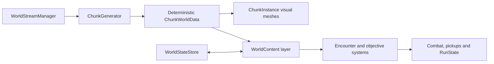
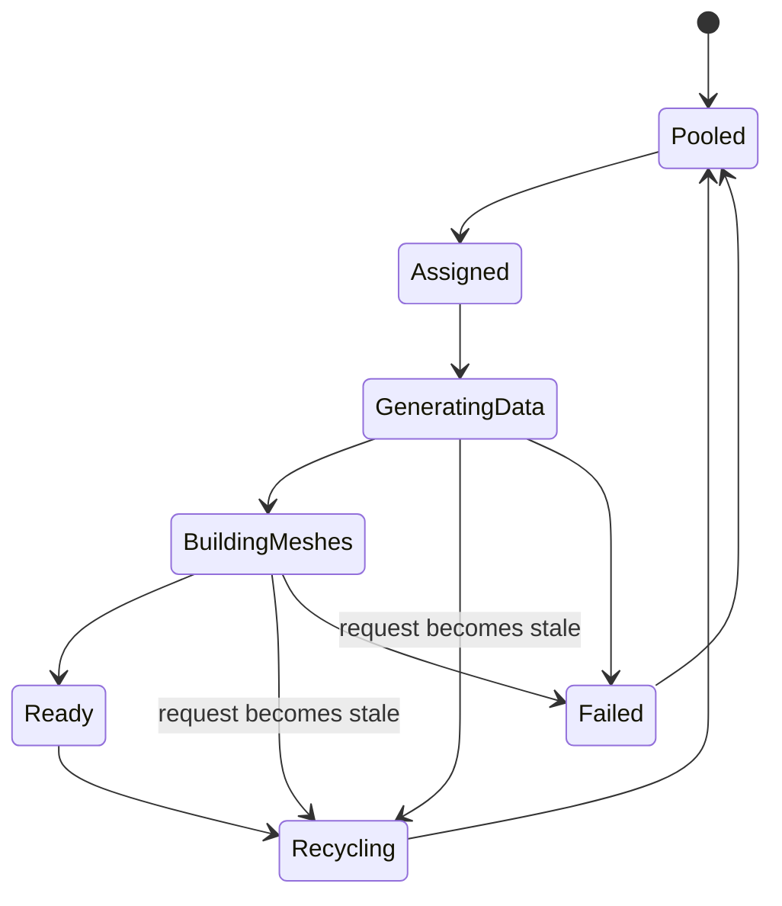
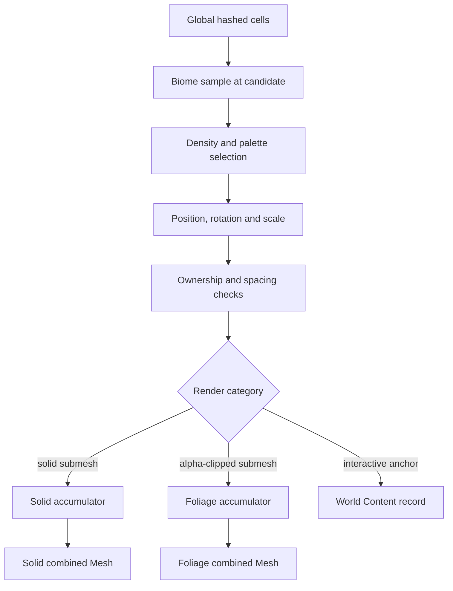

# Zombie War — World Streaming Technical Design

**Authority:** Canonical procedural world, chunk streaming and world-rendering architecture  
**Phase:** EXECUTE — M0–M2B implemented and verified; **M3A profiling gate complete and corrected by M3A.1 — M3 device gate OPEN (no Android device measured)**  
**Updated:** 2026-08-10  
**Gameplay companion:** [`GAME_DESIGN.md`](GAME_DESIGN.md)

> The project now uses a deterministic, chunk-streamed visual world built from regular meshes. This
> document replaces the tiled static-map generator, per-map terrain/NavMesh assumptions and individual
> scenery-renderer strategy. It is an implementation design, not permission to begin implementation
> before `[PHASE: EXECUTE]`.

## 1. Goals

- Present a continuous procedural world with no visible chunk or biome seams.
- Keep gameplay physically flat around `Y = 0`; obtain richness from surface shading and decoration.
- Stream and recycle `32 m × 32 m` chunks around a moving target.
- Hold ordinary chunk rendering to approximately three renderers: ground, solid decoration, foliage.
- Generate the same result for the same world seed and global coordinate on every recycle.
- Separate deterministic scenery data from interactive gameplay entities and persistence.
- Make generation, recycling and performance observable in a dedicated lab scene.
- Leave deliberate upgrade paths for MeshData, Jobs/Burst, LOD and GPU-driven rendering without making
  them MVP dependencies.

## 2. Non-goals

- Unity Terrain.
- Physical hills, caves, cliffs or gameplay elevation in MVP.
- A collider or NavMesh surface per visual chunk.
- One GameObject/MeshRenderer per plant, rock or tree.
- A single giant world mesh.
- Runtime `Instantiate`/`Destroy` during normal traversal.
- GPU instancing, compute shaders, Entities Graphics, Jobs or Burst for the first proof.
- Persistent destruction of ordinary scenery.
- Integrating combat into `WorldStreamingLab`.
- Automatically supporting every imported vegetation prefab and material.

## 3. Verified project baseline and conflicts

### Runtime and scene facts

- Project: Unity `6000.3.10f1`, URP `17.3.0`, Android/portrait direction.
- Current flow loads `Map_Level1`–`Map_Level5` additively from `GameFlow`.
- A representative map contains 121 ground objects, 40 boundary objects and 173 prop objects, plus a
  baked NavMesh, 12 spawn points and wave/spawn systems.
- `DesertMapGeneratorWindow` is editor-only and generates a bounded 50 m arena from 5 m tiles. It
  instantiates individual props, marks them static, relies on static batching/occlusion and bakes
  navigation.
- Current `ZombieSpawner` uses a camera-relative 12–22 m ring, NavMesh sampling, clearance/path tests
  and pooled enemy instances.
- `RunState` and run closure already separate run data from a specific map scene.
- Existing `NoiseTextureSampler` uses texture sampling for recoil/shake; it is not a world generator.

### Assumptions explicitly replaced

| Old assumption | New authority |
|---|---|
| Five scene-authored maps define world progression | one gameplay scene + data-driven expedition profile |
| Tiles/props are individual static GameObjects | three combined outputs per visual chunk |
| Static batching solves scenery draw calls | deterministic CPU mesh baking solves MVP renderer count |
| Each map has a baked NavMesh and boundaries | one flat active gameplay surface; navigation is an integration layer |
| Local seeded scatter is enough | seed + global integer cell coordinates are mandatory |
| Per-map material/ground identity | continuous global biome weights shared by surface and decoration |

## 4. Technical constraints

- Initial chunk size: `32 m`.
- Initial render radius: `2` chunks, producing a `5 × 5 = 25` chunk ring.
- Normal renderers per chunk: at most `3`.
- Initial base renderer submissions: about `25 ground + 25 solid + 25 foliage = 75` before passes,
  shadows and non-world gameplay renderers.
- Target content: approximately `100–200` ordinary decoration placements in a representative chunk.
- Ground is opaque. Solid decoration is opaque. Foliage uses alpha clipping, not alpha blending.
- Ordinary foliage casts no shadows.
- Shared materials only; no material instance per chunk.
- Generation must work for negative coordinates and large logical travel distances.
- All numerical values in `WorldStreamingConfig` are configurable. The starting values are test
  hypotheses, not permanent constants.

## 5. Scene architecture

### Feature-test scene — `WorldStreamingLab`

```text
WorldStreamingLab
├── StreamingWorld
│   ├── WorldStreamManager
│   ├── ChunkPool
│   └── SharedGameplaySurface
├── PlayerProbe
│   └── Sphere
├── Main Camera
├── Lighting
└── Debug
    ├── WorldStreamingDebugView
    └── MetricsPanel
```

`PlayerProbe` is a sphere and the only streaming target. It can be moved through the world by a simple
lab control. The lab contains no player controller, enemies, economy, wave director or production HUD.

### Later production scene

```text
Bootstrap
└── GameplayWorld (additive)
    ├── StreamingWorld
    ├── SharedGameplaySurface
    ├── Player / Camera / HUD
    ├── WorldContentDirector
    ├── EncounterDirector
    └── RunSystems
```

`GameplayWorld` replaces `Map_Level1`–`Map_Level5` as the normal runtime map scene. Expedition contract
data selects seed policy, biome/content palette, threat table, boss and reward profile.

## 6. Architectural boundary



- Streaming owns required coordinates, chunk leases, visual generation and recycling.
- Generation owns deterministic biome samples, decoration transforms and content anchors.
- World Content interprets anchors and expedition data.
- Gameplay owns interactive entities, combat state, loot, completion and run closure.
- Persistence stores stable IDs and states, never a pooled `ChunkInstance` reference.

`ChunkGenerator` must not know how combat works. Combat must not know which pooled chunk currently
renders a world coordinate.

## 7. Proposed systems and responsibilities

Names follow the project's existing `ZombieWar` runtime naming style; final namespaces and folders are
chosen during execution after impact analysis.

| System | Responsibility |
|---|---|
| `WorldStreamingConfig` | ScriptableObject containing chunk size, radii, mesh/detail budgets and profiling toggles |
| `WorldSeed` | immutable 64-bit run/world seed and seed-salt helpers |
| `ChunkCoord` | integer `(x,z)` identity, correct floor conversion and neighbor operations |
| `LogicalWorldPosition` | chunk coordinate plus local offset; avoids long-distance float precision loss |
| `WorldStreamManager` | computes required set, prioritizes requests, shifts origin and owns lifecycle |
| `ChunkPool` | prewarms, leases and returns `ChunkInstance` objects; never generates content |
| `ChunkInstance` | exactly three normal render slots plus metadata and reusable Mesh objects |
| `ChunkGenerator` | coordinates biome, ground and decoration data for one immutable request |
| `BiomeSampler` | samples continuous global fields and produces normalized biome/surface weights |
| `GroundMeshBuilder` | builds flat surface vertices, indices, UVs and biome vertex colors |
| `DecorationSampler` | creates deterministic candidate transforms from global hashed cells |
| `DecorationMeshBuilder` | routes source submeshes and appends solid/foliage combined geometry |
| `DecorationPalette` | approved source entries, density rules, biome weights, atlas rect and render category |
| `DecorationMeshSource` | project-owned readable cached vertex/index data from an approved vendor mesh |
| `WorldContentAnchorGenerator` | emits stable POI/interactive anchor records; does not instantiate gameplay |
| `WorldOriginService` | maps logical coordinates to bounded physical coordinates and announces rebases |
| `WorldStreamingDebugView` | borders, labels, lifecycle, counts, timings and deterministic inspection |

## 8. World coordinate model

Logical space is authoritative. Unity `Transform.position` is a temporary physical representation.

```text
logical position = ChunkCoord × chunkSize + local position in chunk
physical position = logical position - logicalOriginOffset
```

- `ChunkCoord` uses signed integers. `floor(position / chunkSize)` is required; C# truncation toward zero
  is invalid for negative positions.
- Local coordinates use `[0, chunkSize)` on X/Z.
- Hashes use integer chunk/cell coordinates, not float bit patterns.
- Noise samples use logical world coordinates, not chunk-local UVs.
- The shader receives a shared logical-origin offset so world-space detail remains fixed after rebasing.

### Floating origin

The target stays within a small physical region. At a configurable threshold — initially a chunk
boundary or several chunks — `WorldOriginService` shifts active runtime entities by an exact chunk-size
multiple and updates the logical origin. Chunk identity, seed, content IDs and noise input do not change.

This makes the world logically unbounded while keeping float precision, the shared collider and future
navigation bubble bounded. Rebase behavior is tested separately before gameplay integration.

## 9. Chunk coordinate and ownership rules

The owner of any deterministic object is the chunk containing its anchor/origin:

```text
owner = floor(anchorLogicalPosition / chunkSize)
```

A canopy, rock or mesh can extend into a neighbor. The neighbor neither duplicates nor owns it.
Samplers may inspect a margin of external cells to guarantee spacing, but only emit candidates whose
anchor owner equals the requested chunk.

Interactive IDs use a stable form such as:

```text
ContentId = Hash64(worldSeed, anchorCellX, anchorCellZ, contentTypeSalt, slot)
```

No stable state is keyed by pool index, GameObject instance ID or generation order.

## 10. Streaming ring

Starting configuration:

```text
chunkSize       = 32 m
renderRadius    = 2
activeDiameter  = 5
activeChunks    = 25
simulationRadius = 1 (later gameplay integration)
```

When the target enters a new `ChunkCoord`:

1. Build the required coordinate set for the 5×5 ring.
2. Retain leases whose coordinates are still required.
3. Return outgoing visual chunks to the pool after content detachment.
4. Prioritize missing coordinates by distance, then movement direction.
5. Lease pooled chunks and issue immutable generation requests.
6. Enable each chunk only after all required visual outputs and metadata are valid.

The render ring is larger than the future gameplay/simulation ring. Outer chunks hide generation and
recycling while nearby interactive content remains bounded.

Teleporting is supported: cancel/stale all irrelevant requests, retain any coordinate overlap and
rebuild nearest-first. The system must never assume movement crosses only one chunk per frame.

## 11. Chunk lifecycle and pooling



Lifecycle requirements:

- Prewarm at least 25 `ChunkInstance` objects, plus an optional small spare count if profiling supports it.
- Each assignment increments a generation/version token.
- Any later asynchronous result must match both coordinate and token before apply.
- Renderers are disabled before reassignment and enabled atomically after mesh/material/bounds update.
- `Mesh` objects and accumulation buffers are reused.
- No `Destroy`, prefab `Instantiate` or source-mesh readback occurs during steady traversal.
- World Content is notified before a coordinate loses visual coverage; it detaches/migrates gameplay
  state independently of pool return.

## 12. `ChunkInstance` hierarchy and renderer policy

```text
ChunkRoot
├── GroundMeshRenderer
├── SolidDecorMeshRenderer
└── FoliageMeshRenderer
```

Each child has one `MeshFilter` and one `MeshRenderer`. Empty outputs disable their renderer but do not
create or destroy an object. Debug labels and gizmos are owned by the lab/debug system and do not count
as normal production renderers.

Ground, solid and foliage remain separate because render state differs. They are not merged into a
single mesh, and they are not fragmented by species or biome unless later profiling proves a necessary
exception.

## 13. Shared gameplay surface

Visual ground chunks have no colliders. MVP uses one stationary physical gameplay plane centered on the
active world bubble:

- one `BoxCollider` or equivalent flat collider;
- top surface at `Y = 0`;
- initial footprint approximately `192–256 m` square, configurable and larger than render/spawn needs;
- sufficient thickness to avoid fast-motion tunnelling;
- excluded from visual rendering if a separate mesh is unnecessary.

“One collider for the whole map” means one collider for the bounded physical simulation bubble; logical
world space continues through origin rebasing. This avoids per-chunk collider cooking and seams.

### Navigation boundary

Current enemies depend on baked NavMesh assumptions. Streaming does not absorb that responsibility.

- `WorldStreamingLab` has no NavMesh or enemies.
- Ordinary scenery never blocks navigation in MVP.
- Production integration introduces an `IPlanarNavigation` boundary around spawn/movement validation.
- The first combat slice may use one flat navigation surface covering the bounded physical bubble, with
  agents safely warped/rebound during origin shift, or direct planar steering if that proves simpler.
- Dynamic per-chunk NavMesh building is not an implicit requirement and must be separately prototyped if
  gameplay blockers later demand it.

No interactive blocking trees enter the first combat slice until this risk is closed.

## 14. Ground mesh generation

Starting topology per chunk:

- size: `32 × 32 m`;
- grid resolution: `17 × 17` vertices (`289` vertices, `512` triangles);
- all positions at `Y = 0`;
- normals `(0,1,0)` and standard tangent;
- UV0 preserves repeatable surface mapping;
- vertex color RGBA stores four normalized surface/biome weights;
- one submesh, one shared opaque material.

The subdivisions exist for smooth biome-weight interpolation, not geometry height. Topology and indices
are identical across chunks and may be cached. Only logical sampling results and position metadata vary.

No shader vertex displacement may move the rendered surface enough to disagree with gameplay. Tiny
normal/parallax/color detail is allowed; silhouette-changing displacement is not.

## 15. Global noise strategy

### Field hierarchy

```text
logical world XZ
    ↓
macro region field (~256 m scale)
    ↓
temperature / moisture / fertility / rockiness fields (~64–160 m)
    ↓
normalized biome/surface weights
    ↓
shader-only detail breakup (~1–16 m)
```

Scales are tunable starting assumptions. Each field uses a distinct seed salt and continuous global
coordinates. Mild domain warping may reduce obvious Perlin bands, but every added octave must justify
CPU cost and debugging complexity.

### CPU versus shader responsibility

- CPU `BiomeSampler` is the authority for content and surface weights.
- Ground vertices store those weights, so shader and decoration use the same sampled field.
- Shader textures add visual detail inside the weights; they do not decide gameplay biome identity.
- This avoids trying to maintain bit-identical CPU C# and HLSL Perlin implementations.

Chunk edges sample the same global coordinates. Adjacent border vertices must produce identical weights
within a fixed epsilon.

## 16. Biome field and palette

`BiomeSampler` outputs continuous weights rather than one enum. A starting four-channel surface set is:

| Channel | Surface/visual role | Main field influence |
|---|---|---|
| R | dry dirt | low moisture / baseline |
| G | grass/overgrowth | moisture × fertility |
| B | sand/scrub | dryness and macro region |
| A | rock/gravel | rockiness / visual-elevation field |

Weights are shaped with smooth thresholds and normalized to sum to one. The same sample feeds
`DecorationPalette` weights: high grass weight increases cheap grass candidates; rock weight increases
solid rocks and reduces dense foliage; dry weight selects sparse shrubs.

The visual-elevation field is a material/decor input only. It does not change vertex Y.

## 17. Ground shader architecture

Create a project-owned URP mesh-plane shader during execution. Requirements:

- opaque and SRP Batcher compatible;
- four atlas/texture-array surface layers selected by vertex weights;
- world/logical-space UVs so patterns remain continuous across chunks and origin shifts;
- one or two curated grayscale noise samples for macro/detail breakup;
- optional normal/AO inputs only when the mobile cost is measured;
- shared global origin/seed parameters, no per-chunk material instances;
- Forward, ShadowCaster and Depth-compatible passes as required by the current URP pipeline;
- predictable texture sample count exposed in the profiler/debug material variant.

The imported `StylizedToonWorldKit/Environment/Terrain` shader is useful reference code for mesh terrain,
toon lighting and world-space treatment. Its current slope/height layer selection is unsuitable for a
flat `Y = 0` plane, so it is not adopted unchanged.

## 18. Deterministic hashing

Generation must not use `UnityEngine.Random`, shared `System.Random` state or evaluation-order-dependent
randomness. Use a documented integer hash with explicit salts.

```text
h = Hash(worldSeed, globalCellX, globalCellZ, categorySalt, candidateIndex)
probability = ToUnitFloat(h0)
jitterX     = ToSignedUnit(h1)
jitterZ     = ToSignedUnit(h2)
rotation    = ToUnitFloat(h3) × 360°
scale       = Lerp(minScale, maxScale, ToUnitFloat(h4))
```

Adding a new decoration category must not reorder or change existing categories. Every category owns a
stable salt. Hash and float-conversion behavior require golden-value tests.

## 19. Spatial distribution

MVP uses a deterministic jittered grid because it is simple, cheap and inspectable. Approximate starting
cell scales:

| Category | Cell scale | Additional rule |
|---|---:|---|
| small grass/flowers | 2–3 m | density probability; several cheap meshes per accepted cluster allowed |
| bush/fern | 6–8 m | biome weighted |
| rock/log/bone | 8–12 m | solid budget weighted |
| scenery tree | 12–20 m | local priority rejection for spacing |
| gameplay prop anchor | 32–64 m | emitted as content anchor, never baked scenery |
| POI anchor | 64 m+ | separate conflict/spacing rule and contract filtering |

For large props, a candidate survives only if its hash priority beats every competing candidate inside
the spacing radius, including other candidate lanes from the same global cell. Equal hash priorities use
the stable `(cellZ, cellX, candidateIndex)` order as the final tie-break. This produces a blue-noise-like
result without storing or sampling a global blue-noise texture. Exact Poisson-disc generation is
unnecessary for MVP.

Sampling always examines enough neighboring cells for boundary consistency, then applies the owner rule.

## 20. Decoration generation pipeline



Ordinary placements are data records during generation, not GameObjects. Palette selection is weighted
by biome channels and bounded by per-category density/vertex budgets.

If a source prefab contains trunk and leaves as separate material submeshes, the trunk routes to solid
and leaves route to foliage. The tree remains one deterministic placement even though its geometry is
written into two outputs.

## 21. Combined mesh builder

For each accepted source submesh:

1. Obtain cached source vertices, normals, tangents, UVs, colors and indices.
2. Build its candidate transform.
3. Transform positions into chunk-local coordinates.
4. Transform normals correctly; avoid non-uniform scale unless the normal transform is handled.
5. Preserve tangent handedness when tangents are needed.
6. Remap UVs into the target atlas rectangle.
7. Combine source vertex color with approved biome tint/wind data encoding.
8. Offset and append indices to the correct accumulator.
9. Update explicit bounds, including wind sway padding for foliage.
10. Apply the completed arrays to the reusable output Mesh.

### Index and overflow policy

- Prefer UInt16 output and keep each combined mesh below **60,000 vertices** for safety margin.
- If a budget would be exceeded, deterministically retain candidates by authored
  `DecorationPaletteEntry.BudgetPriority` first, hash priority second, then the stable placement order.
  This makes the exposed design control authoritative while keeping equal-priority results deterministic.
- UInt32 is allowed as a diagnostic/prototype fallback, never as a silent overflow fix.
- Do not add a fourth/fifth renderer just to hide uncontrolled authoring cost.

### Missing attributes

- Preserve imported normals/UVs whenever valid.
- Precompute missing normals/tangents in editor preprocessing, not on every recycle.
- Foliage shader should avoid tangent data if it does not use normal mapping; this reduces memory.
- Source bounds and output wind padding are validated in asset preprocessing.

## 22. Allocation and mesh reuse

MVP can use managed reusable buffers if it meets profiling gates:

- cache source mesh arrays once;
- reuse `List<T>`/arrays with pre-sized capacities;
- reuse three Mesh objects per pooled chunk;
- call `Mesh.Clear(false)` and refill without per-prop allocations;
- avoid LINQ, iterator allocations and temporary GameObjects in hot generation;
- apply at most a configurable number of chunk builds per frame, initially one;
- expose generation data time and Mesh apply time separately.

`MeshData`/`NativeArray` is a future optimization path. The architecture separates sampling, accumulation
and apply so it can be introduced without changing world/content contracts.

## 23. Solid and foliage rendering

### Solid output

- rocks, trunks, logs, bones and opaque scenery;
- one project-owned atlas material and one submesh;
- shared material, no per-chunk clone;
- shadow casting is configurable by distance/profile, starting with nearby chunks only if necessary;
- no collider unless the item is promoted to an independent gameplay entity.

### Foliage output

- grass, bushes, leaves, flowers and small vegetation;
- one alpha-clipped atlas material and one submesh;
- transparent blending is prohibited for ordinary foliage;
- shadow casting off for MVP;
- vertex color/UV channels carry palette tint and wind phase where required;
- receive shadows only if the target-device profile supports it.

## 24. Materials and atlas strategy

Normal operation uses exactly three shared materials across all chunks:

1. ground surface material;
2. opaque solid atlas material;
3. alpha-clipped foliage atlas material.

Vendor materials are references, not runtime authority. Execution requires a curated, project-owned
atlas pipeline:

- approve a small source-mesh palette;
- pack compatible base textures and any necessary masks;
- store atlas rect and category per source submesh;
- add padding/dilation to prevent mip bleeding;
- preserve texel density within an acceptable range;
- validate alpha clip at target resolution;
- avoid creating material instances for biome variation.

The existing vegetation `M_Plant_Atlas` is a useful starting source for small plants, but it is not a
complete atlas for the pack. Trees use trunk plus multiple separate leaf materials, so they require
explicit routing and atlas preparation.

## 25. Vegetation pack analysis

Primary prototype pack:
`Assets/Vegetation_Stylized_Pack_ByLuxArtStudios`

### Verified contents

- 34 prefabs: 10 trees and 24 smaller vegetation assets.
- Representative visual groups include trees A–J, four bushes, four ferns, cattails, clovers, flowers
  and several grass meshes/patches.
- Trees use `LODGroup`, capsule colliders and three renderer/mesh levels. Each tree mesh has two
  submeshes: trunk and leaves.
- Small foliage generally uses one renderer and no collider; some LODGroups contain only a rendered
  first level followed by culling.
- The visual style is strongly saturated and stylized. Silhouettes fit the project, but colors/materials
  must be normalized against enemy telegraphs and the toon lighting palette.

### Measured mesh costs

| Sample | Approximate cost | Decision |
|---|---:|---|
| grass variants | 230–414 vertices, 170–378 triangles | suitable for high-density palette |
| Bush A | 1,863 vertices, 1,656 triangles | use at low/medium density |
| clovers | about 2,310 vertices, 3,300 triangles | not a high-density default |
| Flower A | 7,869 vertices, 9,929 triangles | blacklist from ordinary dense MVP foliage |
| several Flower C/D variants | about 6,290 vertices, 9,622 triangles | blacklist from ordinary dense MVP foliage |
| Tree A LOD0 | 4,404 vertices, 2,200 triangles | rare scenery only |
| Tree A LOD2 | 3,587 vertices, 1,791 triangles | reduction is too small to solve mass-tree cost |

All inspected source meshes had `isReadable = false`. Runtime combination cannot assume vendor FBX mesh
data is CPU-readable. The approved execution strategy is editor preprocessing into project-owned
`DecorationMeshSource` data/readable mesh assets. Do not globally mutate every vendor importer and do
not discover unreadable meshes during traversal.

### Initial curation decision

- High density: cheap grass variants and the lowest-cost small flora.
- Medium/low density: selected ferns, bushes and cheap flowers.
- Very low density: trees.
- Excluded until optimized: extremely dense flower/clover sources and any asset failing atlas/readability
  validation.
- Vendor colliders and per-prefab LODGroups are not copied into baked scenery.

## 26. PBR/terrain asset analysis

Primary inspected source: `Assets/Cartoon_Texture_Pack`.

- Dirt: one full PBR set.
- Grass: 30 material/base-color variants, with 26 corresponding normal/height/AO sets.
- Rocks: seven material/base-color variants, five full map sets.
- Sand: four full PBR sets.
- Existing vendor materials use Built-in `Standard`, not the current URP pipeline.
- Representative dirt, sand, grass and cliff textures visually fit a stylized surface, although large
  directional cliff patterns are poor default flat-ground tiles.

Decision: reuse selected textures as sources only. Create project-owned URP materials/shader bindings,
choose a small coherent subset and verify tiling/value contrast in `WorldStreamingLab`. Do not import
the vendor material graph as architecture and do not adopt Unity Terrain.

## 27. Noise package analysis

`Assets/_Project/Art/Textures/Noise` contains 265 baked PNGs across Perlin, Voronoi, turbulence, cracks,
grain, marble and other Substance-style families.

Decision:

- mathematical integer hash plus continuous value/gradient noise defines world structure;
- no runtime Substance dependency;
- no CPU biome generation from a giant texture library;
- curate only 2–4 linear grayscale repeatable textures for shader micro/macro breakup;
- data noise textures use sRGB off, repeat wrap, bilinear/trilinear filtering and mipmaps as appropriate;
- hashed jitter/priority rejection provides blue-noise-like placement; no suitable true blue-noise asset
  was identified during inspection.

The existing library is visual source material, not a reason to make biome determinism texture-dependent.

## 28. Interactive object boundary

### Scenery tree/prop

- no gameplay collider;
- no health, loot or independent state;
- cannot be chopped/destroyed;
- geometry is baked into solid/foliage output;
- regenerated solely from seed and coordinates.

### Gameplay tree/prop

- blocks movement, receives damage, contains loot or participates in an objective;
- exists as an independent pooled entity;
- starts at **0–3 per nearby chunk** and zero in the first integration slice;
- has a stable `ContentId` and state owned by World Content/Persistence;
- may visually overlap chunks but remains anchored to one logical owner.

Promotion from scenery to gameplay is an explicit palette/content change. A source prefab is never made
interactive merely because it originally includes a collider.

## 29. Persistence implications

| Data | Persistence rule |
|---|---|
| ground/biome/ordinary decoration | regenerate; never save |
| chunk pool assignment and physical transform | transient; never save |
| current run objectives and opened POIs | run-session store keyed by stable `ContentId` |
| destroyed/looted gameplay prop | separate world/run state record, never the visual chunk |
| enemies in nearby simulation | owned by encounter/gameplay manager; pooled independently |
| meta unlocks/currencies/contracts | existing profile authority, migrated deliberately |

MVP does not promise a permanently altered world between app sessions. Cross-session world persistence
is post-MVP; the stable ID scheme prevents a later dead end.

## 30. Debug visualization

Debugging is a product requirement for the lab. It must expose:

- chunk borders and logical `(x,z)` labels;
- target current chunk and active 5×5 ring;
- physical versus logical origin and rebase events;
- lifecycle state, pool slot and generation token;
- ownership anchor for sampled props crossing borders;
- biome raw fields, normalized weights and dominant display color;
- candidate, accepted and budget-rejected decoration counts;
- ground/solid/foliage vertex and triangle counts;
- renderer count, material identity and UInt16/UInt32 state;
- data generation, mesh build and apply times;
- allocations/GC and recycle counter;
- stale/cancelled/failed request reason.

Views must be switchable because labels themselves can distort performance. Performance captures run with
debug rendering disabled while metrics collection remains available.

## 31. Initial performance budgets

These are acceptance targets for the prototype, not claims of achieved performance.

| Metric | Starting target |
|---|---:|
| chunk size / active chunks | 32 m / 25 |
| normal renderers per chunk | ≤3 |
| base world renderer submissions | ≈75 |
| placements per representative chunk | 100–200 |
| ground vertices | 289 |
| foliage vertices per chunk | target ≤45,000; hard deterministic budget |
| solid vertices per chunk | target ≤15,000; hard deterministic budget |
| preferred index format | UInt16, ≤60,000 vertices per output |
| steady traversal Instantiate/Destroy | 0 |
| steady traversal managed GC | 0 B/frame target after warmup |
| one chunk generation + apply | p95 ≤4 ms on named reference device; otherwise time-slice/optimize |
| active generated mesh memory | provisional target ≤64 MB; measure actual vertex layouts |
| frame target | 60 fps target; CPU and GPU each aim below 13 ms for headroom |

Actual Batches, SetPass calls and draw cost must be read from Unity Profiler/Frame Debugger. “Three
renderers” is not equivalent to “three GPU draws” when passes and shadows are enabled.

## 32. Profiling protocol

Profile a development build on a named target Android device plus Editor diagnostics:

1. Warm the 25-chunk pool.
2. Move the probe at normal speed across at least 100 chunk transitions.
3. Repeat at accelerated speed and with large teleports.
4. Run a 10-minute directional/diagonal soak.
5. Capture CPU Timeline, GPU time, Rendering counters, Memory and GC.
6. Record batches, SetPass, vertices, triangles, generation stages and worst recycle spike.
7. Compare debug-on and debug-off only to identify tooling overhead; judge production profile debug-off.
8. Save seed, config, device, build type and capture date with results.

No performance success may be declared from renderer arithmetic or Editor frame rate alone.

## 33. Failure cases and required behavior

| Failure | Required response |
|---|---|
| negative-coordinate seam | test fails; do not patch with epsilon offsets |
| stale generation completes after recycle | discard by coordinate + generation token |
| source mesh unreadable | preprocessing validation error with asset path; do not fail mid-traversal |
| vertex budget exceeded | deterministic candidate trim/cheaper source; log budget reason |
| missing atlas/material route | exclude palette entry and report validation error |
| empty category | disable its existing renderer; keep hierarchy stable |
| target teleports beyond ring | rebuild nearest-first, no assumption of adjacent movement |
| generation cannot finish before visible | keep prior/placeholder hidden state and expose metric; never show wrong coordinate |
| floating-origin rebase | shift registered physical entities exactly once; logical IDs/noise unchanged |
| pooled visual chunk unloads under active objective | World Content retains/migrates gameplay entity state independently |
| shader/CPU biome disagreement | vertex weights remain authority; shader may add only visual detail |

## 34. Testing strategy

### EditMode tests

- `ChunkCoord` conversion around zero and negative boundaries.
- Same seed/coordinate/config produces identical hashes, biome weights, placements and content IDs.
- Generation order and pool slot do not change results.
- Adjacent border biome samples match within tolerance.
- Ownership produces no duplicate anchors across neighboring chunk requests.
- Spacing priority is stable at chunk borders.
- Mesh builder preserves indices, normals, UVs, bounds and category routing.
- Atlas validation catches missing/invalid source entries.
- Vertex budgets and deterministic rejection are stable.
- Golden hash values protect save/world compatibility.
- Project-generated decoration geometry is reproducible from its seed, varies with the seed, stays inside
  its atlas slot, and does not exceed the vendor footprint it replaces (M3B.1).
- Checkpoint placement counts and foliage vertex cost are pinned, so a geometry change cannot silently
  move plants or quietly reintroduce the expensive vendor meshes (M3B.1).
- Scheduler ordering (nearest-first, stable tie-break), count-budget enforcement, generation-ticket
  rejection of stale jobs, queue replacement, bounded queue capacity, and invalid-budget validation (M3B.2).
- Distance-density validation, Chebyshev tier classification, 9/16 split, deterministic and order-independent
  selection, nested subsets across thresholds, shared placements keeping every transform property, negative
  and large coordinates, seed independence, solid and non-eligible content untouched, and the eligible
  subset following the configured threshold (M3B.2D).

### PlayMode/lab tests

- Initial 5×5 ring contains exactly the required coordinates.
- Cross boundaries in all eight directions and diagonally.
- Teleport across many chunks and recover nearest-first.
- Recycle repeatedly without `Instantiate`/`Destroy` or renderer leakage.
- Move through an origin rebase without visible jump or changed deterministic output.
- Toggle seed and verify changed world; restore seed and verify exact restoration.
- Verify renderer/material count and no per-chunk material instances.
- Verify the shared collider supports the probe over the full physical bubble.
- Foliage vertex cost at the checkpoint stays below the M3A.2 baseline while placement count, solid
  geometry and renderer architecture stay identical, and survives leaving and returning (M3B.1).
- Teleport yields 25 correct ground chunks immediately with no stale decoration visible; one job per frame
  completes exactly one; nearest chunks finish first; an uninterrupted teleport settles within the ring
  bound; rapid teleports cancel stale work without applying it; the settled world is byte-identical
  regardless of scheduling order (M3B.2).
- Settled ring is 9 near / 16 outer with no tier mismatch; retained chunks rebuild on Near→Outer and
  Outer→Near; crossing the boundary and returning restores identical content; a retained chunk cannot apply
  a result built for its previous tier; settled state stays false while a tier correction is pending and
  cannot be faked by clearing the queue; reversed routes finish identically (M3B.2D).

### Visual tests

- Ground color/material blend has no seam at chunk boundaries.
- Decoration ownership does not create duplicate boundary props.
- Alpha clip, atlas padding, wind bounds and tint remain correct at camera distance.
- Enemy/POI readability is later checked against vegetation value/saturation before production lock.

## 35. `WorldStreamingLab` specification

### Controls

- keyboard/gamepad or editor-friendly input moves the sphere on X/Z;
- configurable normal and accelerated speed;
- buttons/commands for teleport, seed change, regenerate, pause queue and step one chunk;
- camera can follow or frame the active ring.

### Lab phases

1. **M0 — streaming skeleton:** shared flat surface, 25 prewarmed chunk roots, logical coordinates,
   border labels, recycle and teleport. Ground may be a diagnostic color.
2. **M1 — deterministic ground/biomes:** flat generated mesh, border-equal weights, shared shader and
   origin handling.
3. **M2 — decoration baking:** curated palette, source cache, 100–200 placements, solid/foliage outputs.
4. **M3 — profiling gate:** soak tests, memory plateau, budget data and optimization decision.

No gameplay scene integration begins until M3 evidence is recorded.

### Lab acceptance gate

- same seed/config/coordinate reproduces the same world after recycle and restart;
- 5×5 ring remains correct across 100+ transitions and teleports;
- no visible ground/biome seam;
- representative chunk reaches 100–200 placements with no more than three normal renderers;
- no steady traversal `Instantiate`/`Destroy` and no managed GC after warmup target;
- renderer, vertex, memory and generation budgets are measured on the reference device;
- no temporary preview scene/object changes contaminate production scenes.

## 36. LOD strategy

MVP does not preserve vendor per-prop `LODGroup` components because props cease to be GameObjects.

Starting policy:

- curate low-cost source meshes;
- keep trees rare;
- disable foliage shadows;
- use the 5×5 render ring as the first distance bound;
- optionally lower candidate density for outer chunks only after checking transition visibility.

If vertex/GPU cost fails, add chunk-level alternate combined outputs in this order:

1. deterministic outer-ring density reduction/culling for small foliage;
2. editor-produced cheaper source mesh palette;
3. near/far combined mesh variants swapped without adding persistent renderer categories;
4. impostors/billboards only if visual and memory evidence supports them.

The imported tree LODs provide only mild reduction in inspected samples, so they are not treated as a
complete solution.

## 37. GPU instancing reconsideration criteria

GPU instancing is not an MVP requirement. Reconsider it only when profiling demonstrates at least one
of the following after atlas/mesh-budget work:

- duplicated combined-mesh vertex memory exceeds the active-world budget;
- chunk regeneration/apply cost remains above p95 budget because repeated source geometry dominates;
- the approved palette contains many identical meshes and draw submission can remain bounded through a
  controlled indirect/instanced path;
- mobile GPU vertex bandwidth is a stronger bottleneck than CPU submission and material state.

Any instanced alternative must preserve deterministic placement, chunk/content ownership, visibility
control and debugging. It must be benchmarked against the combined-mesh baseline, not adopted by name.

## 38. Jobs/Burst/MeshData reconsideration criteria

First optimize data, source cost, budgets, buffer reuse and work scheduling. Reconsider Jobs/Burst when:

- managed sampling/transform work keeps chunk generation above p95 `4 ms` on the target device;
- movement causes measurable main-thread spikes after one-chunk-per-frame scheduling;
- GC remains non-zero after buffer reuse;
- profiling shows work is parallelizable and Mesh apply is not the dominant cost.

`Mesh.AllocateWritableMeshData`/`Mesh.ApplyAndDisposeWritableMeshData` is a likely later path because the
design already separates generation data from main-thread presentation. Do not combine a Jobs rewrite,
atlas rewrite and gameplay integration into one milestone.

## 39. Future extensibility

The architecture can add without rewriting streaming:

- biome profiles and palette entries;
- POI templates, structures and rare events;
- enemy encounter tables and bosses;
- resource gradients and contract modifiers;
- stable interactive-state storage;
- chunk-level LOD variants;
- asynchronous generation and work cancellation;
- alternative render backends behind the same deterministic placement data.

Gameplay terrain height, caves, roads spanning chunks and dense blockers are structural expansions. They
require explicit new designs for collision, navigation, ownership and visibility; they are not “just
another noise channel.”

## 40. Integration path into gameplay

After `WorldStreamingLab` passes:

1. Create one production `GameplayWorld` scene; do not retrofit all five legacy map scenes.
2. Connect existing bootstrap/run flow to an expedition contract and the shared gameplay scene.
3. Spawn the current player on the shared flat surface and validate camera/targeting.
4. Add an AI navigation adapter and prove one walker composition in the bounded simulation ring.
5. Add pooled spawn/encounter ownership independent of visual chunks.
6. Add one deterministic POI anchor and ensure recycling cannot reset or duplicate it.
7. Prove run closure and payout once through extraction.
8. Add the optional boss route.
9. Only then migrate campaign IDs/UI from map selection to contract selection.
10. Keep legacy maps available as reference until parity checks finish, but remove them from normal flow.

## 41. First execution milestone recommendation

When `[PHASE: EXECUTE]` is explicitly opened, implement only **WorldStreamingLab M0** first:

- `32 m` coordinate conversion including negatives;
- one shared flat collider/surface;
- 25 prewarmed three-renderer chunk roots;
- 5×5 required-set calculation and deterministic lease/recycle behavior;
- movable sphere, borders, labels, teleport and recycle metrics;
- no vegetation, biome shader, gameplay or asynchronous optimization yet.

M0 is complete when 100+ transitions and large teleports keep the correct ring with no normal traversal
`Instantiate`/`Destroy`. This isolates the highest architectural risk before asset baking or shader work.

### M0 implementation evidence — 2026-08-09

**Scene:** `Assets/_Project/Scenes/WorldStreamingLab.unity` (isolated; not in build settings, no production
scene touched).

**Created systems** — `Assets/_Project/Scripts/Runtime/World/Streaming/`, namespace `ZombieWar.WorldStreaming`:

| File | Role |
|---|---|
| `ChunkCoord.cs` | value-type logical identity, `Math.Floor` conversion, stable ring enumeration |
| `WorldStreamingConfig.cs` | ScriptableObject; chunk size, radius, pool spare, surface, startup validation |
| `ChunkInstance.cs` | pool slot; Ground/SolidDecor/Foliage render slots, assign/release, diagnostic colour |
| `ChunkPool.cs` | one-time prewarm, ordered lease/release, lifecycle counters |
| `ChunkDiagnosticAssets.cs` | shared unit quad + shared material + per-coordinate colour |
| `WorldStreamManager.cs` | required set, retain/outgoing/incoming, deterministic lease, immediate refresh |
| `SharedGameplaySurface.cs` | single `BoxCollider`, top at `Y = 0`, recentres on current chunk |
| `WorldStreamingLabController.cs` | lab-only X/Z movement, boost, teleports, reset |
| `WorldStreamingDebugView.cs` | gizmo borders, `Handles` labels, IMGUI metric overlay |
| `WorldStreamingRig.cs` | single build path shared by the scene builder and PlayMode tests |

Scene is generated by `Assets/_Project/Scripts/Editor/World/WorldStreamingLabBuilder.cs`
(menu `ZombieWar/World Streaming/Build Lab Scene`), which also creates
`Assets/_Project/Data/World/WorldStreamingConfig.asset`, `M_ChunkDiagnostic.mat` and `M_LabProbe.mat`.

**Automated tests:** EditMode `WorldStreamingCoordTests` 32/32 passed; PlayMode `WorldStreamingRingTests`
9/9 passed. Full project suites: PlayMode 45/45, EditMode 310/312 (the 2 failures are pre-existing
`WeaponLoadoutGuardTests` cases in unrelated in-flight weapon work).

**100+ transitions:** PASS — 166 chunk-centre changes covering positive travel, reversal through zero into
negative space, both diagonals and one non-adjacent jump to `(312,-487)`. Ring set, lease count 25 and zero
duplicates asserted at every step.

**Large teleports:** PASS — `(64,64)`, `(-96,-50)`, `(-129,160)` and back to `(0,0)`, each reassigning all
25 slots in exactly one refresh, never iterating intermediate chunks.

**Pooling counters after full lab session:** prewarmed 25 · active leases 25 · roots created after warmup 0 ·
roots destroyed during traversal 0 · recycles 162 · pool capacity 25 · scene colliders 1.

**Confirmed deviations from the M0 sketch:**

- Chunk roots are built programmatically rather than from a prefab — fewer assets, and the scene and the
  PlayMode tests share one construction path (`WorldStreamingRig`).
- Chunk root pivot is the chunk minimum corner: `position = coord × chunkSize`.
- The `MetricsPanel` object in §5 was not created; metrics render inside `WorldStreamingDebugView` so debug
  visualisation adds no per-chunk or per-recycle object.
- The shared surface recentres on the current chunk centre during large teleports. It remains exactly one
  collider; no floating-origin service exists yet, as specified for M0.

### M1 implementation evidence — 2026-08-09

**New files**

| Path | Role |
|---|---|
| `Assets/_Project/Scripts/Runtime/World/Streaming/BiomeSampler.cs` | `BiomeSample` + global continuous field |
| `Assets/_Project/Scripts/Runtime/World/Streaming/GroundMeshBuilder.cs` | flat mesh creation + per-coordinate weight refill |
| `Assets/_Project/Art/Shaders/WorldStreamingBiomeDiagnostic.shader` | URP unlit vertex-colour diagnostic shader |
| `Assets/_Project/Scripts/Tests/EditMode/WorldStreamingBiomeTests.cs` | determinism, validity, continuity, topology, seams |
| `Assets/_Project/Scripts/Tests/PlayMode/WorldStreamingGroundTests.cs` | ground ring, Mesh reuse, recycled-data correctness |

Modified: `WorldStreamingConfig` (seed + ground resolution), `ChunkInstance` (owns one reusable Mesh),
`ChunkPool` (ground-Mesh counter, config passthrough), `ChunkDiagnosticAssets` (shared biome material),
`WorldStreamingDebugView` (seed/topology/biome readout, blend↔dominant toggle),
`WorldStreamingLabBuilder` (biome material, robust rebuild when the lab scene is already open).
`WorldStreamManager` and the streaming/pooling algorithm were **not** changed.

**Seed:** one `int worldSeed` on `WorldStreamingConfig` (default `20260809`). No `UnityEngine.Random`, no
shared `System.Random`; every value comes from an integer avalanche hash with a per-field salt.

**Biome fields:** macro region (256 m), moisture (160/44 m), fertility (96/27 m), rockiness (112/31 m) —
two-octave value noise with smootherstep interpolation on a *global* integer lattice, never restarted per
chunk. Four non-negative affinities are shaped with smoothstep and divided by their sum, so R+G+B+A = 1
exactly and each channel stays in `[0,1]`. Dry dirt keeps a `0.30` floor so the sum is never zero.

**Ground topology:** 17×17 = 289 vertices, 512 triangles, 1536 indices, 1 submesh, all `Y = 0`, upward
normals, chunk-local UV0 in `[0,1]`, RGBA vertex colour = biome weights, bounds exactly 32×32 m from the
chunk minimum corner. No tangents (the M1 shader needs none). No gaps: the mesh covers the full chunk and
borders are shown by Gizmos only.

**Seam rule:** vertex sample positions are computed as `(chunkAxis × cells + index) × step` — the integer
part is evaluated first, so the right edge of chunk `x` and the left edge of chunk `x+1` resolve to the
*same* integer and therefore a bit-identical float. Seam tests pass at tolerance `1e-6` across +X/−X,
+Z/−Z, negative-to-negative, zero-crossing and large coordinates (10 pairs × 17 vertices).

**Mesh lifecycle:** exactly 25 ground `Mesh` objects created at prewarm, one per pool slot. Recycling
rewrites only the colour array. Ground meshes created after warmup: **0** across cardinal, diagonal,
teleport and a 151-transition soak; the same 25 `Mesh` references survive throughout.

**Tests:** M1 EditMode 16/16 · M1 PlayMode 7/7 · full PlayMode 52/52 · full EditMode 326/328 (the 2
failures are the same pre-existing `WeaponLoadoutGuardTests` cases from unrelated weapon work).

**M0 regression:** unchanged — 25 leases, 25 roots, 0 duplicates, 0 roots created after warmup, 0 destroyed
during traversal, 1 shared collider, teleport in one refresh, 100+ transition soak passing.

**Visual verification:** at origin, at a chunk boundary and at `(-65,-44)` the 25 meshes form one
continuous surface with no gap and no seam. Dominant-surface mode (key `B`) draws hard-edged region
boundaries that flow across chunk borders without any 32 m step — the strictest available seam check.

**Confirmed deviations:** vertex colours are stored at Unity's default 8-bit-per-channel precision, so
mesh-level colour assertions use a `1/255` tolerance while pure sampler assertions use `1e-6`. Running
PlayMode tests with the lab scene open causes Unity to add it to `EditorBuildSettings`; the entry must be
removed afterwards — the lab scene stays out of production build settings.

### M2A implementation evidence — ground surface visual slice, 2026-08-09

M2A turns the validated M1 biome data into a textured ground surface. It **validates the ground visual
slice only** — it does not complete decoration rendering and it is not the final optimisation milestone.

**Selected source textures.** Chosen by looking at every candidate image, not by filename. Vendor
textures are used as *sources* only; the shader and material are project-owned, and no vendor import
setting was changed (the pack's four normal maps already import as `NormalMap`).

| Layer | Asset | Why |
|---|---|---|
| Dry | `Cartoon_Texture_Pack/DIRT/Dirt_Path/Textures/Dirt_Path_Basecolor.png` | the only complete dirt set; warm, soft, non-directional, tiles cleanly |
| Grass | `GRASS/GRASS_Dense/GRASS_Dense_Tint_02/.../Basecolor_A.png` | muted olive with yellow flecks. Tint_01 was rejected: its saturated green looked like a different game next to the earthy dirt |
| Sand | `SAND/SAND_Beach/Textures/Sand_Beach_Base_Basecolor.png` | pale ochre, soft ripples, closest value match to the dirt |
| Rock | `ROCKS/ROCKS_Volcanic/Textures/Rock_Volcanic_B_Basecolor.png` | stylised faceted grey-green, non-directional. The `ROCKS_Cliff` set was rejected as too directional for flat ground |
| Noise | `_Project/Art/Textures/Noise/Noise_Perlin_01.png` | already project-owned, clean tileable greyscale Perlin |

Normal maps use the matching `_Normal.png` of each set as retained A/B sources. The canonical stylized
presentation now starts with `_NORMALMAP` disabled; see the post-M2B art-direction correction below.

**Shader:** `Assets/_Project/Art/Shaders/WorldStreamingGround.shader`
(`ZombieWar/World Streaming/Ground`), material `Assets/_Project/Art/Materials/M_WorldStreamingGround.mat`.
This shader replaces the M1 `WorldStreamingBiomeDiagnostic` shader, which was retired along with
`M_ChunkDiagnostic.mat` — its two diagnostic views now live inside the ground shader as debug modes, so
the world has exactly one ground shader and one ground material.

**World-space mapping.** Every layer's UV is derived from world position, never from mesh UV0:

```text
worldXZ = positionWS.xz + _WorldOriginOffset.xz
uv_layer = worldXZ / _<Layer>Tiling
```

`_WorldOriginOffset` is a placeholder for a future floating origin and is `(0,0,0,0)` in M2A, where
logical position equals physical position. Because the mapping depends only on world XZ, it cannot reset
at a chunk border, and the normal-map TBN is the constant plane basis `T=(1,0,0) B=(0,0,1) N=(0,1,0)` —
so there are no mesh tangents to disagree and no tangent seams.

**Biome authority and blend shaping.** `BiomeSampler` remains the only source of biome weights. The
shader re-normalises the interpolated RGBA, applies four phase-shifted, zero-sum noise biases through
`_WeightJitter` (0.18) so transitions
are not ruler-straight, raises the result to `_BlendSharpness` (3.2) and re-normalises again. Both steps
are display-only; CPU weights are untouched and still sum to 1 (asserted in tests).

**Tiling, tuned against captured frames.** Metres per repeat: dry 13, grass 9, sand 17, rock 11. The
first attempt (6.5 / 4.5 / 9 / 5.5) produced a clearly visible repeat grid at the lab camera height and
was rejected on the screenshot evidence. Macro breakup: `_MacroScale` 190 m, `_MacroStrength` 0.34.

**Lighting:** main directional light with wrapped Lambert (`_LightWrap` 0.55) plus SH ambient. No shadow
sampling, no PBR, no extra multi_compile — one pass, opaque, SRP Batcher compatible.

**Texture samples per fragment:** 6 with normal maps off (4 albedo + 2 noise), 10 with them on. M2A
originally kept normal maps because they exposed rock facets, but later art-direction review showed that
the relief made the flat world read as PBR/realistic. The maps remain assigned for diagnostics while the
canonical material disables the variant. The only shader keyword M2A adds is `_NORMALMAP`
(2 variants) — the other keywords in the shader's keyword space are Unity's stereo built-ins.

**Debug modes** (`B` cycles): `Textured` → `BiomeWeights` → `DominantSurface`. The debug view updates
the one shared ground material, restores its original value when disabled, and leaves every ground
renderer without a `MaterialPropertyBlock` so URP can keep them on the SRP Batcher path.

**Visual verification** (Game View captures, all inspected):

| View | Result |
|---|---|
| Origin | continuous textured surface, smooth dry→rock transition, no seam |
| Chunk boundary `(32,32)` | no seam, no UV reset, no 32 m square |
| Negative `(-65,-44)` | identical behaviour to positive coordinates |
| Dry `(192,-2856)` | weight 1.000 |
| Grass `(2376,1512)` | weight 0.756, reads as credible grassland |
| Sand `(-2328,0)` | weight 0.645 |
| Rock `(1800,0)` | weight 0.664 |
| Mixed `(-1728,1560)` | R0.29 G0.24 B0.22 A0.24 — reads as interleaved patches, not averaged mud |

**Streaming regression:** 182 chunk transitions (positive, negative, reversal through zero, both
diagonals, a non-adjacent jump to `(-620,391)`, return to origin) with zero failures. 25 leases, 25
ground renderers, **1 distinct ground material**, the same 25 `Mesh` references as at warmup, 0 meshes
and 0 roots created after warmup, 0 roots destroyed, 1 collider, 1530 recycles.

**Profiling observations (Unity Editor only — not a mobile result).** 25 ground renderers · 36 batches ·
12 SetPass calls · ~15.2k triangles · ~10.0k vertices for the whole lab view. A clean measurement of 100
transitions after GC settle: **0 bytes** managed allocation per transition, ~1.97 ms per full ring refresh
(the biome resample of every incoming chunk). Editor frame time ≈16.7 ms. Mobile cost is unproven and
belongs to M3.

**Current limitations:** the sand layer still shows a mild diamond ripple signature at large tiling; the
lab camera sits much higher than the eventual gameplay camera, which exaggerates repetition; there is no
distance-based detail fade, no shadow receiving and no height/parallax blending. All are M3 concerns.

**Deferred:** all decoration and vegetation work (M2B), atlases, LOD, floating origin, Jobs/Burst,
GPU instancing and mobile profiling.

### M2B implementation evidence — deterministic decoration + combined mesh baking, 2026-08-09

M2B adds ordinary non-interactive scenery while keeping the renderer count fixed. Every placement is
**data**, never a GameObject: geometry is appended into two reusable combined meshes per chunk.

**Curated palette** (6 entries from 7 baked submesh sources). All sources come from
`Vegetation_Stylized_Pack_ByLuxArtStudios`; vendor assets and import settings were not modified.

| Entry | Source (submesh) | Category | Verts | Cell | Density | Spacing | Affinity D/G/S/R |
|---|---|---|---:|---:|---:|---:|---|
| `grass_b` | `S_Grass_B` | Foliage | 230 | 2.6 m | 0.46 | – | 0.25 / 1.00 / 0.05 / 0.05 |
| `grass_c` | `S_Grass_C` | Foliage | 230 | 2.9 m | 0.44 | – | 0.35 / 0.90 / 0.15 / 0.05 |
| `cattail_b` | `S_Cattail_B` | Foliage | 245 | 4.5 m | 0.34 | – | 0.10 / 1.00 / 0.00 / 0.00 |
| `flowers_g` | `S_Flowers_G` | Foliage | 384 | 5.5 m | 0.32 | – | 0.15 / 1.00 / 0.05 / 0.00 |
| `fern_d` | `S_Fern_D` | Foliage | 968 | 7 m | 0.32 | 4 m | 0.05 / 1.00 / 0.00 / 0.10 |
| `tree_a` | `S_Tree_A` sub 1 (leaves, 1840 v) + sub 0 (trunk, 2564 v) | Foliage **and** Solid | 4404 | 16 m | 0.60 | 18 m | 0.30 / 1.00 / 0.05 / 0.15 |

`tree_a` is **one** placement whose geometry routes to two outputs — that is what keeps chunk ownership
unambiguous for a prop whose canopy overlaps neighbours.

**Rejected after inspecting real costs:** `S_Flowers_A/B` (7,869 / 7,847 v), `S_Flowers_C/D` (6,290 v)
and `S_Clovers_A/B` (2,310 v) are far too expensive for dense placement. `S_Bush_A/B` (1,863 / 2,393 v)
were dropped for a different reason: they use `S_Bush_01A`, which would need a third atlas slot for
little visual gain at MVP.

**Stable IDs and salts.** Salt is FNV-1a over the `stableId` string, never a list index and never
`string.GetHashCode()` (not stable across runs). Reordering the palette therefore cannot move a single
plant. Validation rejects duplicate IDs and duplicate salts outright.

**Editor preprocessing** — `Assets/_Project/Scripts/Editor/World/DecorationAuthoring.cs`, menu
`ZombieWar/World Streaming/Rebuild Decoration Assets`. Vendor meshes are `isReadable = false` and vendor
textures are ASTC-compressed and unreadable, so:

- geometry is read through Editor APIs and baked into project-owned `DecorationMeshSource` assets, with
  the prefab-to-root transform folded in and vertices re-indexed per submesh (the trunk no longer carries
  the leaves' vertices);
- atlas pixels are read by `Graphics.DrawTexture` into an sRGB `RenderTexture` then `ReadPixels` — this
  works on compressed unreadable textures and needs **no** vendor importer change.

The tool is idempotent: existing assets are rewritten in place, so GUIDs and references survive.

**Atlases** — `Assets/_Project/Art/WorldStreaming/Decoration/`:

- Foliage `2048x1024`, two `1024` slots, **16 px padding with edge dilation**, wrap Clamp. Slot 0 is
  `T_Plant_Atlas_D` (shared by every small plant); slot 1 is `Leaf_2`. `Leaf_2` is a *grayscale mask*, so
  the bake multiplies it by a leaf colour — without that the canopy renders white. The vendor colour
  `(0.263, 1.000, 0.513)` was softened to an olive `(0.340, 0.480, 0.280)` after screenshot A/B; reducing
  saturation as well as brightness keeps trees readable without making them shout over the M2A ground.
- Solid `1024x1024`, one slot, **no padding**, wrap **Repeat**. The trunk's UVs run from `-2.39` to
  `3.53` — it tiles. `DecorationMeshSource.TilesUv` records that, and validation *rejects* a tiling
  source placed into a sub-rect, because clamping would smear it and remapping would bleed into a
  neighbour's slot. Tiling sources pass their UVs through untouched.

**Deterministic generation** — `DecorationHash` is an integer avalanche hash over
`(worldSeed, cellX, cellZ, entrySalt, candidateIndex, lane)` with eight independent lanes: acceptance,
jitter X, jitter Z, rotation, scale, source choice, priority, tint. No `UnityEngine.Random`, no shared
`System.Random`, no `GetHashCode()`, no traversal-dependent state.

- **Ownership** is the anchor only: `floor(anchor / chunkSize)`. A canopy may overlap a neighbour; the
  neighbour neither duplicates nor owns it. Verified across a 4x4 chunk sweep including negative and
  zero-crossing borders — zero duplicate ownership.
- **Spacing** uses deterministic local priority rejection on the *global* cell grid, so the answer is the
  same whichever chunk asks. That is why border trees do not flicker on recycle.
- **Budget rejection** sorts by priority, keeps what fits, and re-sorts into stable emission order.
  Budgets: solid 15,000 v, foliage 45,000 v, hard UInt16 ceiling 60,000. Index format stays `UInt16`;
  there is no silent promotion to `UInt32`.

**Combined mesh building** — `DecorationMeshBuilder` holds two shared accumulators reused across every
chunk and every recycle. Uniform scale only, so normals need rotation alone and winding never flips.
UVs are clamped and remapped into the source's atlas rect (except tiling sources). Tint is stored in
vertex colour at half scale (tint 1.0 gives 127) and the shaders multiply by `_TintScale = 2`. Foliage
bounds carry a 0.5 m padding reserved for future wind sway.

**Rendering.** Two new project-owned URP shaders: `ZombieWar/World Streaming/Solid Decor` (opaque) and
`ZombieWar/World Streaming/Foliage` (alpha **clip**, `Cull Off`, two-sided lighting, no shadow pass;
shadow casting is off at renderer level). Both are SRP-Batcher-shaped and neither uses a
`MaterialPropertyBlock`. Across the whole ring: **one ground material, one solid material, one foliage
material**, 75 renderers with exactly one material slot each.

**Measured on the live ring (grass region, seed 20260809):**

| Metric | Value |
|---|---|
| placements, whole ring | 2,435 (64–135 per chunk) |
| representative grass chunk | **135** placements, 38,113 foliage v, 2,564 solid v |
| candidates / rejected density / spacing / ownership / budget | 11,821 / 8,793 / 25 / 568 / 0 |
| solid combined, ring | 66,664 v, 33,280 tri |
| foliage combined, ring | 699,636 v, 671,805 tri |
| renderers enabled | 22 solid, 25 foliage, 25 ground |
| prop GameObjects / colliders on scenery | **0 / 0** |
| shared gameplay colliders | 1 |
| meshes, materials, roots created after warmup | **0 / 0 / 0** |
| managed allocation per transition | **0 B** |
| generation + apply, full ring | 132.0 ms + 11.9 ms |
| full-ring teleport | 69.6 ms |
| batches / SetPass / draw calls | 64 / 18 / 64 |
| Editor frame | about 20.8 ms |

**Streaming regression:** 100+ transitions (positive, negative, reversal through zero, both diagonals,
a non-adjacent jump to `(-620,391)`, return to origin) with the mesh set, material set and renderer count
unchanged throughout. Leaving a coordinate and returning after a 9 km round trip reproduces a
byte-identical mesh checksum and the same placement count; the pool slot serving a coordinate has no
effect on what grows there.

**Visual verification:** origin, positive boundary, negative boundary, zero crossing, grass, sand, rock,
mixed, trees straddling chunk borders, and the same coordinate before/after recycling. No pink materials,
no sorting artifacts, no atlas bleeding, no per-chunk pattern, no duplicate boundary props, no geometry
floating or sinking, trunk and canopy aligned, density visibly following the ground biome. The lab camera
was lowered to 42 m so vegetation is judgeable.

### Post-M2B stylized-rendering correction — 2026-08-10

Screenshot review found that correct PBR source textures, normal-map relief, strong macro contrast and
continuous Lambert lighting had collectively pulled the lab away from the locked cartoon/stylized art
direction. The canonical presentation now uses three-band lighting for ground, solid decor and foliage;
normal-map relief is off; ground texture contributes only 28% over authored biome color blocks; macro
contrast is 6%; and ambient contribution is capped to preserve color headroom. Source textures and normal
maps remain assigned so diagnostics do not destroy the earlier asset-selection work.

Fullscreen outline is **not** responsible for stylizing the flat ground texture. Both project RP assets
already request a depth texture. The lab had omitted the active Outline Volume, so the renderer feature
had no settings to consume. `WorldStreamingLab` now contains a global `StylizedOutlineVolume` using the
project profile: depth-only fullscreen outline is visible on probe/tree/prop silhouettes. It cannot and
should not outline biome transitions on a plane whose geometry is entirely Y=0; those regions are made
readable by palette and blend shaping instead. Normal-based outline remains unnecessary for this lab
profile, so the combined shaders do not add a DepthNormals pass in this milestone. The existing
OutlineFeature is available on both Mobile and PC renderers; with no active outline Volume it enqueues no
passes, so enabling availability does not impose the effect on unrelated scenes.

**Current limitations, all deferred to M3:**

- About 700k foliage vertices in the active ring is heavy for a mobile target; no LOD, no density falloff
  on outer chunks.
- Generation is synchronous, so a full-ring teleport costs about 70 ms and a dense chunk about 11 ms of
  that total — well above the eventual p95 4 ms/chunk target. No async queue exists yet, by design.
- No wind animation. Foliage bounds already reserve padding for it.
- The decoration on/off toggle only affects chunks that are subsequently (re)assigned; retained leases
  keep what they were built with.
- Editor-only measurements. Nothing here is an Android result.

### M3A implementation evidence — profiling gate, 2026-08-10

> **SUPERSEDED IN PART by M3A.1 below.** The timing findings stand; the claims about profiler overhead, allocation, steady state and memory plateau were measured incorrectly and are corrected in the M3A.1 section.

M3A adds a reproducible benchmark harness and measures the M2 implementation. **It does not optimise
anything.** Its output is the evidence that selects the smallest valid M3B scope.

**Harness** — `Assets/_Project/Scripts/Runtime/World/Streaming/Profiling/`:

| Type | Role |
|---|---|
| `WorldStreamingProfiler` | static stage timers; 7 stages; preallocated `TimingSeries`; **off by default** |
| `TimingSeries` | fixed-capacity samples, reused sort scratch, nearest-rank percentiles, counts dropped samples |
| `WorldStreamingBenchmarkRoute` | pure deterministic routes for the four scenarios |
| `WorldStreamingBenchmark` | runs a scenario against a live manager, warms up, then measures |
| `WorldStreamingBenchmarkResult` / `OwnedResourceSnapshot` | metrics + report, incl. exact owned-resource counts |
| `WorldStreamingProfilingRunner` (Editor) | queues all four scenarios, writes the report to `Temp/` — never to `Assets/` |

When the profiler is off, each instrumentation point costs one static `bool` read and allocates nothing.
Nothing is added to the scene: the harness runs from a menu item, a bridge call or a test.

**Environment.** Unity 6000.3.10f1 · build target **Android** · RP asset **Mobile_RPAsset** ·
Editor on Direct3D12, NVIDIA GTX 1650, AMD Ryzen 5 5600H, 15.7 GB RAM.
**Every number below is an Editor measurement, not a device measurement.**

**Scenarios.** Steady state (240 refreshes, no movement) · Adjacent traversal (**679 transitions**, closed
loop covering ±X, ±Z, both diagonals, zero crossings, second lap revisiting every coordinate) ·
Teleport stress (6 non-adjacent jumps incl. negative, ±1000+, return to origin) ·
Soak (**1,607 transitions / 10,115 chunk assignments**, ~36 s).

#### Timing, per chunk assignment (ms)

| Stage | n | p50 | p95 | max | share of assign |
|---|---:|---:|---:|---:|---:|
| ground biome | 10,115 | 0.162 | 0.185 | 0.435 | 5% |
| decoration sample | 10,115 | 0.377 | 0.471 | 1.240 | 11% |
| **decoration build (combine)** | 10,115 | **2.531** | **4.843** | 7.055 | **76%** |
| solid apply | 10,115 | 0.036 | 0.087 | 0.472 | 1% |
| foliage apply | 10,115 | 0.216 | 0.463 | 3.342 | 6% |
| **chunk assign TOTAL** | 10,115 | **3.337** | **6.003** | 9.741 | — |

Per ring refresh: p50 **20.5 ms**, p95 **40.1 ms**, max **93.1 ms**.
Teleport (full 25-chunk rebuild): p50 76.6 ms, p95/max **115.3 ms**.

Adjacent traversal reproduces the same shape (assign p50 3.445, p95 6.024; build p50 2.614, p95 4.856),
and two independent full runs agreed to within a few percent.

**Gate result: chunk assign p95 = 6.0 ms against a target of ≤4 ms — FAILS, in the Editor, on a desktop
CPU.** A mobile CPU will be materially slower, so the real gap is larger.

#### Allocation and memory

- Generation path allocates **0 B per chunk** — measured directly: 200 iterations of
  `DecorationSampler.Generate` + `DecorationMeshBuilder.Build` produced a 0 B managed delta.
- The only traversal allocation is **debug GameObject renaming** in `AssignTo`/`Release`:
  **234 B per assignment** measured in isolation. That accounts for the observed 241 B/transition
  (adjacent) and 2,312 B/transition (soak, ~6 assignments per transition).
- **Zero Gen0 collections** in every measured window.
- Owned mesh memory 28–46 MB depending on biome density, well under the provisional 64 MB budget, and it
  **plateaus**: warmup 28.96 → mid 37.61 → end 29.45 MB across 10,115 recycles. The variation tracks
  content density, not a leak.
- The steady-state managed delta (516 KB over 240 refreshes) is dominated by the snapshot harness itself
  (`GetComponentsInChildren` arrays and hash sets at three capture points), not by streaming.

#### Correctness through every scenario

25/25 leases · pool capacity 25 · 0 duplicate coordinates · 0 duplicate slots · 0 roots created after
warmup · 0 roots destroyed · 0 ground meshes created after warmup · 0 decoration meshes created after
warmup · 75 owned meshes · 3 shared materials · **1 collider** · 0 UInt32 meshes · 0 budget rejections.

#### Rendering

Batches 53–60 · SetPass 16–18 · draw calls 53–60 · ring vertices 376k–774k, triangles 347k–718k
depending on biome (grass-dense ring ≈ 700k foliage vertices, confirming the M2B suspicion after the
stylized-rendering changes).

The fullscreen outline (`OutlineFeature` on `Mobile_Renderer`) costs exactly **+1 batch, +1 SetPass,
+1 draw call**. Its GPU cost is below Editor frame-timing noise (29.4 ms with vs 34.4 ms without — the
"without" sample was higher, which is noise, not a saving), so **outline GPU cost is unresolved and needs
a device**. The feature was toggled for measurement and restored; the renderer asset is unmodified.

#### Android verification

`Android performance claim: NOT VERIFIED — no usable device was connected.`
`adb devices` returned an empty list. No build was produced and `EditorBuildSettings.asset` was not
modified. **The overall M3 device gate remains OPEN.**

#### Optimisation criteria — triggered and not triggered

| Option | Triggered? | Evidence |
|---|---|---|
| 1. Curate cheaper foliage sources | **YES** | build time scales with vertex count; `fern_d` is 968 v vs 230 v for grass |
| 2. Deterministic outer-ring density reduction | **YES** | 16 of 25 chunks are far from camera; the existing priority hash lane already gives a stable ranked subset |
| 3. Near/far combined-mesh variants | not yet | a heavier form of (2) that also costs mesh memory; only if (2)'s popping proves unacceptable |
| 4. Bounded nearest-first scheduling | **YES, for teleport only** | teleport p95/max 115 ms is a visible hitch; does not improve per-chunk p95 |
| 5. `MeshData` API | **NO** | it targets apply/upload, which is 1–6% of the cost (solid 0.036, foliage 0.216 p50) |
| 6. Jobs/Burst | **NO** | documented criteria require managed work to stay above p95 4 ms *after* data/source/budget work; options 1–2 are untried, and GC is already 0 B |
| 7. GPU instancing | **NO** | the bottleneck is CPU mesh building, not submission — 53–60 batches / 16–18 SetPass for the whole scene |

#### Recommended bounded M3B scope

1. Reduce foliage vertex cost per placement (cheaper sources and/or lower fern density).
2. Deterministic outer-ring foliage density reduction using the existing priority hash lane.
3. Remove the per-assignment debug string allocation, taking traversal allocation to a true 0 B.
4. Re-measure with this same harness. Only if `chunk assign` p95 is still above 4 ms, add bounded
   nearest-first scheduling for the teleport hitch.

Explicitly **not** in M3B: `MeshData`, Jobs/Burst, GPU instancing, LOD groups, async generation.

### M3A.1 — profiling integrity hotfix, 2026-08-10

Independent review found that the M3A harness measured several things it claimed not to. The timing
findings survived; the claims about *overhead, allocation, steady state and memory plateau* did not.
**The M3A section above is superseded wherever it conflicts with this one.**

#### What was wrong, and what replaced it

| M3A claim | Verdict | Correction |
|---|---|---|
| "when the profiler is off, each instrumentation point costs one static `bool` read and allocates nothing" | **FALSE** | The static constructor allocated 7 × 2 arrays (~0.44 MB) the first time any chunk touched the class, and `AssignTo` called `Stopwatch.GetTimestamp()` unconditionally 6× per assignment. Buffers are now allocated **only** by `Begin()`; `BeginSample()` returns an invalid token without reading the clock when capture is off. Proven by `HasCaptureBuffers` and a `ClockReads` counter, not by assertion. |
| allocation measured with `GC.GetTotalMemory(false)` | **INVALID** | That is live-heap size, not allocation throughput; it can fall while allocating. It also included the benchmark's own `OwnedResourceSnapshot` hash sets and `GetComponentsInChildren` arrays, taken *inside* the window. |
| "0 B generation path, 234 B/assignment from renaming" | **partly re-derived** | The renaming allocation was real and is now **removed** (roots keep a slot-stable name; coordinates come from `ChunkInstance.Coord`). The 0 B generation path is **re-confirmed with a counter proven to respond** — see below. |
| "steady state: 240 refreshes" | **NOT A FRAME WINDOW** | It was 240 synchronous `RefreshNow()` calls inside one Editor tick. The canonical runner now advances only when `Time.frameCount` changes: **272 real frames**. |
| "owned mesh memory 28–46 MB, plateaus" | **METHOD INVALID** | The three snapshots were taken at three *different* coordinates, so the spread only described biome density. All three snapshots are now taken at the identical checkpoint `(74,47)` and the report verifies they describe the same world (same placements, vertices, triangles) before drawing any conclusion. |

#### Allocation counters on this runtime — a warning for future work

Two counters were tested with a **control allocation** before being trusted:

- `GC.GetAllocatedBytesForCurrentThread()` — **does not work here.** Allocating a 100,000-byte array
  produced a delta of **0 B**. Any "0 B" conclusion drawn from it is meaningless. It is now banned by test.
- `Profiler.GetMonoUsedSizeLong()` — **responds correctly**: a 2,000,000-byte array produced a
  2,002,944 B delta.
- `ProfilerRecorder(ProfilerCategory.Memory, "GC Allocated In Frame")` — **works, but only across
  frames.** Reading it in the same tick it was created always yields 0. The frame-spread runner keeps it
  alive and performs a control allocation each run; if the control is not observed the report prints
  **UNVERIFIED** instead of a number.

**Measured allocation, corrected:**

- Per-frame counter (validated; control observed 313 KB – 2.2 MB): steady state **104.3 MB over 261
  frames ≈ 400 KB/frame with zero transitions**. Since nothing moves, that floor is Editor + the lab's
  own IMGUI debug overlay (`OnGUI` rebuilds its report string every event) — **it is not streaming.**
  Traversal frames run ≈684 KB/frame. The difference cannot be attributed to streaming without deep
  profiling, because the overlay's content also changes while moving.
- Direct measurement of the streaming path with `GetMonoUsedSizeLong` (control-verified):
  **0 B over 300 `DecorationSampler.Generate` calls, 0 B over 300 `DecorationMeshBuilder.Build` calls,
  and 0 B over 60 full `TeleportTargetTo` transitions.** The generation path remains allocation-free.
- GC collections still occur during traversal windows (gen0 18–45), driven by the per-frame Editor and
  overlay allocation above, not by world generation.

#### Corrected canonical results — FRAME-SPREAD (Editor, not a device)

Unity 6000.3.10f1 · target Android · `Mobile_RPAsset` · D3D12 GTX 1650 · Ryzen 5 5600H.
Steady state 272 frames · adjacent 680 transitions / 693 frames · teleport 7 / 20 frames ·
soak **1,608 transitions / 10,160 chunk assignments / 1,621 frames**.

| Stage (soak, n=10,160) | p50 | p95 | max |
|---|---:|---:|---:|
| ground biome | 0.163 | 0.178 | 1.081 |
| decoration sample | 0.379 | 0.473 | 0.670 |
| **decoration build** | **2.641** | **5.245** | 11.848 |
| solid apply | 0.038 | 0.085 | 0.241 |
| foliage apply | 0.213 | 0.470 | 0.885 |
| **chunk assign TOTAL** | **3.508** | **6.504** | 13.411 |
| ring refresh | 26.833 | 47.890 | 133.524 |

**Frame time — new evidence only the frame-spread runner could produce:**

| Scenario | frame p50 | frame p95 | frame max |
|---|---:|---:|---:|
| steady state (no movement) | 16.53 | 21.36 | 774 |
| adjacent traversal | 33.60 | 59.60 | 682 |
| teleport stress | 123.39 | 472.69 | 473 |
| soak | 32.95 | 57.39 | 685 |

Traversal frames run at roughly **2× a 16.7 ms budget**, and a teleport frame reaches **473 ms**. The
synchronous M3A runner could not have shown this at all.

**Owned memory at the identical checkpoint `(74,47)`** — all three snapshots verified to describe the
same world (2,435 placements, 773,525 vertices, 717,885 triangles):

| Scenario | warmup | mid | end | converged |
|---|---:|---:|---:|---|
| steady state | 55.11 MB | 55.11 MB | 55.11 MB | yes |
| adjacent | 55.11 MB | 59.75 MB | 59.75 MB | yes |
| teleport | 59.75 MB | 59.84 MB | 59.84 MB | yes |
| soak | 59.84 MB | 61.15 MB | 60.12 MB | yes |

Memory climbs from 55 MB to roughly **60 MB** and then stops: Unity `Mesh` buffers retain their
high-water-mark capacity, so the total converges to a ceiling rather than returning to the first
reading. That is a bounded ceiling, not a leak — but it sits much closer to the provisional **64 MB**
budget than M3A's "28–46 MB" implied, because M3A happened to sample sparse biomes.

Correctness held throughout: 25/25 leases · 0 duplicate coordinates or slots · 0 roots, meshes or
materials created after warmup · 1 collider · 0 UInt32 meshes. Rendering 53–60 batches, 16–18 SetPass.

#### Effect on the M3B recommendation

The ordering is **unchanged**, but two justifications are stronger than M3A knew:

1. **Reduce foliage vertex cost** — now serves *two* gates, not one: CPU (`decoration build` is still
   ~75% of chunk cost) **and** the memory ceiling (~60 MB against a 64 MB budget).
2. **Deterministic outer-ring density reduction** — unchanged, still the best benefit-per-risk.
3. **Bounded nearest-first scheduling** — **promoted**. Frame-time evidence that did not exist before
   shows traversal frames at ~2× budget and teleport frames at 473 ms.
4. `MeshData`, Jobs/Burst, GPU instancing — still **not triggered**; apply cost is 1–6% of the total and
   the generation path allocates nothing.

Also worth fixing when convenient (lab-only, not M3B): the debug overlay rebuilds its report string on
every `OnGUI` event, which dominates per-frame allocation in the lab and makes frame-level allocation
attribution impossible without deep profiling.

**Android device gate: still OPEN.** No device was connected for M3A.1 either
(`adb devices` empty), so no on-device measurement exists.

### M3A.2 — sample-integrity correction, 2026-08-10

M3A.1 fixed the ruler but left one question unanswered: *did the ruler record every event, or did it
quietly drop some?* A timing series with a fixed capacity discards samples once full, and the M3A soak
run had already lost 1,923 of them once before the capacity was raised. A p95 computed from a truncated
series is not a p95 of the run.

The runner now reports sample counts next to event counts, and every scenario is verified to satisfy
`ring-refresh samples == transitions` and `chunk-assign samples == chunk assignments`:

| Scenario | transitions | ring-refresh samples | chunk assignments | chunk-assign samples | dropped |
|---|---:|---:|---:|---:|---:|
| adjacent | 680 | 680 | 4,240 | 4,240 | 0 |
| teleport | 7 | 7 | 150 | 150 | 0 |
| soak | 1,608 | 1,608 | 10,160 | 10,160 | 0 |

Nothing was dropped, so the M3A.1 numbers above stand as measured. The correction is to the *claim of
completeness*, not to the values.

The soak stage table above was also mislabelled `n=6,000`; the canonical full-route soak is
**n=10,160**, and the table now says so. The figures in it were always the 10,160-sample figures.

### M3B.1 — foliage geometry cost reduction, 2026-08-10

M3A.1 named reducing foliage vertex cost the first M3B lever, on the grounds that `decoration build` was
~75% of chunk assignment cost *and* that owned mesh memory sat at ~60 MB against a 64 MB budget. M3B.1
takes that lever and nothing else: no distance LOD, no scheduling, no density reduction.

#### Where the cost actually was

Cost was attributed per palette entry as `source vertex count × accepted placements`, over the full 5×5
ring at the canonical checkpoint `(74,47)` — 2,435 placements, 699,636 foliage vertices:

| entry | placements | foliage v/source | total foliage v | % of foliage |
|---|---:|---:|---:|---:|
| grass_b | 1,075 | 230 | 247,250 | 35.3 |
| grass_c | 838 | 230 | 192,740 | 27.5 |
| fern_d | 97 | 968 | 93,896 | 13.4 |
| cattail_b | 254 | 245 | 62,230 | 8.9 |
| flowers_g | 145 | 384 | 55,680 | 8.0 |
| tree_a (canopy) | 26 | 1,840 | 47,840 | 6.8 |

Two grasses and one fern were **76.2%** of all foliage geometry. `fern_d` is the striking case: 4% of the
placements carrying 13.4% of the cost.

#### Why no cheaper vendor source exists

The preference order is *cheaper existing source* → *cheaper source via project-owned preprocessing* →
*density reduction*. The first option was measured and ruled out; each vegetation asset was inspected
rather than judged by filename:

- **230 vertices is the pack's floor for grass.** No bush or grass mesh in
  `Vegetation_Stylized_Pack_ByLuxArtStudios` is cheaper.
- **The small-plant LOD meshes are empty.** `S_Grass_B/C`, `S_Cattail_B`, `S_Flowers_G` and `S_Fern_D`
  have LOD1 and LOD2 levels with **no renderers at all** — they are cull levels, not cheaper meshes.
  Only `S_Tree_A` carries real LOD geometry (4,404 → 4,067 → 3,587 v).
- **Atlas slot 0 has no alpha silhouettes to substitute for geometry.** `T_Plant_Atlas_D` was inspected
  visually: it is a flat **colour palette** — solid green/yellow/orange/pink/brown regions — not a sheet
  of cut-out plants. A grass blade's outline there is its geometry, so the usual "replace the mesh with
  an alpha card" trade is not available.

That leaves project-owned preprocessing, which is what M3B.1 implements.

#### What replaced them

`DecorationLowPolySources` (Editor-only) generates two shapes, and `DecorationAuthoring` bakes them over
the existing `DMS_<stableId>.asset` files. Three properties make this safe:

1. **Size and UVs are inherited from the vendor mesh being replaced**, not invented. The generator reads
   the vendor submesh, takes its bounds and the UVs of its lowest and highest vertices, then throws the
   geometry away. The new plant therefore stands at the old footprint and samples the old palette colours.
2. **The assets are overwritten in place**, so GUIDs, palette references and `StableId` values survive —
   and since placement comes from hashing the entry's `StableId`, **not one placement moves**.
3. **Generation is deterministic through `DecorationHash` with a fixed `SaltFromId` seed** — no
   `UnityEngine.Random`, no shared `System.Random`, no `string.GetHashCode()`.

| id | shape | vendor v | new v | cut |
|---|---|---:|---:|---:|
| grass_b | 14 tapered blades | 230 | 56 | −75.7% |
| grass_c | 14 tapered blades | 230 | 56 | −75.7% |
| fern_d | 9-blade rosette | 968 | 36 | −96.3% |

**One design was built, inspected and rejected.** `fern_d` was first rebuilt as alpha cards on atlas slot
1 (`Leaf_2`), which does have real alpha. Two measurements killed it. All 920 canopy triangles of
`S_Tree_A` span the full `[0,1]` UV range, so `Leaf_2` is a *single long branch spray*, not a multi-card
atlas; stretched onto a 1.3 m fern it rendered as a pale grey tangle, nothing like the vendor plant. A
side-by-side macro capture confirmed it. The vendor fern is a rosette of broad opaque leaves, so the
shipped version is that shape built from opaque quads on the same palette strip the vendor fern used.

#### Result at the checkpoint

Placement counts are byte-identical to M3A.2 — 1,075 / 838 / 254 / 145 / 97 / 26, total 2,435:

| | M3A.2 | M3B.1 | change |
|---|---:|---:|---:|
| foliage vertices | 699,636 | 276,370 | **−60.5%** |
| solid vertices | 66,664 | 66,664 | unchanged |
| total owned v/t | 773,525 / 717,885 | 350,259 / 270,100 | −54.7% |

#### Benchmark, re-run from a clean Play Mode session

Re-run on a fresh session on purpose: Unity `Mesh` buffers keep their high-water-mark capacity, so
measuring memory inside a session that had already toured dense biomes would report the old ceiling
regardless of the new geometry.

The "M3A.2 p95" column is read from `Temp/WorldStreamingProfiling/M3A1_20260810_091853.txt`, the actual
M3A.2 run. An earlier revision of this table mistakenly quoted the older M3A.1 run in that column
(5.245 / 6.504 / 47.890 ms and frame p95 59.60 / 472.69 / 57.39); those numbers describe a different
run and overstated the M3B.1 improvement. The M3B.1 result values were never affected.

| Stage (soak, n=10,160) | p50 | p95 | max | M3A.2 p95 |
|---|---:|---:|---:|---:|
| ground biome | 0.164 | 0.219 | 1.386 | 0.188 |
| decoration sample | 0.390 | 0.531 | 1.636 | 0.481 |
| **decoration build** | **1.167** | **2.422** | 9.607 | 4.919 |
| solid apply | 0.036 | 0.118 | 2.408 | 0.096 |
| foliage apply | 0.094 | 0.239 | 4.459 | 0.489 |
| **chunk assign TOTAL** | **1.884** | **3.441** | 10.977 | 6.125 |
| ring refresh | 11.543 | 21.276 | 65.610 | 40.650 |

| Scenario | frame p95 before | frame p95 after |
|---|---:|---:|
| adjacent traversal | 53.00 | 48.34 |
| teleport stress | 172.51 | 130.63 |
| soak | 52.46 | 35.29 |

**Owned memory at the identical checkpoint `(74,47)`**, all snapshots verified to describe the same world
(2,435 placements, 350,259 v / 270,100 t):

| Scenario | warmup | mid | end | converged |
|---|---:|---:|---:|---|
| steady state | 24.41 MB | 24.41 MB | 24.41 MB | yes |
| adjacent | 24.41 MB | 26.97 MB | 26.97 MB | yes |
| teleport | 26.97 MB | 28.36 MB | 28.36 MB | yes |
| soak | 28.36 MB | 27.62 MB | 27.43 MB | yes |

The ceiling falls from ~60 MB to **~28 MB**, comfortably below both the 64 MB budget and the ~52 MB
preferred target.

#### Gates

| Target | Result |
|---|---|
| decoration build p95 ≤ 4.0 ms | **2.422 ms** ✅ |
| chunk assign p95 materially below 6.125 ms | **3.441 ms** ✅ |
| checkpoint foliage vertices −20% or better | **−60.5%** ✅ |
| owned mesh memory well under 64 MB, ideally ≤ 52 MB | **~28 MB** ✅ |
| 0 dropped profiler samples | 0 across all four scenarios ✅ |
| no renderer / material / root creation regression | 25/25 leases · 3 renderers · 3 materials · 1 collider · 0 roots or meshes after warmup · 0 UInt32 meshes ✅ |

Rendering held at 60 batches / 16 SetPass, inside the 53–60 / 16–18 band recorded at M3A.1.

#### Visual verification

Captured at origin, checkpoint `(74,47)`, a dense-grass ring, the most-mixed biome point, negative
coordinates, a chunk boundary with overlapping canopy, and the fern-dominant chunk `(77,49)` — plus
ground-level macro captures of a single grass tuft and a single fern, before and after. Density,
colour and silhouette read as before at gameplay framing; the generated plants are visibly blockier only
under a macro camera that the game never uses.

**Android device gate: still OPEN.** No device was connected for M3B.1 either, so every number above is
an Editor measurement and none of it may be quoted as device performance.

### M3B.2 — bounded nearest-first decoration scheduling, 2026-08-10

M3B.1 made one chunk cheap enough (`decoration build` p95 2.422 ms). It did nothing about doing
**twenty-five of them in the same frame**, which is exactly what a teleport asked for. M3B.2 changes
*when* decoration work happens, and nothing about *what* it produces.

#### Immediate work vs deferred work

The split is drawn where the consequences of being wrong differ. The player stands on the ground; a hole
in it is unacceptable. Nobody falls through a missing bush.

| Done immediately, inside `RefreshNow` | Deferred to the scheduler |
|---|---|
| logical `ChunkCoord` and lease bookkeeping | decoration sampling |
| root transform placement | combined Solid/Foliage mesh building |
| ground mesh biome colours, ground renderer on | Solid/Foliage mesh apply and renderer enable |
| **clearing the previous coordinate's decoration** | |
| shared gameplay collider recentre | |

Clearing old decoration is immediate on purpose. Leaving it up as a placeholder would render the
*previous* coordinate's vegetation at the *new* coordinate — a wrong world that looks plausible, which is
worse to diagnose than an obviously bare one. Before its job runs, a chunk has valid ground, empty
Solid/Foliage meshes and both decoration renderers disabled.

#### Queue ownership and stale-job rules

`DecorationScheduler` is a plain class owned by `WorldStreamManager`, allocated once in `Initialize()`.
Its storage is **a fixed array indexed by pool slot**, not a growable list. That single choice supplies
several properties for free: queue depth is bounded by pool capacity by construction, re-assigning a slot
is a one-cell overwrite rather than a search-and-remove, and no hot-path allocation is possible.

Validity is a **generation ticket**. `ChunkInstance.DecorationTicket` increments on every `AssignTo` *and*
every `Release`. A job carries the ticket and coordinate it was queued with, and is only allowed to build
when the chunk is still assigned, still holds that coordinate, and still has that ticket. Jobs are also
cancelled eagerly when their coordinate leaves the ring. Cancelled jobs are counted separately and are
never reported as generated content.

#### Priority rule

Nearest-first by **Chebyshev chunk distance**, `max(|dx|, |dz|)`, computed against the *current* origin at
selection time — so priority follows the player if they move mid-queue. Chebyshev matches the square ring:
every chunk one step away is equally a neighbour. Ties break by squared distance (axis before corner),
then Z, then X, then slot id. That chain never ties, so the order is fully reproducible.

Selection is a linear scan of 25 cells rather than a sort — cheaper at this size, allocation-free, and it
re-reads the origin every time a job is taken.

#### Settled-state contract

`WorldStreamManager` exposes `PendingDecorationCount`, `CompletedDecorationJobs`,
`CancelledStaleDecorationJobs`, `MaxObservedDecorationQueueDepth`, `LastFrameCompletedDecorationJobs`
and `IsGenerationSettled`.

`IsGenerationSettled` asks **the active chunks**, not the queue: it is true only when no active chunk still
has `DecorationPending`. An empty queue is not sufficient evidence — a job cancelled while its coordinate
was still in the ring would empty the queue while leaving the world incomplete. A PlayMode test pins this
distinction by clearing the queue by hand and asserting the manager still reports *not* settled.

`ProcessDecorationJobs(maxJobs)` is the scheduler's step function: `LateUpdate` calls it every frame with
the configured budget, and tests call it to step deterministically. `DrainDecoration()` runs to settled.
Neither bypasses the scheduler — they are the scheduler.

#### Configuration

`WorldStreamingConfig.decorationJobsPerFrame`, default **1**. A count budget, not a wall-clock budget: it
is reproducible across runs, so tests can assert a settle bound, and it needs no `Stopwatch` read on the
normal path — precisely what M3A.1 removed. `Validate()` rejects anything below 1 rather than silently
clamping, because a zero budget would leave a permanently bare world with nothing reporting an error.

#### Benchmark methodology changes

Three changes were required to keep the harness honest, and each was forced by a defect found in the
first M3B.2 run rather than anticipated:

1. **Settle gates before every checkpoint snapshot.** Snapshots compare world content; taking one mid-queue
   compares a half-built world and the three snapshots then differ for reasons unrelated to memory.
2. **Window-scoped scheduler counters.** Travel to the checkpoint also completes real jobs, but outside the
   capture window, so those jobs have no timing samples. The first run reported 774 completed against 724
   samples — a 50-job gap that was pure bookkeeping. Counters now accumulate only across measured windows,
   and the report prints the `jobSamples vs completed` comparison itself instead of leaving it to the reader.
3. **Per-half drain counting**, and observation gated to measured phases. `framesToSettleAfterRoute` was
   summing both halves (44), and `maxJobsCompletedInOneFrame` was catching the unbudgeted warm-up drain (25).

`ring refresh` is renamed **`ring remap (enqueue)`** because that is now all it contains. It must not be
compared against the old synchronous figure as though the work vanished — the work moved to
`decoration JOB TOTAL`, spread across frames.

#### Results — FRAME-SPREAD, budget 1 job/frame

`Temp/WorldStreamingProfiling/M3A1_20260810_112432.txt`, clean Play Mode session.

| Soak stage p95 (ms) | M3A.2 | M3B.1 | M3B.2 |
|---|---:|---:|---:|
| decoration build | 4.919 | 2.422 | 2.504 |
| **decoration JOB TOTAL** (new) | — | — | **3.406** |
| **immediate assign** | 6.125 (incl. decoration) | 3.441 (incl. decoration) | **0.244** |
| **ring remap** | 40.650 (incl. decoration) | 21.276 (incl. decoration) | **1.883** |

The last two rows are the milestone: what a ring change costs *in the frame it happens* fell from 40.650 ms
to 1.883 ms, because everything expensive left that frame.

| Frame time p95 (ms) | M3A.2 | M3B.1 | M3B.2 |
|---|---:|---:|---:|
| adjacent traversal | 53.00 | 48.34 | **24.03** |
| teleport stress | 172.51 | 130.63 | **34.79** |
| soak | 52.46 | 35.29 | **24.96** |

| Scheduler | adjacent | teleport | soak |
|---|---:|---:|---:|
| jobs queued (= chunk assignments) | 4,240 | 150 | 10,160 |
| jobs completed | 724 | 54 | 1,652 |
| jobs cancelled stale | 3,516 | 96 | 8,508 |
| max queue depth | 24 | 24 | 24 |
| max jobs in one frame | 1 | 1 | 1 |
| frames to settle after route | 22 | 24 | 22 |
| `jobSamples == completed` | MATCH | MATCH | MATCH |

**The cancellation counts are large and that is the honest result, not a defect.** These routes advance one
chunk per frame — roughly 1,900 m/s — while the budget builds one chunk per frame. Adjacent movement brings
in five chunks per step, so the route outruns generation about 5:1 and most queued work is superseded before
its turn. Real movement is orders of magnitude slower. The number that matters for convergence is
`frames to settle after route`: **22–24 frames**, inside the 25-frame bound for a 25-chunk ring at budget 1.

Owned memory at the identical checkpoint `(74,47)`, all snapshots verified to describe the same world
(2,435 placements, 350,259 v / 270,100 t — **identical to M3B.1**): 24.41 → 27.52 MB, converged. Rendering
held at 60 batches / 16 SetPass. Correctness: 25/25 leases, 0 duplicate coordinates or slots, 0 roots,
meshes or materials created after warmup, 1 collider, 0 UInt32 meshes, **0 dropped profiler samples**.

#### Gates

| Target | Result |
|---|---|
| max completed jobs in a normal frame ≤ budget | 1 of 1 ✅ |
| scheduled decoration worker p95 ≤ ~4 ms | 3.406 ms (soak), 2.490 (teleport), 3.210 (adjacent) ✅ |
| teleport frame does no synchronous 25-chunk rebuild | ring remap p95 4.317 ms; 1 job that frame ✅ |
| teleport convergence ≤ 25 worker frames at budget 1 | 24 ✅ |
| peak queue depth bounded by the ring and reported | 24 of 25, printed per scenario ✅ |
| owned mesh memory comfortably < 64 MB, no regression from ~28 MB | 24.41–27.52 MB ✅ |
| hot-path root/mesh/material creation | 0 ✅ |
| dropped samples | 0 ✅ |

#### Visual verification

The single most informative capture is the frame of a large teleport: the overlay reads
`decor queue 24 pending / settled NO`, `1 this frame / 1 budget`, and `foliage v/t 2756 centre 2756` — the
full 5×5 ground ring is drawn with correct biome colours while **only the chunk under the player** carries
vegetation. That one frame demonstrates immediate ground, deferred decoration, nearest-first order and the
count budget simultaneously.

Also verified: after settling, 25/25 decorated; an adjacent step enqueues exactly the 5 incoming chunks and
leaves the other 20 untouched (no rebuild, no flicker); and after rapid consecutive teleports with 48 jobs
cancelled, the settled checkpoint world is 2,435 placements / 276,370 foliage vertices / 66,664 solid
vertices — byte-identical to M3B.1. Across every partial state, chunks with pending decoration had zero
vertices in their Solid/Foliage meshes and both renderers disabled: no stale vegetation is ever shown.

#### Is more world-streaming optimisation needed before Android profiling?

**No.** The remaining Editor-side headroom is not the binding constraint any more:

- Per-chunk cost is 3.4 ms p95 for a whole job, against a 16.7 ms frame.
- The frame that changes the ring now costs ~1.9 ms instead of ~40 ms.
- Memory sits at ~27 MB against a 64 MB budget.
- The generation path allocates 0 B (re-confirmed at M3A.1 with a control-verified counter).

Every further lever on the list — Jobs, Burst, `MeshData`, GPU instancing, outer-ring density reduction —
would be tuned against Editor numbers that include Editor and IMGUI overhead this project will never ship.
The next measurement must come from a device. **Outer-ring density reduction stays cut**: M3B.1 hit the CPU
and memory targets without it, and it costs visible density popping.

**Android device gate: still OPEN.** No device was connected for M3B.2 either. Every number in this section
is an Editor measurement.

### M3B.2D — distance density completion, 2026-08-10

#### A note on milestone naming

The original M3B plan listed three levers in order: geometry reduction, distance-based density, bounded
scheduling. They were not delivered in that order. What shipped and was reported as "M3B.2" is the
**bounded nearest-first scheduler**, i.e. the originally planned M3B.3. Distance-based density — the real
M3B.2 — was never implemented until now.

Rather than renumber the earlier section and falsify the record, this milestone is called **M3B.2D**.
The M3B.2 section above still describes the scheduler, because that is what it measured on the day.

#### Density tiers

A chunk's tier is a function of its **Chebyshev** distance from the streaming origin,
`max(|dx|, |dz|)`, evaluated against `nearDensityRadius`. Chebyshev again, for the same reason as the
scheduler's priority rule: the ring is a square, so "which ring am I in" and "how far am I" must be the
same measurement. Euclidean distance would push the four corners of ring 1 into the outer tier while they
are still direct neighbours.

At the default radius 1 the 5×5 ring splits **9 near / 16 outer**.

#### Eligible content

Reduction applies only to entries explicitly flagged `distanceDensityEligible` on the palette entry. The
flag defaults to **false**: it must be opted into. The asymmetry is deliberate — missing a bush costs a
little performance, while silently deleting a tree, rock or POI corrupts the world.

| Eligible | Not eligible |
|---|---|
| `grass_b`, `grass_c`, `cattail_b`, `flowers_g`, `fern_d` | `tree_a` |

Classification lives in project-owned palette data, never in runtime prefab-name or filename matching.
`DecorationPaletteEntry.Validate` additionally **rejects** any eligible entry that contributes Solid
geometry, so a mis-flagged tree fails loudly at validation instead of quietly vanishing from the outer
ring.

#### Deterministic nested subsets

There is **one** generation pass. The tier does not change how placements are produced; it only decides
which of them survive a final filter:

```text
selection = DecorationHash.Unit(worldSeed, cellX, cellZ, entrySalt, candidateIndex, HashLane.DistanceDensity)
keep      = selection < activeDensity
```

`HashLane.DistanceDensity` is a new, separate lane. Reusing `Acceptance` would correlate the surviving set
with the very threshold that accepted it, biasing removals toward one end of the distribution.

Because the selection value depends only on global placement identity and thresholds are ordered
(`outer ≤ near`), `{s < outer} ⊆ {s < near}` — the outer set is a strict subset of the near set, and every
shared placement keeps identical source, position, yaw, scale and tint.

**The filter runs after vertex-budget trimming, not before, and that ordering is load-bearing.** Filtering
first would let an outer chunk enter budget trimming with fewer competitors and therefore *keep* a
placement the near chunk had to drop — breaking the subset relation exactly when the budget binds. Running
last makes the relation hold unconditionally. Measured over the checkpoint ring: **0 subset violations,
0 shared-placement property mismatches.**

#### Retained chunk tier transitions

This is the case that does not announce itself. When the origin moves one chunk, most chunks neither enter
nor leave the ring — they keep their coordinate and their pooled root, so the "incoming" path never touches
them. But their distance changed, and some crossed the near/outer boundary. Without explicit handling they
stay at the old density forever: sparse ground drifts in next to the player, dense ground drifts to the rim.

`RefreshNow` therefore ends with a pass over all active leases calling
`ChunkInstance.RequestDecorationTier`. On a real change it bumps the generation ticket, marks the chunk
pending and enqueues a bounded job.

It deliberately **does not clear the existing mesh**, unlike a coordinate change. Old-coordinate geometry is
in the wrong place and must go immediately; old-*tier* geometry is in exactly the right place and merely the
wrong density. Clearing it would blink a chunk the player is looking straight at. The old tier stays visible
until the new build replaces it in one piece.

Stale protection: a queued job stores coordinate, ticket **and** tier, and all three are re-checked before
apply. Because a tier change bumps the ticket, work queued for the previous tier can never land.
`IsGenerationSettled` already asks the chunks rather than the queue, so it correctly reports *not settled*
while a tier correction is outstanding — including when the queue has been force-cleared.

#### Scheduler integration

No second scheduler. Incoming chunks and retained tier-transitions share the same fixed, slot-indexed queue,
the same nearest-first priority and the same `decorationJobsPerFrame` budget. Since the queue is indexed by
pool slot, a chunk that is re-tiered while already pending simply overwrites its own cell — duplicates are
structurally impossible.

#### Configuration and defaults

| Field | Default |
|---|---|
| `distanceDensityEnabled` | `true` |
| `nearDensityRadius` | `1` |
| `nearFoliageDensity` | `1.00` |
| `outerFoliageDensity` | `0.40` |

`Validate()` rejects density outside `[0,1]`, `outer > near`, `nearDensityRadius` outside the streaming
radius, and — when the feature is enabled — a near radius that covers the whole ring, which would leave no
outer tier while still claiming to reduce density.

#### Visual findings, and why 0.40 was kept

A/B at an identical camera in the densest measured grass region, near a chunk boundary:

| | placements | foliage vertices |
|---|---:|---:|
| full density | 2,550 | 296,045 |
| outer 0.40 | 1,671 | 209,966 |
| outer 0.60 | 1,944 | 235,872 |

At the normal gameplay camera the near-field foreground is **pixel-identical** between full density and
0.40 — direct visual confirmation that the near tier is untouched and that shared placements keep their
transforms. The far field is thinner but continuous; there is no straight-line discontinuity, because by
the distance where the boundary sits individual tufts are already near sub-pixel and the ground texture
dominates. **0.40 kept.** 0.60 was captured as a fallback and was not needed.

A retained chunk `(73,47)` was captured through a full round trip:

| state | tier | target | pending | placements | foliage v |
|---|---|---|---|---:|---:|
| near | Near | Near | no | 105 | 13,579 |
| after step, before settle | **Near** | **Outer** | **yes** | 105 | 13,579 |
| settled | Outer | Outer | no | 43 | 6,856 |
| returned | Near | Near | no | **105** | **13,579** |

Row 2 shows the old-tier geometry deliberately retained while the correction is pending; row 4 is
byte-identical to row 1, so the round trip rerolls nothing. Scenery trees are identical in every capture.

#### Benchmark — `Temp/WorldStreamingProfiling/M3A1_20260810_122351.txt`

Checkpoint `(74,47)`, all snapshots verified to describe the same world:

| | M3A.2 | M3B.1 | M3B.2 | M3B.2D |
|---|---:|---:|---:|---:|
| placements (ring) | 2,435 | 2,435 | 2,435 | **1,606** |
| foliage vertices | 699,636 | 276,370 | 276,370 | **197,704** |
| solid vertices | 66,664 | 66,664 | 66,664 | **66,664** |
| total owned v | 773,525 | 350,259 | 350,259 | **271,593** |
| total owned t | 717,885 | 270,100 | 270,100 | **201,236** |
| owned mesh memory | 60.35 MB | ~27.4 MB | 24.41–27.52 MB | **19.30–21.76 MB** |

Solid geometry is identical to the density-disabled reference, asserted by test as well as measured.

**Where the reduction comes from, arithmetically.** Of the 276,370 near-tier foliage vertices, the tree
canopies are 26 × 1,840 = 47,840 and are not eligible, leaving 228,530 eligible. Rebuilding the whole ring
at outer density gives 139,501 foliage vertices, of which the same 47,840 is canopy, leaving 91,661
eligible — **91,661 / 228,530 = 0.4011**, the configured threshold. Nothing outside the eligible subset
moved.

| Soak p95 (ms) | M3B.2 | M3B.2D |
|---|---:|---:|
| decoration build | 2.504 | 2.349 |
| decoration JOB TOTAL | 3.406 | **3.077** |
| immediate assign | 0.244 | 0.208 |
| ring remap (enqueue) | 1.883 | **1.616** |
| frame time | 24.96 | **22.50** |

| Scheduler (soak) | M3B.2 | M3B.2D |
|---|---:|---:|
| chunk assignments | 10,160 | 10,160 |
| jobs queued | 10,160 | **21,668** |
| jobs completed | 1,652 | 1,654 |
| jobs cancelled stale | 8,508 | 20,014 |
| max queue depth | 24 | 24 |
| max jobs in one frame | 1 | 1 |
| frames to settle after route | 22 | 23 |
| `jobSamples == completed` | MATCH | MATCH |

Queued jobs now exceed chunk assignments by 11,508: that difference **is** the tier-transition work, and
reporting it separately is the point. As at M3B.2, the large cancellation count reflects a route that
advances one chunk per frame while the budget builds one chunk per frame; it is not a defect, and cancelled
jobs are never counted as generated content.

Allocation: the control allocation was observed (2,481,259 B), so the allocation figures are **VERIFIED**
rather than assumed. Correctness held: 25/25 leases, 0 duplicate coordinates or slots, 0 roots, meshes or
materials created after warmup, 1 collider, 3 materials, 0 UInt32 meshes, **0 dropped profiler samples**,
60 batches / 16 SetPass.

#### Remaining limitations

- The near/outer split is a step, not a gradient. At radius 1 the step lands ~32–64 m out where it is not
  legible; a larger ring or a lower camera could expose it, and would want a third tier rather than a
  lower outer density.
- Outer chunks pay full sampling cost — only mesh building shrinks. Sampling is ~0.40 ms of a ~3.1 ms job,
  so the ceiling on further savings from this lever is small.
- Density is per-chunk, so a chunk straddling the boundary is uniformly one tier.
- Editor measurements only, as with every milestone in this document.

### M4 - production integration, 2026-08-10

M0-M3 proved the streamed world in a lab. M4 puts it into the five production maps and removes the two
systems it made obsolete: NavMesh navigation and magazine reloading.

#### Production scene integration

One reusable component (`ProductionWorldStreaming`) per map, calling the same `WorldStreamingRig.Build`
the lab and every PlayMode test already use. There is no production copy of the streaming algorithm -
what M0-M3 verified is literally what runs in a match. One editor routine
(`ProductionMapStreamingConverter`) converts all five maps, because a structural census showed all five
are identical in shape; five bespoke conversions would only create five places to drift.

**Ordering matters and cost a real bug.** The rig is built in `Awake()`, not `Start()`. The old maps had
121 ground tiles carrying colliders; once those are retired the shared gameplay surface is the *only*
thing holding the player up, and `PlayerSpawner` spawns the player in `Start()`. Building the rig in
`Start()` raced that spawn: the player appeared over a hole, fell, and died before the ring existed -
observed on Map_Level1, which is exactly what the one-map-at-a-time gate exists to catch. The surface
does not depend on the player, so it is now placed on the map's `PlayerSpawnPoint` during `Awake`,
before anything can spawn.

An earlier design also carried a per-map `startChunk` that teleported the player into a distinct region.
It was removed: it recreated the same hazard (surface placed at the start chunk while the player spawned
at the authored spawn point) and added nothing, because a distinct `worldSeed` per map already opens a
completely different landscape.

| Classification | Objects |
|---|---|
| Preserved | player, camera, HUD, wave director, spawner, run systems, pickups, lighting rig, `Environment/Props`, `Environment/Interactive`, `SpawnPoints` |
| Retired (disabled, not deleted) | `NavMesh` surface, `Environment/Ground` (121 tiles), `Environment/Boundary` (cliff walls) |

`Environment/Props` is deliberately kept. It is authored landmark geometry and the only real gameplay
blocker in the maps - procedural decoration carries no collider - so removing it would leave nothing for
enemy obstacle avoidance to act on. `Boundary` had to go: it walled a 55 m arena, under two chunks wide,
which would have made streaming pointless.

Stage identity is per-scene serialized data (`worldSeed`), derived once at conversion time from the map's
index. No scene-name switching in gameplay code, and an author can retune any map's seed in the inspector.

#### Planar enemy movement

`PlanarSteeringWorld` is a static registry plus a spatial hash with fully preallocated storage, rebuilt at
most once per frame and queried through a 3x3 cell neighbourhood. Registration is O(1) swap-back, which
matters because a cleared wave unregisters dozens of enemies in one frame.

`PlanarEnemyMotor` replaces `NavMeshAgent` and keeps a deliberately similar API (`Speed`, `IsStopped`,
`SetDestination`, `Move`, `Warp`) so the seven zombie subclasses changed names, not behaviour. Steering is
pursuit + separation + obstacle slide + a stable tangential bypass, with a decaying external impulse for
knockback. The bypass side is derived from `InstanceID`, so two enemies meeting head-on pick opposite
sides deterministically instead of oscillating.

**Separation applies while stopped, too.** Attacking sets `IsStopped`, and the first implementation
skipped steering entirely in that state - measured minimum pair spacing of 0.16 m in a 24-strong swarm,
i.e. interpenetrating. Stopped enemies now run the separation term alone, which turns a pile into a ring
without letting them advance while the behaviour says hold.

Special attacks take explicit ownership via `BeginExternalControl` / `EndExternalControl` (charger dash,
pouncer leap) so a committed move cannot be bent mid-flight by crowd separation. The boss slam uses
`IsStopped` instead, so knockback still lands on a slamming boss.

Knockback lost its coroutines. The old comment explained that `Rigidbody.AddForce` could not move a
NavMeshAgent-driven enemy because the agent overwrote position every frame, so displacement had to go
through `Agent.Move`. With no agent, knockback is simply an impulse the motor decays.

#### Flat-world spawn validation

`ZombieSpawner` lost `NavMesh.SamplePosition` (x2), `NavMesh.CalculatePath` and its `NavMeshPath`
allocation. On an open plane those tested nothing: the candidate is already on the gameplay surface, and
"can the enemy walk here from there" is always yes. The capsule overlap against real blockers is kept -
it is the check that still has teeth - and the enemy footprint now comes from its own collider rather
than the deleted agent.

This also fixed a latent problem: on an *unconverted* map the legacy ground counts as an obstacle under
the spawner's mask, so almost every candidate is rejected. A control run on unconverted Map_Level2 had a
single enemy alive and frozen; the same map after conversion spawns and pursues normally.

#### Prefab migration

All 16 project-owned enemy prefabs had their now-inert `NavMeshAgent` removed and `PlanarEnemyMotor`
serialized in its place, Unity-aware via `PrefabUtility`. Verified afterwards: 0 missing scripts, and
health, collider, VAT animator and zombie subclass intact on every prefab.

#### Continuous fire

Magazines and reloading are gone from the runtime, the data and the HUD - not disabled, removed.
`WeaponData.magazineSize` and `reloadDuration` no longer exist; `reloadSfxKey` deliberately survives
because the addressable audio catalog tooling reads and writes it and that work is not owned by this
milestone.

Cadence is a bounded accumulator, not a countdown cooldown. The difference is frame rate: "fire once,
set cooldown = interval" silently loses cadence whenever a frame is longer than the interval, so a
20 rounds/s weapon at 30 FPS quietly becomes worse on weaker hardware. Measured across 60/30/15 FPS the
accumulator holds 100 +/- 2 shots for a 10 shots/s weapon over 10 seconds.

Burst safety is three clamps: idle holds exactly one shot ready (instant response on contact, but a quiet
minute banks one shot, not sixty), firing caps the accumulator at the per-frame catch-up budget, and pause
needs no special case because `Time.deltaTime` is zero at `timeScale` zero.

`CombatPower` drops the magazine/reload cycle term: sustained DPS is now damage x pellets x rate. Splash
and penetration remain unmodelled - inventing a coefficient for them would be false precision in a number
players read as authoritative.

#### Weapon balance

Removing reload downtime raised every weapon by 1.39x-1.78x - a rescale, not a reshuffle. One genuine
inversion: `WD_Shotgun_DoubleBarrel` at 2.30x jumped ten rank places, because its identity *was* two shots
followed by a long reload and that drawback no longer exists. Its fire rate was lowered 1.0 -> 0.75/s,
returning it to 66.0 DPS and rank 20 of 25 (it was 22). That is the only asset changed.
`WD_Sidearm_M1911` moved four places within a cluster of three weapons separated by 0.3 DPS - noise, not
an inversion.

#### HUD

The ammo ring is disabled from code rather than deleted from the prefab: HUD prefabs are owner-authored.
A permanently full ring would tell the player ammunition still exists and is merely topped up, which is
precisely the wrong reading. The weapon label now shows weapon identity instead of a round count.

#### Verification

All five maps entered in Play Mode individually. Every map: 1 player, 1 stream manager, 25/25 chunks,
1 shared collider, streaming target is the player, camera follows the player, 0 active legacy ground,
0 active NavMesh surfaces, 0 NavMeshAgents on any live enemy, every enemy on Y=0, 9-10 chunk boundaries
crossed during play with 0 roots and 0 meshes created after warmup, weapon switching, and 112-113 shots
in 40 simulated seconds at 2.8 shots/s - against a former 6-round magazine.

Cross-map pass over all five scenes via runtime `LoadScene`: stream managers, chunk pools, chunk roots and
players stayed at 1 / 1 / 25 / 1 across every transition, with no stale streaming target. The static
steering registry is cleared on scene teardown, which is the one leak that would otherwise accumulate
invisibly across a session.

#### Known limitation

**Map_Level5 renders its procedural ground black.** Localized but not root-caused: 16 of 25 ground
renderers report visible, geometry is at the correct world positions, and the shared material, its four
terrain textures, `_DebugMode = 0`, mesh vertex counts and biome vertex colours are all correct and
identical to Map_Level4, which renders correctly - as are the scene's lighting, ambient, skybox, fog and
camera culling mask. All functional gates pass on this map. Every other map renders correctly.

### M4.5 - toon lighting, legacy cleanup, art A/B, 2026-08-10

#### The fake-light contract

The project does not light with a real directional light. `ToonLightRig` ([ExecuteAlways],
[DisallowMultipleComponent]) pushes two globals via `Shader.SetGlobalVector/Color`:

| Global | Value |
|---|---|
| `_ToonLightDirection` | `-transform.forward` (direction TOWARD the light, URP's `_MainLightPosition` convention) |
| `_ToonLightColor` | `lightColor x intensity`, with **alpha = 1 as a "rig present" flag** |

`OnDisable` writes `Vector4.zero` / `Color.clear` so a scene without a rig falls back cleanly. The
reference consumer is `VAT_EnemyToon`, whose resolve order is rig -> URP main light -> authored ambient,
and which never returns black.

**The real directional light is disabled in all five production maps.** That is the design, not an
oversight: the rig replaces it, and the light object only ever existed for environment shadow maps.

#### Map_Level5 black-ground root cause

The three streamed-world shaders never joined that contract - they called `GetMainLight()`. With the
directional light disabled project-wide, `mainLight.color` is black, so the entire lit term vanished and
the ground was left with only `SampleSH(normalWS) * _AmbientBoost`. Whether that reads as brown or black
depends purely on the scene's baked ambient SH, which differs per scene. Map_Level4 happened to have
usable SH; Map_Level5 did not, so its ground rendered black while the props - which use
StylizedToonWorldKit shaders with their own fallback - stayed lit.

So the black ground was never a Level5 bug. It was the general incompatibility, and Level5 was simply the
map where the missing light term had nothing to hide behind.

Fixed at the contract, not the scene: `Assets/_Project/Art/Shaders/ToonLightContract.hlsl` provides
`ZW_ResolveToonLight`, implementing the same three-tier resolve as `VAT_EnemyToon`, and all three shaders
now call it. The third tier (`_AmbientFallback`, default 0.78/0.78/0.82) makes black output impossible
regardless of scene lighting state. Where the fallback tier is taken, banding is disabled - drawing a
shadow band for a light that does not exist is just noise.

One shared include rather than three copies: the ground, solid and foliage shaders cannot drift apart,
and cannot drift from the character shader they must match.

Verified: all three shaders compile, `isSupported = true`, **1 pass each (unchanged)**, 0 shader messages.

#### Legacy environment cleanup

M4 deliberately kept `Environment/Props` as gameplay blockers. M4.5 reverses that on visual grounds: the
authored low-poly environment set must not compete with the streamed world. `Environment/Props` joined
`NavMesh`, `Environment/Ground` and `Environment/Boundary` in the converter's retirement list.

| Map | Renderers disabled | Colliders disabled | Legacy still active | Env children kept | Gameplay roots kept |
|---|---:|---:|---:|---:|---:|
| Map_Level1 | 173 | 173 | 0 | 1 (`Interactive`) | 9 |
| Map_Level2 | 184 | 184 | 0 | 1 | 9 |
| Map_Level3 | 171 | 171 | 0 | 1 | 9 |
| Map_Level4 | 186 | 186 | 0 | 1 | 9 |
| Map_Level5 | 182 | 182 | 0 | 1 | 9 |

Colliders were disabled in step with renderers on every map, so no invisible obstacle maze is left
behind. Everything is `SetActive(false)`, never deleted.

#### Art direction A/B

M3B.1 had already moved most ground cover to geometry, so the honest difference between the two
directions is narrower than it first appears - three sources, of which the alpha tree canopy dominates.

| Source | Candidate A | Candidate B |
|---|---|---|
| grass_b / grass_c | 56 v, geometry | unchanged |
| fern_d | 36 v, geometry | unchanged |
| cattail_b | 245 v vendor mesh | 36 v generated tuft |
| flowers_g | 384 v vendor mesh | 28 v generated tuft |
| tree_a canopy | **1,840 v alpha cards** | **126 v opaque polyhedron** |

Candidate B's canopy samples atlas slot 0 (the flat colour palette), not slot 1 (`Leaf_2`). An earlier
revision borrowed the leaf slot and would have had alpha clipping punch holes through solid geometry -
precisely what the direction exists to avoid.

Measured over the 25-chunk ring at the canonical checkpoint, identical seed, identical density tiers:

| Metric | Candidate A | Candidate B | Delta |
|---|---:|---:|---:|
| placements | 1,606 | 1,606 | identical (controlled) |
| foliage vertices | 197,704 | 84,564 | **-57.2%** |
| foliage triangles | 155,156 | 41,736 | **-73.1%** |
| solid vertices | 66,664 | 66,664 | identical (untouched) |
| total vertices | 264,368 | 151,228 | -42.8% |
| est. mesh memory | 10,398 KB | 5,756 KB | -44.6% |
| sample+build | ~33 ms | ~20 ms | -38% |
| alpha-card sources | `tree_a` | **none** | B is fully opaque |

In-game comparison at identical camera, player position, lighting and seed (982 placements each, player
plus 24 enemies in frame): B's grass and flower clumps read as bolder, more solid shapes that sit closer
to the chunky low-poly language of the player and enemies; A's blades read thinner and wispier. The
difference is real but moderate in a dry biome; the decisive evidence is that B reaches comparable or
better readability at 43% of the foliage vertices, 27% of the triangles and zero alpha overdraw.

**Recommendation: Candidate B**, with one carve-out - keep A's vendor sources available for rare biome
accent plants, where a handful of higher-detail props per chunk buys variety at negligible cost.
Confidence is high on cost and alpha, moderate on the aesthetic judgement, which is the user's call.

**Not applied.** Production remains on `DecorationPalette.asset` (Candidate A). Candidate B lives in
`DecorationPalette_CandidateB.asset` as evidence only, pending review.

### M4.6B / M4.6B.1 - hybrid grass clumping, 2026-08-11

#### What was actually wrong

The hybrid split was already correct before this milestone: broad coverage comes from the ground
shader's four-way biome blend, and actual grass is sparse geometry inside the one combined foliage
mesh. Six of the seven candidate defects were measured and rejected - biome affinity, near/far subset,
seam continuity, dry-vs-grass-rich separation, broad coverage and source readability all held.

One defect was real. `grass_b` and `grass_c` carried `spacingRadius = 0` and `candidatesPerCell = 1`,
which is a jittered regular grid: exactly one candidate per cell, accepted on a probability that
depends only on a biome field varying over hundreds of metres. Nothing in that pipeline lets two
nearby tufts decide together, so grass could not clump - and the grid actively suppressed variance.

Measured as quadrat dispersion (variance/mean over 4 m cells, where Poisson = 1.00), the old
distribution sat at **0.79 / 0.92 / 0.85** in dry / grass-rich / negative. It was *more even than
chance*. That is the salt-shaker look, stated as a number.

#### The change

Density gains a low-frequency spatial field so neighbouring cells decide together:

```csharp
density *= entry.ClumpFactorAt(worldSeed, anchor.x, anchor.z);
```

Placed inside `TryBuildCandidate` - the single point where a candidate is built - so the spacing rule
in `IsBeatenByNeighbour` sees the same world that is actually emitted. Applying it in `Generate`
instead would have let the exclusion test disagree with the emitted set and opened chunk seams.

Sampled at the **global anchor point** via `BiomeSampler.ValueNoise`, reusing the existing noise
rather than adding one: already continuous (no seams), already global (chunk-independent), already
covered by the biome field's determinism guarantees.

The curve is `smoothstep² × 2.7`. The square is load-bearing: plain smoothstep left a floor near 0.15,
so grass still appeared everywhere and dispersion barely moved (0.92 → 0.99). Squaring drives the gaps
to ~0. The 2.7 gain is `1 / E[smoothstep²]`, holding mean density constant - grass **redistributes**
rather than multiplies, which is why vertex cost falls instead of rising.

`candidatesPerCell` 1 → 3 with `baseDensity` divided by 3 was also required: without it the grid still
caps local density at one tuft per cell no matter how high the field goes.

#### Default-off compatibility

`clumpCellSize = 0` or `clumpStrength = 0` makes `ClumpFactorAt` return exactly `1f`, so every entry
that does not opt in generates bit-identically to before. Verified by re-measuring the unpromoted
palette after the code change and recovering the same placement counts. The four non-grass entries in
production are byte-untouched and measurably unchanged.

#### Production values (M4.6B.1)

Promoted in place into the canonical asset, `Assets/_Project/Data/World/Decoration/DecorationPalette.asset`
(GUID `7922d0873cf59aa449f0a6378bd1ae99`), so all five maps and the shared `WorldStreamingConfig`
keep their existing reference:

| Entry | candidatesPerCell | baseDensity | clumpCellSize | clumpStrength |
|---|---:|---:|---:|---:|
| `grass_b` | 1 → **3** | 0.46 → **0.15333334** | 0 → **11** | 0 → **0.85** |
| `grass_c` | 1 → **3** | 0.44 → **0.14666666** | 0 → **11** | 0 → **0.85** |

No other entry and no other field changed.

#### Result

| Measure | Before | After |
|---|---:|---:|
| Dispersion, grass-rich (VMR) | 0.92 | **1.38** |
| Dispersion, dry | 0.79 | 0.99 |
| Empty 4 m quadrats, grass-rich | 12 / 64 | 17 / 64 |
| Foliage vertices, grass-rich ring | 185,891 | **179,003** (-3.7%) |
| Foliage vertices, negative ring | 103,628 | 100,100 (-3.4%) |
| Grass placements, grass-rich ring | 1,178 | 1,055 |
| Est. foliage mesh memory, ring | 7,261 KB | 6,992 KB |
| Generation p50 / p95 | 0.471 / 0.551 ms | **0.960 / 1.165 ms** |

Geometry got cheaper; generation CPU got dearer. The cost is understood: tripling candidates for two
entries triples that part of the candidate loop and adds one noise sample each. Because the scheduler
is bounded nearest-first, this lands as marginally more settle frames rather than a frame spike -
`settled = True, pending = 0` at every captured coordinate.

Unchanged throughout: 25 active chunks, 3 renderer children per chunk, **1 shared foliage material**,
1 submesh, UInt16 indices, 0 KB managed heap delta over 200 chunk generations.

#### Note on the M3B.1 placement-count guards

Three tests pinned the checkpoint ring at 2,435 placements to prove the M3B.1 *geometry* swap did not
disturb placement. A deliberate *distribution* change necessarily moves those constants; they were
updated to 2,241 (and foliage 276,370 → 265,506). The guard itself is intact and is what proves the
change did not leak: `cattail_b` 254, `flowers_g` 145, `fern_d` 97 and `tree_a` 26 are unchanged to
the unit, so the shared hash was not disturbed - only the two entries that were meant to move did.

### M4.6C - foliage palette cohesion (candidate), 2026-08-11

#### Why a new control was needed at all

All five ground-foliage entries sample the SAME atlas rect (`x 0.008, w 0.484`) and share ONE
material. Their colour is chosen only by where each source's UVs land inside that shared palette
strip. So neither the material nor the atlas could ever separate grass from flowers - any change to
either moves all six entries together. That is why the reported problems (neon grass, magenta
flowers, dark stick cattails) had no existing knob to turn.

Measured, by sampling the atlas at each source's own UVs:

| Source | mean RGB | saturation | note |
|---|---|---:|---|
| `grass_b` / `grass_c` | (0.292, 0.559, 0.214) | 0.62 | ground grass is (0.350, 0.574, 0.308) at 0.46 |
| `cattail_b` | (0.281, 0.427, 0.208) | 0.51 | dark, reads as a thin stick |
| `flowers_g` | (0.379, 0.499, 0.313) | 0.37 | mean is green; magenta is a minority vertex subset |
| `tree_a_leaf` | (0.131, 0.192, 0.118) | 0.39 | already the darkest source |

The grass problem is **saturation, not brightness** - the mesh is actually darker than the ground in
R and B, but 35% more saturated. Darkening it would have been the wrong fix.

#### Vertex-colour channel contract

Before M4.6C the combined foliage mesh stored greyscale brightness only:

```
RGB = tint x 127.5      (equal on all three channels)
A   = 255               (unused)
```

The shared foliage shader already did `albedo.rgb *= _BaseColor.rgb * input.color.rgb * _TintScale`,
consuming all three channels. So per-entry colour needs no shader change:

```
RGB = tint x 127.5 x entry.FoliageTint     (per-channel)
A   = 255                                  (still reserved, no meaning assigned)
```

`DecorationPaletteEntry.foliageTint` defaults to white, and white is exactly neutral - multiplying the
old `(t,t,t)` by white returns the same three bytes. Palettes authored before M4.6C carry no
`foliageTint` key at all; verified in-engine that the missing key deserializes to **white** (the C#
field initializer runs before the YAML overlay), not to black, and that the production mesh still
produces 13,968 of 13,968 greyscale vertices - bit-identical to before.

The lookup is data-driven: no `stableId` appears in the shader or the mesh builder, so adding a plant
type is a palette row, not a code edit.

#### Cost

No shader edit, no material instance, no extra submesh, no extra texture sample, no draw call, no
allocation - the change only alters byte values written into an array that already existed. Foliage
vertex counts are identical to before by construction, and the H1 grass distribution is untouched
(`mismatchVsProduction = 0` over the 25-chunk ring).

#### Candidate status

**Not applied to production.** Production remains on `DecorationPalette.asset` with all six entries at
white. The candidate tints live in `DecorationPalette_C1.asset` as evidence only, pending Codex review.
Evidence: `Temp/CodexReview/M4.6/M4.6C/` - `C0_Current/`, `C1_Candidate/`, `EntryGrid/`, `PlayerScale/`,
`Metrics/`, `comparison.md`.

Honest limit recorded with the evidence: at gameplay distance the whole-frame difference is small
(mean saturation 0.569 -> 0.568 at grass-rich) because mesh foliage covers only a few percent of
screen pixels while the ground shader dominates. The per-entry mechanism is proven active
(37 -> 92 distinct vertex colours); the isolated entry grid is where the change is legible.

### M4.6C.1 - foliage asset-fit audit, 2026-08-11

#### The question that was wrong

M4.6C asked how to recolour the foliage. The prior question is whether a source belongs beside the
player at all. Measured that way the answer changes, so the colour work is parked.

Detail density, as triangles per metre of height (raw triangle counts cannot compare a 1.7 m character
to a 0.7 m tuft):

| Subject | tri/m |
|---|---:|
| Player (`StylizedToonWorldKit/Toon/Toon Lit`) | **1,511** |
| Enemy band | 600-1,500 |
| `flowers_g` | 408 |
| `cattail_b` | 330 |
| `tree_a_leaf` | 155 |
| `fern_d` | 49 |
| `grass_b` / `grass_c` | **38 / 37** |

The player is a chibi/toon figure - rounded volumes, flat pastel colour, no surface detail, clean dark
outline. Current grass is ~40x simpler than that, while flowers and cattails sit 10x closer, so the
foliage set is not even internally coherent. The failures are structural (silhouette, detail language),
which is why a tint could never fix them: no tint converts a wire-stem magenta arrow into something
that belongs beside a chibi character.

#### Keep / replace / reject

| Source | Verdict | Reason |
|---|---|---|
| `S_Bush_A` / `S_Bush_B` | REPLACE CURRENT | only inspected vegetation matching the player's rounded chunky silhouette; 824 / 1,323 tri/m is inside the character band. Colour (neon teal) is minor finishing after the fit gate |
| `S_Grass_01A` / `S_Grass_02A` | REJECT | dense hair-card turf: stippled alpha edge, hair-thin blades, neon - three named offenders at once |
| `S_Fern_*` | OPTIONAL ACCENT | clean outlines but spiky rosettes rather than rounded volume |
| `S_Cattail_B` / current `cattail_b` | REJECT | thin sticks, read as debris beside a rounded character |
| all `S_Flowers_*` / `S_Clovers_*` / `flowers_g` | REJECT for MVP | at gameplay distance a flower is invisible or a single coloured speck, while risking confusion with future pickups; cost is absurd for the role (`S_Flowers_A` 9,929 tri/m) |
| current `grass_b` / `grass_c` | KEEP (provisional) | not neon, not stippled, cheap - but 38 tri/m. No inspected alternative is better; LuxArt grass is worse on three counts |
| current `fern_d` | REPLACE | flat rosette reads as a dark splat |
| `tree_a` | KEEP | canopy reads as a clear mass at both distances; no stipple reproduced in any capture |
| MegaCity Nature | REJECT | `URP/Lit`, renders dark under the production fake-light state |
| `b_canopy` / `b_cattail` / `b_flowers` (M4.5) | KEEP as authoring direction | chunky generated low-poly, opaque, project-owned - the closest existing match to the player's language and the template a purpose-built grass tuft should follow |

#### Recommendation

Drop flowers for MVP. Replace `fern_d` with a bush mass in the `S_Bush_A` family. Keep `tree_a`.
Retain current grass provisionally - the honest gap is that the project owns no *rounded, chunky*
grass clump, which is a small authoring job in the `b_canopy` style, not an import.

#### Status

Audit only. Nothing mutated: production palette, both materials, both shaders and build settings all
byte-identical to the pre-work baseline; H1 distribution untouched; `DecorationPalette_C1.asset`
referenced by zero production scenes. Candidate-set construction and the streaming-path prototype were
NOT completed - see `Temp/CodexReview/M4.6/M4.6C1/comparison.md` section 6 for exactly what remains.

### M4.6C.3 - foliage wind foundation, 2026-08-11

Vertex contract of the combined foliage mesh:

| Channel | Meaning |
|---|---|
| Position / Normal / UV0 / Vertex RGB | unchanged: geometry, atlas rect, biome tint |
| Vertex Alpha | root-to-tip stiffness, 0-255 |
| UV1.x | deterministic per-instance phase |
| UV1.y | per-category wind amplitude (0 for Solid trunks) |

Stiffness is computed in `DecorationAccumulator.Append` from SOURCE-LOCAL height, before rotation and
scale - taking it after transform would put the "root" in the wrong place on a yaw-rotated tuft.
Degenerate bounds clamp to 0 rather than dividing by zero.

Phase comes from the placement's global identity (entry salt + global cell X/Z + candidate index) via
`DecorationHash.Unit` with a dedicated seed, assigned once per placement so a tuft leans as one plant
instead of shearing. No chunk-local input, so phase survives recycling, near/far tier changes,
reversed generation order and negative coordinates.

Shader: one pass, no new keywords, `_WindStrength = 0` is a true no-op. Phase derives from world XZ
plus `_WorldOriginOffset` (floating-origin placeholder, matching the ground shader), so there is no
32 m repeat and no chunk seam. Displacement is horizontal and scales with stiffness squared.
Controls: `_WindStrength 0.18`, `_WindFrequency 0.09`, `_WindSpeed 1.35`, `_WindDirection (1,0,0.35)`,
`_GustStrength 0.55`, `_GustScale 0.021`.

Pause is deliberate: wind uses scaled `_Time`, so `timeScale = 0` freezes foliage and unpausing
resumes it. Measured 0.00% pixel change while paused, 1.92% on resume.

Verified with a world-frozen / time-running harness (actors pinned, camera locked, state fingerprint
asserted before each capture): T0-T1 1.87%, T1-T2 2.22% pixels changed. 139/139 tufts encode
root < tip, 0 intra-tuft phase inconsistencies, recycle drift 0, far-tier phases all present in the
near tier, solid amplitude 0.

Cost (Editor): mesh build p50 1.981 ms / p95 3.250 ms; managed heap delta 8 KB over 200 builds;
mesh memory 6,293 KB to 7,691 KB, +1,398 KB (+22.2%) across the 25-chunk ring for the UV1 stream.
An earlier note estimating ~2.7 MB extrapolated a single chunk and was too high.

Tests: `WorldStreamingWindTests` (10). Suites: EditMode 464/464, PlayMode 141/141.

### M4.6C.4 - gameplay camera coverage, 2026-08-11

The reported "empty world boundary" defect did **not** reproduce through the production camera.
`WorldStreamManager.RefreshNow` centres the ring on the player's chunk with no camera awareness, which
looked like the cause, so the camera's actual ground footprint was measured instead of assumed: the
four viewport corners were ray-cast onto Y=0 at portrait 1080x1920 across seven sites.

| Site | Camera footprint Z | Active ground Z | Margin |
|---|---|---|---:|
| +Z chunk edge (worst) | 23.9 .. 44.7 | -64 .. 96 | **51.3 m** |
| chunk centre | 8.0 .. 28.8 | -64 .. 96 | 67.2 m |
| negative (-2416,-1584) | -1592.0 .. -1571.2 | -1664 .. -1504 | 67.2 m |

Footprint is about 13 x 21 m against 160 x 160 m of active ground. The ring re-centres on every chunk
crossing (at most 32 m of travel), so margin never falls below roughly 19 m.

**The 5x5 ring is retained on that evidence and no code was changed.** Do not enlarge it without new
reproducible Game Camera measurements that contradict these. What the original screenshot showed was
the Scene View horizon, not a gameplay-camera boundary.

`fern_d` was removed from production in the same milestone: a flat radial rosette reads as a decal or
dark splat from directly above. It was cut, not thinned. Placements fell by exactly 97 and foliage
vertices by exactly 3,492 - precisely its own contribution - with `solid` unchanged, which is the
evidence that no other entry shifted.

### M4.6CD - vegetation and apocalypse prop production lock, 2026-08-11

Final production palette, 12 entries:

| Entry | Source | Category | v/instance | Cell | Density | Spacing | Clump | Far-thinned |
|---|---|---|---:|---:|---:|---:|---|---|
| `grass_b` | project-generated tuft (template `S_Grass_B`) | Foliage | 72 | 2.6 | 0.1533 x3 | - | 11 / 0.85 | yes |
| `grass_c` | project-generated tuft (template `S_Grass_C`) | Foliage | 72 | 2.9 | 0.1467 x3 | - | 11 / 0.85 | yes |
| `bush_a` | project-generated blob (template `S_Bush_D` sub 1) | Foliage | 162 | 5.5 | 0.62 | 2.0 | 9 / 0.40 | no |
| `cattail_b` | `S_Cattail_B` | Foliage | 245 | 4.5 | 0.34 | - | - | yes |
| `flowers_g` | `S_Flowers_G` | Foliage | 384 | 5.5 | 0.32 | - | - | yes |
| `tree_a` | `S_Tree_A` leaf + trunk | Foliage+Solid | 4404 | 16 | 0.60 | 18 | - | no |
| `rock_a` | `SM_Nature_Rock_01` | Solid | 143 | 6.5 | 0.45 | 2.2 | - | no |
| `rock_b` | `SM_Nature_Rock_02` | Solid | 163 | 8.0 | 0.40 | 2.2 | - | no |
| `debris_a` | `SM_Props_Garbage_03` (bin bag) | Solid | 136 | 8.5 | 0.42 | 2.0 | - | no |
| `debris_b` | `SM_Props_Garbage_01` (refuse pile) | Solid | 1647 | 22 | 0.40 | 9.0 | - | no |
| `barrel_a` | `SM_IndustrialProps_Barrel_01` | Solid | 208 | 15 | 0.38 | 4.0 | - | no |
| `tire_a` | `SM_IndustrialProps_Wheel_01` | Solid | 825 | 18 | 0.34 | 4.0 | - | no |

**Grass.** The promoted tufts were upright but visually thin - they nearly vanished under the top-down
camera. Blade count went 14 to 18 and blade width 0.075 to 0.115, so 56 to 72 vertices each. Footprint
grew about 28% in X, past the old vendor-template bound; that widening is the point and the test bound
moved with it. Height still sits under the previous ceiling.

**Bush - the missing middle layer.** Vendor bushes are stacked alpha cards: `S_Bush_A` 1,863 v,
`S_Bush_B` 2,393 v, `S_Bush_D` 3,913 v. Ten of those exhaust a chunk's entire foliage budget, and at
real display size all the player reads is a rounded mass of leaves. `BuildLowPolyCanopy` produces that
mass in 162 flat-shaded vertices (95.9% cheaper), in the same geometric language as the character and
the tree canopy.

Its colour band is chosen explicitly rather than inherited from the template, and this took two
corrections that only pixel evidence caught:

1. The first bake inherited UV from the template's lowest and highest vertices. Both landed on the
   plant atlas's **magenta flower patch** (`#A704AA`), so every bush rendered as a bright purple blob.
2. The replacement had green endpoints but the straight UV segment between them crossed **empty atlas**,
   and `BuildLowPolyCanopy` interpolates UV linearly - those triangles were alpha-clipped away.

The locked band is the vertical segment `x = 0.300, y 0.500 -> 0.975`, verified opaque and green at 64
samples along its full length: `#4A8032` at the root to `#5A9E47` at the tip.
`WorldStreamingPaletteLockTests.Bush_ReadsAsGreenFoliage_NotAsAFlowerColour` re-checks alpha and hue at
every vertex. Clump cell is 9 m, not 17 m: the camera covers only about 13 x 21 m of ground, so a 17 m
clump field put an entire screen inside one peak or one trough.

**Solid atlas - how MegaCity was made to fit.** `tree_a_trunk` has UV running `[-2.39,-1.84]` to
`[3.53,2.82]` - 5.92 x 4.66 wraps - so before this milestone it had to own the whole solid atlas and
left no room for anything else. The slot now has the bark **pre-tiled 6x5** and the trunk UV normalised
to `[0,1]`, which preserves pattern frequency to within 6/5.92 (1.3%) instead of flattening it to a
single wrap. Slot 1 is `T_MegaCity_01`. The whole MegaCity pack shares that one palette texture, every
prop is a single submesh, and every prop's UV already lies inside `[0,1]` on a small colour island - so
rocks, refuse, barrel and tire all remap directly with no per-prop material and no extra submesh.
Tiled slots are drawn across their padding with the pattern's own continuation and skip edge dilation,
which would otherwise overwrite it with a smeared column.

Measured colours through the project solid atlas: `rock_a/b #5B666D`, `debris_a #292929`,
`debris_b #5B3C25`, `barrel_a #647E9F`, `tire_a #393839`, `tree_a_trunk #9D5B42`.

**Biome affinity.** Rocks favour rock and gravel - that is geology. Refuse and man-made props do not:
their grass weight was raised to 0.55-0.60 because abandoned civilisation is everywhere and vegetation
grows back over it. At the first-pass weights (0.25-0.35) the grass-rich regions - where the player
actually spends time - came out spotless and the world read as meadow rather than aftermath.

**Rejected / not promoted.**

| Source | Verdict | Reason |
|---|---|---|
| `S_Fern_A/B/C/D` | REJECT | flat rosette; reads as a decal from above |
| `S_Clovers_A/B` | REJECT | 2,310 v for a 0.29 m ground mat |
| `S_Bush_A/B/C/D` as geometry | REJECT | 1,863-3,913 v of alpha cards; used only as size/UV template |
| `SM_Nature_Grass_01/02` | REJECT | no silhouette advantage over the project tuft at 366 v |
| `SM_Props_Garbage_09/10/11` | REJECT | 4-vertex flat quads - the same decal failure as `fern_d` |
| `SM_Nature_BigRock_01/02` | INTERACTIVE_OR_POI_LATER | 9-10 m; landmark scale, not scatter |
| `SM_IndustrialProps_ShippingContainer_*`, `Fence_*` | INTERACTIVE_OR_POI_LATER | blocking structures |
| `SM_IndustrialProps_Construction_04` | REJECT | 11,412 v for a 1.5 m prop |
| `SM_FloorProps_RoadSign_*` | INTERACTIVE_OR_POI_LATER | 2.7 m verticals; they read as signage, i.e. as a place |

**Tires and bones.** A real reusable tire exists: `SM_IndustrialProps_Wheel_01`, 825 v, 0.84 x 0.32 m,
promoted as `tire_a`. It is a standalone mesh, not extracted from a vehicle or a building. **Bones
remain unavailable** - no trustworthy standalone mesh was found in any imported pack. Recorded as a
content gap, not authored to satisfy a checklist.

**Cattail and flowers - kept.** `cattail_b` (245 v) and `flowers_g` (384 v) were re-examined under the
production camera. Cattails read as thin verticals, and the magenta flowers as small colour specks -
but at 254 and 145 placements across a 25-chunk ring they are punctuation, not a layer, and neither
competes with the player, enemies or pickups for attention. The magenta is intended texture colour.
Both stay; they are the cheapest accent variety available and cutting them would flatten the palette.

**Tree - kept unchanged.** `tree_a` still passes the composition gate. At 4,404 v per placement it is by
far the most expensive entry, but at 26 placements per ring it stays inside budget. Its trunk geometry
is untouched; only the UV frame of reference moved.

**Deterministic evidence that nothing drifted.** All five pre-existing entries keep their exact
placement counts at the checkpoint after seven entries were added: `grass_b` 944, `grass_c` 775,
`cattail_b` 254, `flowers_g` 145, `tree_a` 26. Total moves by precisely the sum of the new ones:
2144 + 360 + 110 + 69 + 125 + 15 + 24 + 16 = 2863.

**Budgets and cost** (25-chunk ring at the checkpoint, production near/far tiers):

| | vegetation only | production M4.6CD |
|---|---:|---:|
| sample p50 / p95 | 0.889 / 1.019 ms | 1.197 / 1.297 ms |
| mesh build p50 / p95 | 2.123 / 3.198 ms | 2.836 / 4.315 ms |
| foliage v / tri | 205,808 / 159,208 | 264,128 / 178,648 |
| solid v / tri | 66,664 / 33,280 | 153,538 / 85,478 |
| worst chunk foliage / solid | 15,335 / 5,128 | 18,575 / 9,957 |
| ring mesh memory | 12,835 KB | 19,494 KB |
| managed heap delta | 0 KB | 0 KB |

Worst chunk stays at 41% of the foliage budget and 66% of the solid budget; zero budget rejections;
UInt16 indices retained everywhere.

Runtime, measured in a real Play session from Bootstrap: 25 roots, 3 children per root, 75 renderers,
**0 colliders on decoration**, **3 shared materials total** (ground, solid, foliage), 1 submesh each,
71-80 batches, 22-24 SetPass. A 41,000 m teleport drains in 86 ms at peak queue depth 25 and settles.
No roots, meshes or materials are created after warmup.

Editor numbers only - **no WebGL device performance is claimed**.

**Latent bug fixed.** `DecorationAuthoring.EnsurePalette` still wrote the pre-M4.6B table: pressing
"Rebuild Decoration Assets" would silently have restored `fern_d`, wiped the approved clumping (11/0.85)
and reset grass density from 0.1533 back to 0.46. The asset had been hand-edited by earlier milestones
while the tool that generates it was never updated. The tool and the asset now agree.

Evidence: `Temp/CodexReview/M4_Final/M4.6CD_Full/` - `Final_Biomes/` (dry, mixed, grass-rich, rock-rich,
negative, chunk boundary), `Final_NearFar/`, `Final_Wind/`, `Harness/` (state fingerprint asserted before
every capture; any capture whose camera, lease count or settle state drifted was skipped, not saved).

Tests: `WorldStreamingPaletteLockTests` (18 new). Suites: EditMode 483/483, PlayMode 141/141.
Console: 0 errors, 0 warnings from a cleared console across bake plus full ring generation.

Next milestone: **M4.6E** - Maps 1-5 rollout and final M4 playtest.

> **Superseded by M4.6CD.1.** The generated 72-vertex grass, the generated 162-vertex bush blob,
> MegaCity Rock 01/02 and Garbage 03 recorded above are **no longer the production direction**. They
> passed the structural and performance gates but failed the art-quality gate. The section above is
> kept as the record of how the atlas and outline architecture was built; for the current asset set
> read M4.6CD.1 below.

### M4.6CD.1 - director-locked asset correction + environment outline, 2026-08-12

M4.6CD optimised vertex count before silhouette quality. Through the real gameplay camera the
generated bush read as a hollow folded polygon, the generated grass was too thin, MegaCity Rock 01/02
were visibly faceted beside the rounded player, and Garbage 03 was an unidentifiable black blob. None
of that is fixable by tinting - it is asset fit. **Geometry quality now outranks minimum vertex
count**, and the extra cost is paid in deterministic density, never by degrading the mesh.

Final palette, 18 entries:

| Entry | Source | Category | v | Cell | Density | Spacing | Per chunk (checkpoint) |
|---|---|---|---:|---:|---:|---:|---:|
| `grass_b` | `S_Grass_B.prefab` | Foliage | 230 | 2.6 | 0.1000 x3 | - | 24.4 |
| `grass_c` | `S_Grass_C.prefab` | Foliage | 230 | 2.9 | 0.0965 x3 | - | 19.6 |
| `bush_a` | `S_Bush_A.prefab` | Foliage | 1863 | 11.0 | 0.225 | 2.4 | 1.32 |
| `bush_b` | `S_Bush_B.prefab` | Foliage | 2393 | 11.0 | 0.225 | 2.4 | 1.24 |
| `bush_c` | `S_Bush_C.prefab` (2 submeshes merged) | Foliage | 3508 | 26.0 | 0.11 | 5.0 | 0.04 |
| `bush_d` | `S_Bush_D.prefab` (2 submeshes merged) | Foliage | 3913 | 26.0 | 0.11 | 5.0 | 0.12 |
| `cattail_b` | `S_Cattail_B.prefab` | Foliage | 245 | 4.5 | 0.34 | - | 10.16 |
| `flowers_g` | `S_Flowers_G.prefab` | Foliage | 384 | 5.5 | 0.32 | - | 5.80 |
| `tree_a` | `S_Tree_A` leaf + trunk | Foliage+Solid | 4404 | 16 | 0.60 | 18 | 1.04 |
| `rock_a` | `Stone_Chunks_Small.prefab` | Solid | 1194 | 8.5 | 0.24 | 2.4 | 1.00 |
| `rock_b` | `Stone_Chunks_Large.prefab` | Solid | 3372 | 13.0 | 0.16 | 3.2 | 0.28 |
| `debris_a` | `Parts_Pile_Small.prefab` | Solid | 1578 | 12.0 | 0.20 | 2.4 | 1.12 |
| `debris_c` | `Parts_Pile_Medium.prefab` | Solid | 2424 | 20.0 | 0.18 | 4.0 | 0.44 |
| `debris_b` | `SM_Props_Garbage_01.prefab` | Solid | 1647 | 22.0 | 0.30 | 9.0 | 0.52 |
| `barrel_a` | `Fuel_A_Barrel_Dirty.prefab` | Solid | 1292 | 18.0 | 0.22 | 4.0 | 0.60 |
| `crate_a` | `Containers_Crate_Medium_Wood.prefab` | Solid | 1607 | 30.0 | 0.22 | 5.0 | 0.12 |
| `pallet_a` | `Pallet_Wood.prefab` | Solid | 398 | 26.0 | 0.24 | 4.0 | 0.32 |
| `tire_a` | `SM_IndustrialProps_Wheel_01.prefab` | Solid | 825 | 20.0 | 0.22 | 4.0 | 0.12 |

Director density targets, all met at the checkpoint: grass 44.0 (35-60), normal bush 2.56 (1-3),
accent bush 0.16 (<= 0.4), man-made 1.16 (0-2). Rock clusters are 1.28 in the grass-rich checkpoint
and 3.3 at origin - biome affinity keeps them in rocky ground rather than making every chunk a quarry.

**Retired, and retired from the baker as well.** The generated 72-vertex `GrassTuft` and the
162-vertex `BushBlob` are gone from `DecorationAuthoring.GeneratedSources`, which is now empty, and the
table that produced them was deleted rather than left commented out. Pressing "Rebuild Decoration
Assets" can no longer restore them.
`WorldStreamingPaletteLockTests.Vegetation_UsesOriginalVendorGeometry_NotTheRetiredGeneratedApproximations`
asserts the exact vendor prefab path and vertex count for all four grass/bush sources.

**Rejected.** `S_Grass_01A`, `S_Grass_02A` (dense hair-card carpets, not a base layer); Playground
`SM_Grass_01/02/03`; MegaCity `SM_Nature_Grass_01/02`; `SM_Nature_Rock_01/02`; `SM_Props_Garbage_03`;
Playground `SM_Trash_01/02/03`; MegaCity `Garbage_09/10/11`; `SM_IndustrialProps_Barrel_01` (superseded
by the KayKit dirty barrel). `RejectedGrassSources_StayOutOfProduction` and
`RejectedSolidSources_StayOutOfProduction` keep every one of them out.

**Deferred to POI/event, not chunk scatter:** bones (still unavailable - no trustworthy standalone
mesh in any imported pack), shipping containers, fences, road signs, 9-10 m rocks, vehicles, buildings,
logs.

**Atlas.** Both atlases became 3-slot and moved from a horizontal strip to a **2x2 grid**: three
1024 px slots in a row would be 3072 px wide, past the 2048 importer ceiling, and Unity would have
squashed them to 2048x683. The grid keeps 1024 px per slot at a mobile-friendly 2048x2048, and for two
slots it degenerates to exactly the previous 2048x1024 layout. `GL.LoadPixelMatrix` runs Y-down while
atlas rects are UV Y-up, so the draw row is the mirrored UV row - getting that wrong swaps the two
rows and every source samples the wrong slot.

| Atlas | Slot 0 | Slot 1 | Slot 2 |
|---|---|---|---|
| Foliage | `T_Plant_Atlas_D` | `Leaf_2`, tinted (0.340, 0.480, 0.280) | `Leaf_4`, tinted (0.300, 0.520, 0.300) |
| Solid | `T_Trunk_D`, pre-tiled 6x5 | `T_MegaCity_01` | `resource_bits_texture` |

`Leaf_4` is a grey mask; the vendor's colour lives in `S_Bush_01A._BaseColor` = (0.000, 0.736, 0.447).
Multiplying that straight into a grey mask gives a green with **no red channel at all** - exactly the
neon cyan the contract forbids, because the project's toon shader adds no ambient the way the vendor
shader does. The slot therefore keeps the vendor hue with red lifted and saturation reduced, the same
treatment slot 1 already had for the tree canopy, and the bush is set slightly warmer and lighter than
the canopy so the two layers separate from above.

KayKit Resource Bits, like MegaCity, ships **one material and one texture** for the whole pack, every
prop a single submesh with UVs inside [0,1] on small colour islands - so rocks, scrap, barrel, crate
and pallet all remap into one slot with no per-prop material and no extra submesh. Measured colour
roles survive: stone grey, wood tan, garbage brown with black bags, dirty barrel red, tire dark rubber.

**Multi-submesh merge.** `S_Bush_C/D` carry two submeshes with two different materials (leaf mask +
plant atlas), and `DecorationPaletteEntry` only accepts a secondary source of a *different* category,
so two Foliage pieces cannot share one entry. `DecorationAuthoring.BakeMerged` extracts each submesh,
maps its UV into its own atlas slot, and concatenates them into one geometry stream declaring the whole
atlas as its rect - the runtime never learns there were two materials.

**Environment outline.** Rendering-layer bit 4 (= 16) was verified free in a live gameplay session
(bit 0 default, 1 weapon, 2 enemy, 3 player; 430 renderers scanned), so the production selection mask
is now **14 | 16 = 30**. The bit is applied in `ChunkInstance.CreateSlot`, where the renderers are
created, so it is correct from the first frame and does not depend on any Editor tool running
afterwards; ground and foliage are explicitly cleared of it in the same place.

| Renderer | Outline |
|---|---|
| player / weapon / VAT enemy | character outline (bits 2, 4, 8) |
| `SolidDecorMeshRenderer` | **environment outline (bit 16)** |
| `GroundMeshRenderer` | none |
| `FoliageMeshRenderer` | none |

Outlined ground would draw a 32 m grid over the world; outlined foliage would turn thousands of grass
blades into noise. This is `Renderer.renderingLayerMask`, a pure visual channel - physics layers,
colliders and the collision matrix are untouched, and a test asserts that.

The tree is split across the boundary: its trunk is Solid and outlined, its canopy is Foliage and is
not. In the captures this reads correctly - the trunk gains definition against the ground while the
canopy stays a soft mass - so no exception was made.

**Builder cost.** Moving to vendor geometry tripled the vertices per chunk and pushed mesh-build p95 to
8.2 ms, past the 6.0 ms worker gate, with density already at the floor of every locked band. A
micro-benchmark showed the per-vertex **arithmetic**, not the list writes, was the cost: 167.9 ns/vertex
with the transform versus 35.6 ns for five `List.Add` calls. Two byte-identical changes fixed it -
`Encapsulate` compares components directly instead of calling `Vector3.Min/Max` (each of which calls
three more `Mathf.Min`), and the two `Mathf.Clamp01` calls in the hot loop are written inline. The
Editor's JIT inlines none of those. Result: **p50 4.649 -> 1.994 ms, p95 8.226 -> 3.218 ms**, with
identical output. That headroom is what allowed density to move back up into the middle of the bands.

**Measured cost** (25-chunk ring at the checkpoint, production near/far tiers):

| | vegetation only | production M4.6CD.1 | gate |
|---|---:|---:|---|
| sample p50 / p95 | 0.940 / 1.391 ms | 1.128 / 1.478 ms | - |
| mesh build p50 / p95 | 1.269 / 2.930 ms | 2.441 / **4.775 ms** | p95 <= 6.0 |
| foliage v / tri | 289,086 / 268,582 | 439,995 / 403,408 | - |
| solid v / tri | 66,664 / 33,280 | 242,237 / 139,934 | - |
| worst chunk foliage | 21,712 | **33,369** | <= 45,000 |
| worst chunk solid | 5,128 | **23,341** | <= 60,000 |
| ring mesh memory | 17,054 KB | **32,498 KB (31.7 MB)** | <= 32 MB |
| managed heap delta | 0 KB | **0 KB** | 0 |

Zero budget rejections; UInt16 indices retained. Solid vertex budget raised 15,000 -> 45,000 (hard
UInt16 ceiling unchanged at 60,000) because solid scenery went from 143-vertex blocks to 1,194-3,372
vertex clusters. Editor measurements only - **no WebGL or Android device performance is claimed**.

Evidence: `Temp/CodexReview/M4_Final/M4.6CD1/` - `Vegetation_SourceGrid/` (TopDown, LowAngle),
`Solid_SourceGrid/` (TopDown without outline, TopDown with environment outline, LowAngle with outline),
`Final_Biomes/` (dry, mixed, grass-rich, rock-rich, negative, chunk boundary), `OutlineAB/`,
`Harness/`. Every source grid is built from real DMS data through the production materials beside the
real player - no vendor shader anywhere. The A/B pair differs in exactly one thing, asserted before
each capture: `solidWithBit` 0 vs 25, `groundWithBit` 0 in both, `foliageWithBit` 0 in both, identical
camera, chunks, vertex totals and settle state.

Tests: `WorldStreamingEnvironmentOutlineTests` (5 new, PlayMode) plus new palette-lock coverage for
approved paths, rejected sources and the director density bands. Suites: **EditMode 490/490, PlayMode
145/145**.

Three pre-existing assertions had their premise reversed by this milestone and were re-framed with the
reason recorded in each, not weakened silently: the M3B.1 "foliage must be 30% below the M3A baseline"
pair (the reduction goal is superseded; they now assert the total stays below M3A at all, 569,429 vs
699,636, while the real production gate is the per-chunk budget), and the M2B "100-200 placements per
chunk" pair (lowered to 55-200, because the same budget now buys fewer but far more detailed
placements).

Next milestone: **M4.6E** - Maps 1-5 rollout, representative playtest, final M4 profiling and closeout.

### M4 closeout - one endless world in the real production flow, 2026-08-12

M4 closes on a single endless procedural world. `Map_Level1` is the only production gameplay scene;
`Map_Level2`-`Map_Level5` are retired from the runtime while their scene and wave assets stay on disk.

Retirement is data-driven, not surgery. `CampaignCatalog` is the single authority the selector, hub UI
and scene loader all read, so the catalog was reduced to one entry and `CampaignDataAuthoring` gained a
`production` flag per stage. Wave data is still authored for all five - only the catalog filters - so a
stage comes back by adding one `production = true` line. Build Settings now ship exactly Bootstrap,
Menu and Map_Level1.

Verified through the real player path (Bootstrap -> Menu/Hub -> PLAY -> Map_Level1), never by opening
the map directly:

| Invariant | Required | Measured |
|---|---|---|
| world-stream managers | 1 | 1 |
| pooled chunk roots | 25 | 25 |
| chunk renderers | 75 | 75 |
| shared world materials | 3 | 3 |
| decoration colliders | 0 | 0 |
| shared gameplay collider | 1 | 1 |
| foliage / solid submeshes | 1 / 1 | 1 / 1 |
| environment outline on SolidDecor | 25 | 25 |
| environment outline on Ground / Foliage | 0 / 0 | 0 / 0 |

Traversal covered positive coordinates, negative coordinates, a diagonal adjacent step, a crossing of
zero, both axes alone, and a 60 km teleport. Every stop settled with 25 leases; drain 75-105 ms; peak
queue depth 25.

Worst chunk during the run: 33,607 foliage and 22,208 solid vertices, against the 45,000 / 60,000
gates. Peak world mesh memory 27.4 MB (vertex streams) plus about 0.9 MB of indices, against the 32 MB
gate. Batches 40-130, SetPass 21-74.

Returning to the hub tears the world down completely - 0 stream managers, 0 player spawners, 0 run
directors - and a second run rebuilds exactly one of each. No service, camera, audio listener or wave
director is duplicated by re-entering gameplay.

The authored Map_Level1 environment (`Ground` 121 children, `Boundary` 40, `Props` 173, 334 renderers
and 334 colliders, 156,210 vertices) is disabled and never renders beside the procedural world; spawn
points, wave/run managers, camera, HUD and services are retained.

## 42. Open risks

- **Navigation integration:** current enemies assume baked NavMesh; the flat-bubble adapter must be proven
  before gameplay blockers are allowed.
- **Source mesh cost/readability:** imported meshes are unreadable at runtime and several attractive
  flowers are too expensive for density targets; preprocessing and strict curation are mandatory.
- **Mobile memory:** combined meshes duplicate transformed vertices. The 64 MB active mesh target needs
  real device measurement and may require cheaper sources or outer-ring density reduction.
- **Shader cost:** four-layer blending, noise, alpha clipping and toon passes may become GPU-bound on the
  eventual reference device.
- **Visual readability:** the vegetation pack is highly saturated; palette normalization must protect
  enemies, projectiles, pickups and telegraphs.
- **Floating-origin entities:** pooled enemies, projectiles, particles, camera and audio positions must
  each register for exactly-once rebasing during later integration.
- **Content repetition:** deterministic decoration alone cannot sustain exploration; POI and encounter
  production must advance with gameplay integration.

None of these blocks the CONCEIVE decision or `WorldStreamingLab M0`; each has an explicit proof point.

---

## Camera / ground coverage invariant (M5 final closeout, 2026-08-13)

**Invariant:** every point of the active gameplay camera footprint on the gameplay plane must be
covered by an enabled streamed ground mesh before it can enter Game View, with a guard band of at
least one chunk (32 m) in every direction.

Implemented as a pure calculator, `ZombieWar.WorldStreaming.GroundCoverage`:

- `ComputeFootprint(camera, planeY, samplesPerEdge)` intersects real frustum border rays with the
  plane and returns the bounding rectangle plus a `SeesHorizon` flag. Border-only sampling is
  sufficient because the footprint is the image of a convex frustum, so extremes lie on the border.
- `MarginToRing(footprint, origin, radius, chunkSize)` returns metres of spare ground; negative means
  exposed.
- `IsFullyCovered(..., guardBand)` and `TouchedChunks(...)` complete the API.

It is allocation-free (all structs, caller-supplied list) and reads no scene state, so production and
tests share exactly one implementation. It does not modify streaming behaviour.

`SeesHorizon` is a hard failure, not a large footprint: a camera whose frustum top edge rises above
the horizon is unbounded and cannot be covered by ANY ring size. This distinction matters because it
separates "needs more chunks" from "needs a different camera".

**Measured envelope** (worst-case player placement on a chunk min-corner, portrait, offset
`(0, 12, -8)`):

```text
orthographic size :  10 -> 51.4 m   20 -> 39.8 m   30 -> 30.2 m*  47 -> 15.4 m   60 -> 4.2 m
perspective pitch :  60 -> 56.0 m   45 -> 51.0 m   40 -> 35.9 m   35 -> 4.0 m*   30 -> HORIZON
                                                                     (* guard band lost)
```

Authored production camera is perspective, fov 60, pitch 60 deg, far 100 — worst margin 42.67 m
across portrait/tall/landscape, comfortably clear of the cliff. `renderRadius` remains 2 and
`PoolCapacity` remains 25; the measurement shows a larger ring would not have addressed the reported
symptom.

Locked by `Assets/_Project/Scripts/Tests/PlayMode/GroundCoverageTests.cs` (22 tests). None of them
asserts `RenderRadius == 2` — they assert the visible invariant, so a camera change that enters the
unsafe envelope fails here rather than in a playtest.

---

## R2 — Camera-aware CoverageOrigin (2026-08-13)

The invariant recorded in the previous section was correct but was only *checked by tests*. Production
streaming still reacted to one signal: the player crossing a chunk boundary. Nothing in the runtime
ever asked what the camera could see. R2 adds that missing runtime invariant.

### Two coordinates

| | `PlayerChunk` (= `CurrentChunk`) | `CoverageOrigin` |
|---|---|---|
| meaning | chunk containing the player | centre of the 5x5 rendered ground ring |
| authoritative for | decoration near/far tier, `DecorationScheduler` priority, shared collider recentre, debug labels, gameplay identity | required chunk coordinates, early prefetch, safe release, coverage diagnostics |
| moves when | player crosses a chunk boundary | camera footprint + guard band would leave current coverage |

`CurrentChunk` keeps its original meaning and all 21 existing callers; `PlayerChunk` is a
self-documenting alias for the same value. No caller was silently re-pointed at `CoverageOrigin`.

When no camera is bound — the lab, the benchmark and every pre-R2 streaming test — `CoverageOrigin`
falls back to `PlayerChunk`, so prior behaviour is reproduced exactly.

### Selection rule

`GroundCoverage.SelectCoverageOrigin(currentOrigin, playerChunk, footprint, guardBand, radius,
chunkSize, out decision)` is pure, deterministic and allocation-free:

1. invalid/horizon footprint -> `InvalidFootprint`, fall back to the player chunk;
2. footprint + guard still inside the ring around `currentOrigin` -> `Retained` (this IS the
   hysteresis: it deliberately does not recentre toward the player just because another origin is
   nearer);
3. otherwise -> `Shifted` to the valid origin nearest the current one per axis, so only the
   overflowing axis moves and only by the minimum number of chunks;
4. footprint + guard larger than the ring -> `FootprintTooLarge`, log the measured span and the
   required diameter, fall back to the player chunk. It never grows the radius silently.

### Guard band

`WorldStreamingConfig.coverageGuardBand`, default 32 m (one chunk).

The ring spans 160 m but is grid-aligned to 32 m, so it only guarantees containment of an arbitrarily
placed span of 160 - 32 = 128 m. With the widest measured footprint (~42.6 m, landscape) the largest
feasible guard is (128 - 42.6) / 2 = ~42.7 m. 32 m leaves ~21 m of headroom and absorbs camera shake
(0.5 m), SmoothDamp follow lag, one frame of travel and float boundary error.

A wider guard does not increase shift frequency — frequency follows distance travelled; the guard only
decides how early the shift happens.

`Validate` rejects `2 * guard >= (ringSpan - chunkSize)`. Comparing against the full ring instead of
the arbitrary-placement span would accept a configuration that can never cover.

### Update order

`WorldStreamManager` carries `[DefaultExecutionOrder(100)]` so its `LateUpdate` runs after
`CameraFollow` (order 0) has written the final camera pose for the frame. Two unrelated `LateUpdate`
methods have no guaranteed relative order, so this is declared rather than assumed.

`ProductionWorldStreaming` binds the camera before `Initialize()`, because `Initialize` builds the
first ring inside that call. It binds the camera carrying `CameraFollow` rather than `Camera.main`,
since the MainCamera tag can sit on a menu or character-stage camera.

### Release/assign ordering

Release-then-lease is retained and is safe by construction: released coordinates lie outside the NEW
ring, and the new ring contains footprint + guard, so anything switched off is already outside the
visible and safety region. Both loops run inside one synchronous `RebuildRing()` with no frame boundary
between them, so no frame can exist with missing ground. Pool capacity is never exceeded — which a
lease-before-release ordering could not guarantee for a non-overlapping teleport.

Set difference: 5 out / 5 in for one-axis movement, 9 out / 9 in diagonal, 25 out / 25 in teleport.

### Runtime safety check

`VerifyCoverageInvariant()` is `[Conditional("UNITY_EDITOR")]` / `[Conditional("DEVELOPMENT_BUILD")]`
and compiles out of release builds. It walks only the chunks the footprint touches and does dictionary
lookups — no hierarchy scan, no allocation. It distinguishes two failures that need opposite fixes:
a visible coordinate with no lease (coverage wrong, next frame shifts the origin) versus a leased
coordinate whose renderer/mesh/active state is invalid (pool/renderer invariant failure, explicitly
labelled as NOT a radius problem).

`renderRadius` remains 2 and `PoolCapacity` remains 25.

---

## M5 RENDERING CLOSEOUT (2026-08-13) — real root cause, and batching

**Missing-ground root cause: Camera Occlusion Culling** interacting with recycled procedural chunk
renderers / stale baked occlusion data. Owner reproduced it: with occlusion culling off, ground is
correct.

**Rejected:** camera pitch / footprint / coverage-origin was never proven to cause it. The R2
camera-aware `CoverageOrigin` architecture was built for that misdiagnosis and has been **removed**;
the ring is centred on the player chunk again, one refresh per genuine crossing, 25 fixed roots.

Policy is now set in code (`CameraFollow.Awake` -> `useOcclusionCulling = false`) so a scene save
cannot re-enable it. Measured cost of disabling it: **116 -> 114 batches**, i.e. nothing.

### Batching

Three defects were silently disabling automatic GPU instancing for the crowd:

1. `VAT_Animator` wrote `_PositionTexture` (a TEXTURE), `_PositionMin` and `_PositionMax` into each
   renderer's MaterialPropertyBlock. Archetype constants in a per-renderer MPB — and a texture in an
   MPB cannot be instanced — so instancing was off despite `enableInstancing = true`. Now written once
   to the shared archetype material.
2. `BillOutlineFeature.LayerMaskPass` built `DrawingSettings` without `enableInstancing`, so the mask
   pass drew per renderer while the visible pass batched.
3. Alive blob shadows carried a non-instanced per-renderer colour from `SetDissolve(0)` on every
   spawn. Alive blobs now carry no property block at all.

```text
before : 204 batches, setPass 138, 26 enemies  (~3.4 batches/enemy)
after  : 153 batches, setPass  65, 27 enemies  (~1.44 batches/enemy)
```

Still outstanding: the <=150 target (153 measured, not faked), per-enemy cost still scales with
population, Run A/B, and any device/WebGL measurement. Editor numbers only.

Detail: `Review/M5_RenderingCloseout/GATES.md`.

---

# Gate 5 — WebGL 2 build: PASS (2026-08-14)

Real build through the normal project path, `BuildTarget.WebGL`, Development.

```text
result   : Succeeded
errors   : 0
warnings : 15
size     : 268,001,442 bytes
time     : 00:10:46
output   : Build/WebGL_M5Acceptance  (30 files, 255.6 MB on disk)
           index.html · .wasm 104.2 MB · .data 133.6 MB · .framework.js · .loader.js
```

Pre-build conditions confirmed:

```text
scenes enabled: Bootstrap, Menu, Map_Level1  (exactly three, nothing else)
activeBuildTarget: WebGL · WebGL module installed: True
graphicsAPIs(WebGL): OpenGLES3  (WebGL 2) · linkerTarget: Wasm
```

Shader/material inclusion, taken from the build log:

```text
Compiling shader "ZombieWar/Environment/CharacterContactShadow"   -> serialized into build
Compiling shader "ZombieWar/VAT/EnemyToon"                        -> serialized into build
build contents:
   4.6 kb  Assets/_Project/Art/Shaders/CharacterContactShadow.shader
   0.2 kb  Assets/_Project/Art/Materials/M_CharacterContactShadow.mat
```

No missing shader, no pink material, no compile error. One **pre-existing** shader warning in
`VAT_EnemyToon` (potentially uninitialised `DissolveNoise`, d3d11 + gles3) — not introduced by this
work and not a build failure.

Asset integrity across the build:

```text
15 VAT data assets changed by the build : 0
M_CharacterContactShadow.mat hash       : c21f5fe6cac4f8d8ae73b6a44d28a1c3398c86c3
staged                                  : 0
```

**Limitation, stated precisely:** browser automation is not available in this environment, so the
built player was not launched and no in-browser frame was captured. Verification is build-level:
successful compile/link, shader inclusion, material inclusion, correct scene set, correct graphics
API, and zero asset mutation.

## Defect found and fixed by the build log

The log exposed a real race:

```text
[ContactShadows] Đã có một CharacterContactShadows khác — huỷ bản thừa.
  at CharacterContactShadows.Awake  <- AddComponent  <- EnsureInstance  <- Register
```

`EnsureInstance()` used `FindFirstObjectByType`, which **skips inactive objects**. Enemies register in
`OnEnable`, and Awake order between unrelated objects is not guaranteed, so the authored Map_Level1
manager could be missed and a second one created — immediately destroyed by the duplicate guard, with
a red error each time.

Fixed: the lookup now uses `FindObjectsByType(FindObjectsInactive.Include, ...)`, and it **no longer
auto-creates** a manager. A runtime-created manager has no authored material, so it would only produce
a silent, invisible shadow system; a missing manager is now a loud, precise error naming the material
path — matching the material policy.

Verified live afterwards: `contactShadowManagers (incl. inactive) = 1`, one GameObject of that name,
material `M_CharacterContactShadow`, 29 registrations, and no duplicate-manager error.

# Gate 9 — final regression: PASS

Production code changed (`EnsureInstance`), so the full suites were rerun:

```text
EditMode              504 / 504  PASS
PlayMode              227 / 227  PASS
PlayMode (2nd run)    227 / 227  PASS
```

# Gate 2 — status: PARTIAL

Held: ON/OFF pair on an identical frozen 70-enemy frame, 70-crowd frame, an alive frame, and the
numeric removal proof (bomb clears the wave -> `alive 0` and `visible shadows 0` together).

Not captured: Sheet C (dry vs grass biome, boss footprint) and the remaining Sheet D frames (hit,
mid-dissolve, pooled respawn). Each attempt to stage them ended with the player dying into the
standing crowd before the frame could be composed. Gate 2 therefore stays **PARTIAL**.

---

# Gate 2 — Visual acceptance: PASS (2026-08-14)

Capture environment was controlled, not lucky: entered through `Bootstrap -> Hub -> PLAY`, player made
effectively invulnerable via the existing `Health.IncreaseMax/Heal` API (HP 1e8), wave director and
spawners disabled, `ZombieManager` tiering suspended so a staged enemy could not be auto-deactivated,
and the crowd cleared so one controlled enemy could be observed. All of it runtime-only state — **no
production code, no assets and no scenes were modified to take screenshots**, and nothing temporary
was left under `Assets/`.

Asserted before every capture:

```text
CharacterContactShadows managers : 1
contact-shadow renderers         : 1     materials : 1     submeshes : 1
all visible shadows              : 1 draw
legacy ShadowBlob nodes          : 0
Player/Plane MeshRenderer        : absent
runtime contact-shadow material  : false   (M_CharacterContactShadow)
renderingLayerMask               : 1       (outside outline selection)
```

## Sheet C — biome and scale

| # | frame | evidence |
|---|---|---|
| C-1 | dry biome, player + normal enemy | `SheetC_1_dry_player_and_enemy.png` (registered 2 / visible 2) |
| C-2 | grass-rich biome, player + normal + large enemy | `SheetC_2_grass_player_normal_large-1.png` (registered 3) |

The grass-rich site was chosen by measurement, not by eye — five candidate world positions were
sampled for foliage vertex count and the densest picked (`(-160, -120)`, 341,056 foliage verts vs
228,928 at the sparsest).

Both ground types keep a readable contact shadow. No rectangle, no quad corner, no z-fighting, no
floating gap; the larger archetype's ellipse scales with its footprint and the player has exactly one
shadow.

## Sheet D — lifecycle (one controlled enemy, tracked by instance id)

| # | state | id | registered | visible | evidence |
|---|---|---|---:|---:|---|
| D-1 | alive | -2093302 | 2 | 2 | `SheetD_1_alive.png` |
| D-2 | after non-lethal hit (hp 40 -> 24) | -2093302 | 2 | 2 | `SheetD_2_after_hit.png` |
| D-3/4 | lethal -> dissolve -> fully removed | -2093302 | **1** | **1** | `SheetD_4_fully_removed.png` |
| D-5 | pooled respawn (fresh pooled instance) | -2092990 | 2 | 2 | `SheetD_5_pooled_respawn.png` |

The hit did not detach or duplicate the shadow; death released it (count fell to the player alone,
leaving no shadow on the ground); the pooled respawn registered **exactly once**. Renderer, material
and submesh stayed 1/1/1 throughout, and no legacy blob reappeared.

Earlier, still valid and not recaptured: `SheetA_70crowd_shadows_OFF.png` /
`SheetB_70crowd_shadows_ON.png` (identical frozen 70-enemy frame) and the numeric removal proof from
Run A (bomb clears the wave -> `alive 0` and `visible shadows 0` together).

**Gate 2: PASS.**

---

# M5 FINAL STATUS — COMPLETE

| Gate | Result |
|---|---|
| 1 — contact-shadow lifecycle | PASS 11/11 |
| 2 — visual acceptance | PASS |
| 3 — VAT authoring-time contract | PASS (15/15 materials, 0 runtime mutations) |
| 4 — performance | PASS (70 enemies + player: 122 batches / 52 SetPass / 71 shadows in 1 draw) |
| 5 — WebGL 2 build | PASS (0 errors; browser execution unavailable in this environment) |
| 6 — ground matrix | PASS 48/48 |
| 7 — production Run A / Run B | PASS (one owner per service, clean teardown after both) |
| 8/9 — regression | EditMode 504/504 · PlayMode 227/227 · repeated PlayMode 227/227 |

## Accepted limitation

The WebGL 2 build **succeeded** (0 errors, both shaders and the authored material serialized into the
player, 0 asset mutation). Browser automation is not available in this environment, so the built player
was not launched and no in-browser frame was captured. This is a **verification limitation, not a
failed build** — nothing about the build itself is unresolved.

## Rendering arc, end to end

```text
before : 26 enemies = 204 batches / 138 SetPass   (one transparent shadow draw per character)
after  : 70 enemies = 122 batches /  52 SetPass   (all 71 character shadows in one draw)
```
